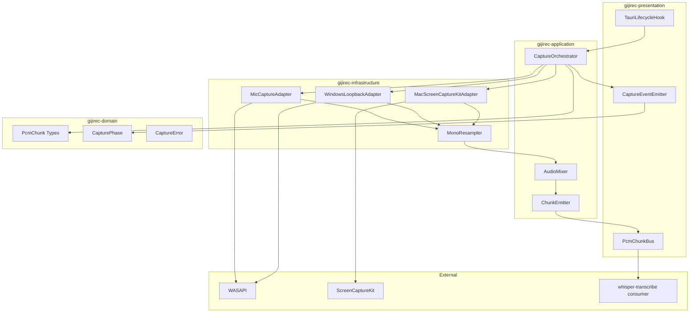
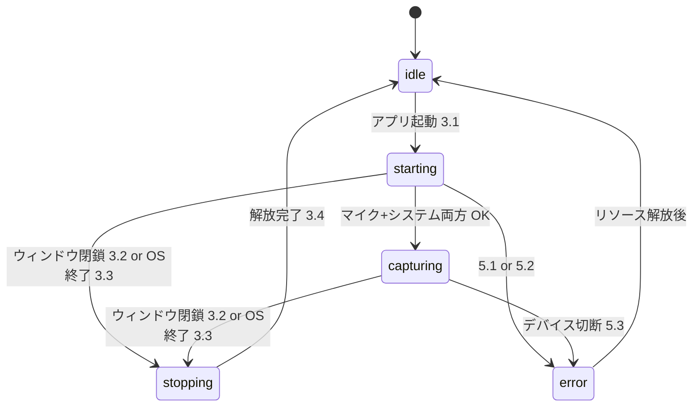
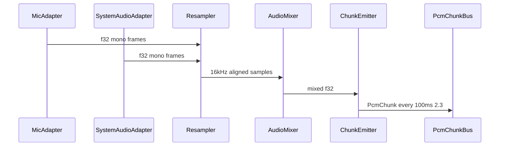

# 設計書: audio-capture

## Overview

gijirec Audio Capture は、Tauri デスクトップアプリの Rust バックエンドがマイク入力と OS システム音声を同時に取得し、16 kHz / 16 bit / モノラル PCM へ正規化・ミックスして下流の whisper-transcribe へ供給する機能である。利用者はアプリをダブルクリック起動するだけでキャプチャが開始され、ウィンドウ閉鎖または OS 終了操作で完全停止する。

_Gap analysis: skipped (greenfield per brief Current State)._

**Purpose**: Web 会議利用者が仮想オーディオデバイスなしで議事録用の統合 PCM ストリームを得る。

**Users**: 会議参加者（エンドユーザー）、gijirec 開発者（Bun + Tauri ホストのセットアップ）。

**Impact**: 製品ロードマップの先頭 spec として Tauri ホスト・Rust レイヤード crates・永続 PCM 契約の基盤を確立する。

### Goals
- Mac / Windows でマイク＋システム音声の二重キャプチャ（仮想デバイス不要）
- 16 kHz モノラル PCM のリアルタイムミックスと 100 ms チャンク供給
- アプリライフサイクルとキャプチャライフサイクルの一致
- 利用者が回復可能なエラー通知
- Bun によるフロントエンドツールチェーン統一

### Non-Goals
- Whisper 推論、エディタ UI、Markdown 保存
- Linux 対応、話者分離、クラウド STT
- 仮想オーディオデバイス、マイク選択 UI
- 音声の永続ファイル保存・外部ネットワーク送信

## Boundary Commitments

### This Spec Owns
- マイクおよびシステム音声の取得、リサンプル、レベル調整、ミックス
- `PcmChunk` ストリームの生成と下流バスへの供給（`docs/contracts/audio-capture-pcm.md`）
- キャプチャ開始・停止（アプリ起動・終了に連動）
- キャプチャフェーズおよび利用者向けエラーイベント（`docs/contracts/audio-capture-status.md`）
- Tauri ホストの最小 UI（ステータス・エラー表示）と Bun ツールチェーン初期構成

### Out of Boundary
- 文字起こし推論・テキスト表示（whisper-transcribe、transcript-editor）
- モデルダウンロード、Markdown 出力
- ユーザー認証・認可
- 音声データのディスク永続化

### Allowed Dependencies
- **OS API**: Windows WASAPI（cpal）、macOS ScreenCaptureKit（`screencapturekit` crate）、マイク入力（cpal）
- **Rust crates**: cpal, rubato（リサンプル）, rtrb（リングバッファ）, tokio（非同期ランタイム・Tauri 既定）
- **Tauri 2**: ライフサイクルフック、イベント emit
- **Bun**: フロント依存管理・スクリプト（ADR-0002）
- **下流**: なし（本 spec がロードマップ先頭）

### Revalidation Triggers
- `PcmChunk` のサンプルレート・チャンク長・エンディアン変更 → whisper-transcribe
- ミックス出力がモノラル以外になる変更 → whisper-transcribe
- システム音声取得方式の変更（例: macOS TAP へ切替）→ 権限 UX・性能テストの再検証
- Tauri IPC で PCM をフロントへ露出する変更 → セキュリティ・7.2 の再検証

## Architecture

### Architecture Pattern & Boundary Map

**Selected pattern**: レイヤード・ヘキサゴナル（steering `structure.md` 準拠）。`gijirec-domain` が中心、OS 依存は `gijirec-infrastructure` に隔離。



**Architecture Integration**:
- Domain/feature boundaries: 音声取得は infrastructure、オーケストレーションは application、Tauri 結線は presentation
- Steering compliance: cargo bylaw / dependency-cruiser でレイヤ依存を CI 検証
- New components rationale: プラットフォームアダプタ分離により Mac/Windows 並行実装が可能

### Technology Stack

| Layer | Choice / Version | Role in Feature | Notes |
|-------|------------------|-----------------|-------|
| Desktop Shell | Tauri 2 | 起動・終了フック、イベント IPC | `tauri.conf.json` |
| Frontend | TypeScript strict + Vite | 最小ステータス UI | Bun で管理 |
| Backend | Rust edition 2024 | キャプチャパイプライン | `src-tauri/crates/*` |
| Mic capture | cpal 0.16+ | 既定入力デバイス | 全 OS |
| System audio Win | cpal WASAPI loopback | 既定出力ミックス | ADR-0001 |
| System audio Mac | screencapturekit crate | SCK オーディオ | macOS 13+ のみビルド |
| Resample | rubato | 任意レート → 16 kHz mono | infrastructure |
| Buffer | rtrb | RT コールバック → 処理スレッド | allocation-free 境界 |

## Persistent References

### Contracts (authoritative outside this feature dir)
| Path | Mode | Notes |
|------|------|-------|
| docs/contracts/audio-capture-pcm.md | modify | 初版作成済み — PcmChunk 形状・100 ms 供給 |
| docs/contracts/audio-capture-status.md | modify | 初版作成済み — フェーズ・エラーイベント |

### Architecture
| Path | Mode | Notes |
|------|------|-------|
| docs/architecture/boundaries.md | modify | audio-capture 境界・依存行を追加 |
| docs/architecture/README.md | reference | index のみ |

### ADRs
| Path | Status |
|------|--------|
| docs/architecture/adr/ADR-0001-platform-audio-capture.md | Accepted |
| docs/architecture/adr/ADR-0002-bun-frontend-toolchain.md | Accepted |

## File Structure Plan

### Directory Structure
```
.
├── package.json                 # Bun scripts: dev, build, check
├── bun.lock
├── README.md                    # Bun 必須・セットアップ手順（8.3）
├── src/
│   ├── main.ts                  # React/Vite エントリ
│   └── presentation/
│       ├── App.tsx              # キャプチャ状態・エラー表示
│       └── hooks/
│           └── useCaptureStatus.ts  # Tauri イベント購読
└── src-tauri/
    ├── Cargo.toml               # workspace メンバー定義
    ├── tauri.conf.json          # beforeDevCommand: bun run dev
    ├── src/
    │   └── lib.rs               # Tauri Builder、crate 結線
    └── crates/
        ├── gijirec-domain/
        │   └── src/
        │       ├── lib.rs
        │       └── audio/
        │           ├── mod.rs
        │           ├── pcm_chunk.rs      # PcmChunk, PcmChunkConsumer trait
        │           ├── phase.rs          # CapturePhase
        │           └── error.rs          # CaptureError, UserFacingError
        ├── gijirec-application/
        │   └── src/
        │       ├── lib.rs
        │       └── capture/
        │           ├── mod.rs
        │           ├── orchestrator.rs   # CaptureOrchestrator
        │           ├── mixer.rs          # AudioMixer（レベル調整・ミックス）
        │           └── chunk_emitter.rs  # 100 ms チャンク生成
        ├── gijirec-infrastructure/
        │   └── src/
        │       ├── lib.rs
        │       └── audio/
        │           ├── mod.rs
        │           ├── mic_capture.rs
        │           ├── resampler.rs
        │           └── platform/
        │               ├── mod.rs
        │               ├── windows_loopback.rs
        │               └── macos_sck_audio.rs
        └── gijirec-presentation/
            └── src/
                ├── lib.rs
                └── tauri/
                    ├── mod.rs
                    ├── lifecycle.rs      # setup/exit フック（3.1–3.4）
                    ├── events.rs         # phase/error emit（5.x, 7.x）
                    └── pcm_bus.rs          # PcmChunkConsumer 登録点
```

### Modified Files
- 新規リポジトリ（greenfield）— 上記すべて作成

## System Flows

### キャプチャライフサイクル



### オーディオパイプライン



## Requirements Traceability

| Requirement | Summary | Components | Interfaces | Flows |
|-------------|---------|------------|------------|-------|
| 1.1 | 既定マイク取得 | D-MicCaptureAdapter, D-CaptureOrchestrator | cpal input | パイプライン |
| 1.2 | システム音声（仮想デバイス不要） | D-WindowsLoopbackAdapter, D-MacScreenCaptureKitAdapter | WASAPI / SCK | パイプライン |
| 1.3 | 両方同時処理 | D-CaptureOrchestrator | 開始ゲート | starting→capturing |
| 1.4 | 仮想デバイス非前提 | ADR-0001 | — | — |
| 2.1 | リアルタイムミックス | D-AudioMixer | f32 mix | パイプライン |
| 2.2 | 16kHz 16bit mono | D-MonoResampler, D-ChunkEmitter | PcmChunk | 契約 |
| 2.3 | チャンク連続供給 | D-ChunkEmitter, D-PcmChunkBus | audio-capture-pcm | 100 ms |
| 2.4 | レベル差調整 | D-AudioMixer | RMS gain | パイプライン |
| 3.1 | 起動で自動開始 | D-TauriLifecycleHook | setup hook | ライフサイクル |
| 3.2 | ウィンドウ閉鎖で停止 | D-TauriLifecycleHook | on_window_event | ライフサイクル |
| 3.3 | OS 終了で停止 | D-TauriLifecycleHook | RunEvent::Exit | ライフサイクル |
| 3.4 | 停止中は取得なし | D-CaptureOrchestrator | stop() | idle |
| 4.1 | 会議アプリ並行 | D-*Adapter RT 制約 | allocation-free | — |
| 4.2 | CPU/メモリ上限 | 性能テスト計画 | 計測 | Operational |
| 5.1 | マイク不能 | D-CaptureOrchestrator | MIC_* error | error |
| 5.2 | システム音声不能（フォールバック禁止） | D-CaptureOrchestrator | SYSTEM_* error | error |
| 5.3 | 切断時安全停止 | D-CaptureOrchestrator | DEVICE_DISCONNECTED | error |
| 5.4 | 行動可能な通知 | D-CaptureEventEmitter | action_ja | 契約 |
| 6.1 | macOS 対応 | D-MacScreenCaptureKitAdapter | SCK | ADR-0001 |
| 6.2 | Windows 対応 | D-WindowsLoopbackAdapter | WASAPI | ADR-0001 |
| 6.3 | Linux 非対応 | D-TauriLifecycleHook | cfg ガード | N/A 起動拒否 |
| 7.1 | OS 権限プロンプト | D-CaptureOrchestrator | preflight | starting |
| 7.2 | 外部送信禁止 | D-PcmChunkBus | Rust 内部のみ | 契約 |
| 7.3 | 永続保存禁止 | D-AudioMixer | メモリバッファのみ | — |
| 7.4 | 認証 N/A | — | — | N/A |
| 8.1 | Bun 使用 | package.json, tauri.conf | bun scripts | ADR-0002 |
| 8.2 | bun install でセットアップ | README.md | Bun 手順 | — |
| 8.3 | README に Bun 必須 | README.md | ドキュメント | — |

## Components and Interfaces

| Component | Anchor | Domain/Layer | Intent | Req Coverage | Key Dependencies | Contracts |
|-----------|--------|--------------|--------|--------------|------------------|-----------|
| CaptureOrchestrator | D-CaptureOrchestrator | application | 二重キャプチャの開始・停止・エラー分岐 | 1.1–1.3, 3.x, 5.x, 7.1 | Mic/System adapters (P0) | Service, State |
| AudioMixer | D-AudioMixer | application | 整列・ゲイン・ミックス | 2.1, 2.4 | Resampler (P0) | Service |
| ChunkEmitter | D-ChunkEmitter | application | 100 ms PcmChunk 生成 | 2.2, 2.3 | Mixer (P0) | Event |
| PcmChunkBus | D-PcmChunkBus | presentation | 下流 consumer 配信 | 2.3, 7.2 | ChunkEmitter (P0) | Event |
| MicCaptureAdapter | D-MicCaptureAdapter | infrastructure | cpal マイク | 1.1, 6.x | cpal (P0) | — |
| WindowsLoopbackAdapter | D-WindowsLoopbackAdapter | infrastructure | WASAPI ループバック | 1.2, 6.2 | cpal (P0) | — |
| MacScreenCaptureKitAdapter | D-MacScreenCaptureKitAdapter | infrastructure | SCK システム音声 | 1.2, 6.1 | screencapturekit (P0) | — |
| MonoResampler | D-MonoResampler | infrastructure | 16 kHz mono 変換 | 2.2 | rubato (P1) | — |
| TauriLifecycleHook | D-TauriLifecycleHook | presentation | 起動/終了連動 | 3.1–3.4, 6.3 | Orchestrator (P0) | — |
| CaptureEventEmitter | D-CaptureEventEmitter | presentation | UI 向けイベント | 5.4, 7.1 | Tauri (P0) | Event |
| useCaptureStatus | D-UseCaptureStatus | presentation (TS) | フロント状態購読 | 5.4 | Tauri events (P0) | Event |

### application

#### CaptureOrchestrator {#D-CaptureOrchestrator}

| Field | Detail |
|-------|--------|
| Intent | マイク・システム音声の同時開始、いずれか失敗時のエラー停止、切断処理 |
| Requirements | 1.1, 1.2, 1.3, 3.4, 5.1, 5.2, 5.3, 7.1 |

**Responsibilities & Constraints**
- `start()`: マイクを先にオープンし、成功後にシステム音声をオープン（部分開始でサイレント継続を防止 — 5.2）。システム音声オープン失敗時は直ちにマイクストリームをクローズし `capturing` へ遷移しない
- いずれかが不可なら `error` フェーズへ遷移し、二重キャプチャを開始しない
- `start()` / `stop()` は冪等: `capturing` 中の再 `start()` は no-op、`idle` / `error` 中の `stop()` は no-op
- `stop()`: `starting` / `capturing` / `error` から `stopping` へ遷移し、全ストリームを逆順で閉じ、バッファを破棄（7.3）

**Dependencies**
- Outbound: MicCaptureAdapter, platform SystemAudioAdapter — 生フレーム取得 (P0)
- Outbound: AudioMixer — フレーム供給 (P0)
- Outbound: CaptureEventEmitter — フェーズ・エラー通知 (P0)

**Contracts**: Service [x] / State [x]

##### Service Interface
```rust
pub trait CaptureOrchestrator: Send + Sync {
    fn start(&mut self) -> Result<(), CaptureError>;
    fn stop(&mut self) -> Result<(), CaptureError>;
    fn phase(&self) -> CapturePhase;
}
```

**Implementation Notes**
- Integration: Tauri `setup` から `start`、終了フックから `stop`
- Validation: 権限 preflight を `starting` 中に実施（7.1）
- Risks: デバイスホットプラグ — cpal / SCK の再登録は v1 では再起動を案内（5.3）

#### AudioMixer {#D-AudioMixer}

| Field | Detail |
|-------|--------|
| Intent | 二系統 f32 モノサンプルのタイムライン整列・レベル調整・合成 |
| Requirements | 2.1, 2.4, 7.3 |

**Responsibilities & Constraints**
- 50 ms 整列バッファでクロック差を吸収
- 各ソース RMS（200 ms 窓）を -20 dBFS 付近へ正規化後、合算しソフトリミッター（±0.95）
  - 正規化ゲインは +12 dB（4 倍）を上限とし、RMS が -42 dBFS（0.008、transcribe 側 VAD 閾値と同値）以下のトラックはゲイン 1.0 で素通しする（ノイズゲート）。無音側トラックの床ノイズを発話側と同レベルまで増幅しないため
- push のタイムラインラベルは各ストリームの累積配信サンプル数。空のトラックへ届いた内容は「いま」の音として扱い、ラベルが出力カーソルより過去なら カーソルへ引き上げる（配信開始が 50 ms 以上遅れたソースや、無再生時にパケットを出さない WASAPI ループバックの復帰を、整列窓超過として捨てないため）
- 非空トラックへラベルが末尾より先で届いた場合、1 s 以内の欠落は無音で埋め、それ以上は新しい位置から再開する
- 出力はメモリ上のみ。最大 30 s 分のリングバッファ（約 960 KB）を超えて保持しない（7.3）

**Contracts**: Service [x]

##### Service Interface
```rust
pub trait AudioMixer: Send {
    fn push_mic(&mut self, samples: &[f32], timeline_samples: u64);
    fn push_system(&mut self, samples: &[f32], timeline_samples: u64);
    fn drain_mixed(&mut self, out: &mut Vec<f32>) -> usize;
}
```

#### ChunkEmitter {#D-ChunkEmitter}

| Field | Detail |
|-------|--------|
| Intent | ミックス済み f32 から 100 ms 単位の `PcmChunk` を生成 |
| Requirements | 2.2, 2.3 |

**Contracts**: Event [x] — 形状は `docs/contracts/audio-capture-pcm.md`

### infrastructure

#### WindowsLoopbackAdapter {#D-WindowsLoopbackAdapter}

| Field | Detail |
|-------|--------|
| Intent | 既定出力デバイスの WASAPI ループバック |
| Requirements | 1.2, 6.2 |

**Dependencies**
- External: cpal — `default_output_device` + `default_output_config` (P0)

**Implementation Notes**
- RT コールバックでは rtrb へ push のみ。Resampler は別スレッド

#### MacScreenCaptureKitAdapter {#D-MacScreenCaptureKitAdapter}

| Field | Detail |
|-------|--------|
| Intent | ScreenCaptureKit によるシステム音声 |
| Requirements | 1.2, 6.1, 7.1 |

**Implementation Notes**
- `cfg(target_os = "macos")` のみコンパイル
- 2×2 px / 1 fps 映像を破棄、`excludesCurrentProcessAudio = true`
- 画面収録権限が拒否された場合 `SYSTEM_AUDIO_PERMISSION_DENIED`（契約）

#### MicCaptureAdapter {#D-MicCaptureAdapter}

| Field | Detail |
|-------|--------|
| Intent | 既定マイクの cpal 入力 |
| Requirements | 1.1, 6.1, 6.2 |

### presentation

#### TauriLifecycleHook {#D-TauriLifecycleHook}

| Field | Detail |
|-------|--------|
| Intent | アプリ起動・終了とキャプチャの同期 |
| Requirements | 3.1, 3.2, 3.3, 3.4, 6.3 |

**Implementation Notes**
- Linux ターゲットでは `RunEvent` 早期に非対応ダイアログを表示しキャプチャを開始しない（6.3）
- `CloseRequested` / `RunEvent::Exit` で `Orchestrator::stop`

#### PcmChunkBus {#D-PcmChunkBus}

| Field | Detail |
|-------|--------|
| Intent | `PcmChunkConsumer` への配信。v1 は単一登録 |
| Requirements | 2.3, 7.2 |

**Implementation Notes**
- PCM を Tauri イベントでフロントへ送らない（7.2）
- whisper-transcribe 実装時に consumer を composition root で登録
- 下流 `on_pcm_chunk` が遅延した場合: バウンド済みキュー（最大 3 チャンク ≈ 300 ms）を超えた分は破棄し `capture_buffer_drops_total` をインクリメント（リソース枯渇・デッドロック防止）

#### CaptureEventEmitter {#D-CaptureEventEmitter}

| Field | Detail |
|-------|--------|
| Intent | `audio-capture://phase-changed` / `audio-capture://error` を emit |
| Requirements | 5.4, 7.1 |

## Data Models

### Domain Model
- **PcmChunk**: 契約どおりの値オブジェクト（`sequence`, `sample_rate_hz`（固定 16000）, `channels`（固定 1）, `sample_format`（`Int16Le`）, `samples: Vec<i16>`, `frame_count`, `timestamp_ms`）
- **CapturePhase**: `idle | starting | capturing | stopping | error`
- **CaptureError**: 内部原因。`UserFacingError` へマップして UI 通知

### Logical Data Model
- 一時バッファ: 整列用 50 ms × 2 ソース、ミックス出力 100 ms 窓
- 永続ストレージなし（7.3）

## Error Handling

### Error Strategy
- 利用者回復可能エラー: フェーズ `error` + `audio-capture://error`（action_ja 必須）
- 内部エラー: `tracing::error!` に詳細。UI には `INTERNAL` + 一般化メッセージ

### Error Categories and Responses
- **User Errors**: 権限拒否・デバイスなし → 契約コード + 設定への誘導（5.4）
- **System Errors**: ストリーム構築失敗 → キャプチャ開始せず error（5.1, 5.2）
- **Business Logic**: キャプチャ中切断 → 安全停止 + 再起動案内（5.3）

## Observability

- **Logging**: `tracing` を使用。`INFO`: フェーズ遷移、`WARN`: バッファドロップ、`ERROR`: ストリーム失敗。音声サンプル・PCM バイト列はログに出さない（PII/機密）。マイクデバイス名は `DEBUG` 限定でマスク可能な場合は ID のみ
- **Metrics**: `capture_buffer_drops_total`（カウンタ）、`capture_phase`（ゲージ）、`capture_rt_callback_max_us`（ヒストグラム）— v1 は `tracing` フィールドで代替可。本番メトリクス基盤は N/A — 基盤未導入、ログで代替
- **Alerts**: N/A — ローカルデスクトップ単一ユーザー。UI エラーイベントがアラート相当
- **Debuggability**: 全エラーに `error_code` + `correlation_id`（セッション UUID）を付与。`RUST_LOG=gijirec_capture=debug` でアダプタ詳細

## Testing Strategy

### Unit Tests
1. `AudioMixer`: 片系統のみ入力時もクラッシュせず無音扱いにならない（整列待ち）
2. `AudioMixer`: 大音量 mic + 小音量 system でミックス後クリップしない（2.4）
3. `ChunkEmitter`: 1600 サンプル境界で `sequence` 単調増加（2.3）
4. `CaptureOrchestrator`: システム音声失敗時にマイク単独で継続しない（5.2）
5. `UserFacingError`: 各 `CaptureError` が契約の `code` / `action_ja` にマップされる（5.4）

### Integration Tests
1. Windows: ループバック + マイク同時開始（モックデバイスまたは CI skip 付き手動）
2. macOS: SCK 権限モックまたは `#[ignore]` 実機テスト
3. ライフサイクル: `start` → `capturing` → `stop` → `idle` でストリームハンドルが解放（3.4）
4. `PcmChunkBus`: consumer 登録後 100 ms 以内に最初のチャンク到達（2.3）
5. `PcmChunkBus`: 意図的に遅延するモック consumer でキュー上限超過時にドロップが記録される（バックプレッシャー）

### E2E/UI Tests
1. アプリ起動後 UI に `capturing` 表示（3.1）
2. マイク権限拒否シミュレーションで `action_ja` 含有エラー表示（5.4, 7.1）
3. ウィンドウ閉鎖後プロセス終了しマイクインジケータ消灯（3.2）— 手動チェックリスト

### Performance/Load
1. 30 分連続キャプチャで `capture_buffer_drops_total == 0`（4.2）
2. キャプチャ中 CPU 平均 < 5%（4 コア / 16 GB 参照マシン）、ピーク < 15%（4.2）
3. 常駐メモリ増分 < 50 MB（4.2）
4. Zoom/Teams 再生中に主観的な相手音声途切れなし（4.1）— 手動 + 動画同期テスト

## Operational Readiness

### Performance & Scalability
- RT コールバック: アロケーション禁止、ロックは try_lock のみ
- リサンプル・ミックスは専用スレッド（`std::thread` または tokio blocking）
- 測定: Windows Performance Recorder / macOS Instruments の「手動プロファイル手順」を README に記載

### Deployment & Rollout
- Tauri バンドルに cpal / SCK ネイティブ依存を同梱
- macOS: `Info.plist` に `NSScreenCaptureUsageDescription`、マイク用途文字列
- Rollback: バイナリ差し替えのみ。スキーママイグレーションなし

### Migration
- N/A — greenfield 初回リリース

## Security Considerations

- 音声データは sensitive。ネットワーク送信コードパスを実装しない（7.2）
- PCM は Rust プロセス内バスのみ。デバッグビルドでもファイル出力しない
- 権限は OS 標準プロンプトのみ。独自権限エレベーションなし（7.1）
- 認証 N/A（7.4）
- 外部 crate（cpal, screencapturekit, rubato, rtrb）は `Cargo.lock` でピン留めし、CI で `cargo deny` または `cargo audit` を実行（供給チェーン）
