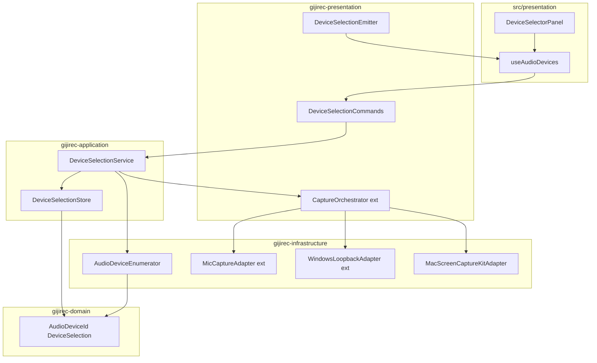
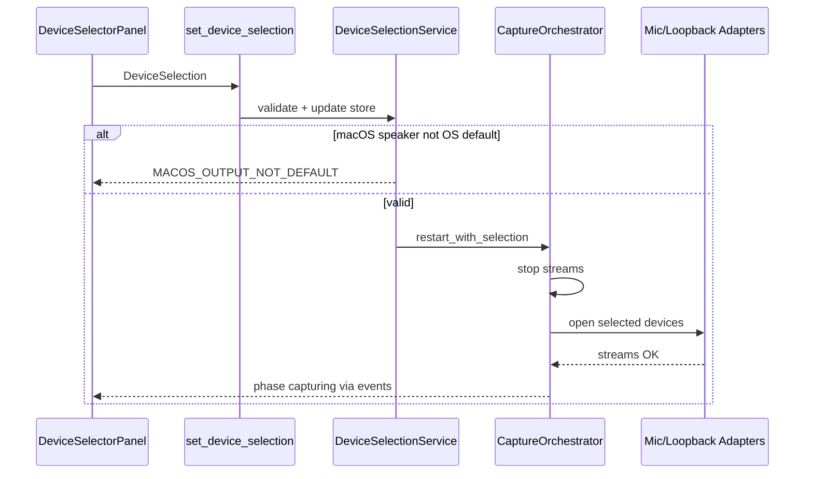
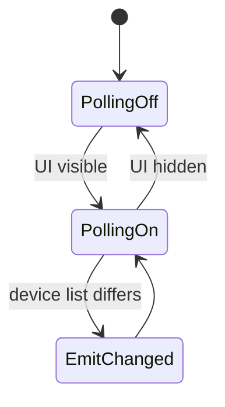

# 設計書: audio-device-selection

## Overview

gijirec Audio Device Selection は、既存 audio-capture の二重キャプチャ（マイク + システム音声ループバック）に、利用可能デバイスの一覧表示・マイク／スピーカー選択 UI・選択デバイスでのキャプチャ再開を追加する機能である。UI 未操作時は OS 既定デバイスと起動時自動キャプチャを維持し、明示選択時のみ `CaptureOrchestrator` が指定デバイス ID で再開する。PCM 下流契約（`audio-capture-pcm.md`）は変更しない。

**Purpose**: 複数マイク／スピーカー環境で意図した入力を選び、会議キャプチャの品質と安定性を向上させる。

**Users**: Web 会議利用者（デバイス選択）、開発者（Tauri IPC・cpal 拡張）。

**Impact**: audio-capture のアダプタとオーケストレータを拡張し、新規デバイス選択 IPC 契約と UI を追加する。

### Goals
- マイク・スピーカー（ループバック対象）の一覧取得と区別可能な表示名（1.x）
- アプリ内選択 UI とセッション内選択状態（2.x）
- 選択デバイスでの二重キャプチャと変更時再開（3.x）
- 選択デバイス利用不能時の明示エラー（サイレントフォールバック禁止）（4.x）
- Mac / Windows 対応、会議並行時の性能維持（5.x, 6.x）
- ローカル処理のみ、権限の明示（7.x）

### Non-Goals
- 選択のディスク永続化（再起動後復元）
- 仮想オーディオデバイス、Linux、ゲイン／EQ チューニング
- PCM 形状変更、Whisper／エディタの変更

## Boundary Commitments

### This Spec Owns
- cpal による入出力デバイス列挙とホットプラグ通知（UI 表示中）
- セッション内 `DeviceSelection` 状態（非永続）
- Tauri command / イベント（`docs/contracts/audio-device-selection.md`）
- デバイス選択 UI（`DeviceSelectorPanel`）
- `CaptureOrchestrator` への選択デバイス ID 伝播と `restart_with_selection`
- 選択デバイス文脈の利用者向けエラー（`audio-capture-status.md` 拡張）

### Out of Boundary
- PCM ミキシング・チャンク生成・`PcmChunk` 形状（audio-capture）
- 文字起こし・エディタ・Markdown 保存
- 認証・認可、外部ネットワーク送信

### Allowed Dependencies
- **上流**: audio-capture の `CaptureOrchestrator`、各 Capture アダプタ、`TauriLifecycleHook`
- **OS API**: cpal 入出力列挙・ストリーム、Windows WASAPI ループバック、macOS ScreenCaptureKit（ADR-0001, ADR-0009）
- **契約**: `audio-capture-pcm.md`（参照）、`audio-capture-status.md`（modify）、`audio-device-selection.md`（modify）
- **下流**: なし（whisper-transcribe は PCM のみ消費）

### Revalidation Triggers
- `DeviceSelection` / command ペイロード形状の破壊的変更 → フロント hooks 再検証
- macOS スピーカー取得方式の変更（SCK 以外）→ ADR-0009 見直し
- 選択変更時の再キャプチャが PCM ギャップを増大させる変更 → whisper-transcribe バッファ設計

## Architecture

### Existing Architecture Analysis

audio-capture はレイヤード構成で既定デバイス二重キャプチャを実装済み。本 spec は **ハイブリッド拡張**（research.md Option C）:
- 新規: デバイス列挙・選択ストア・選択 IPC・UI
- 拡張: `CaptureOrchestrator`、`MicCaptureAdapter`、`WindowsLoopbackAdapter`（デバイス ID 受け取り）
- 参照: `MacScreenCaptureKitAdapter`（SCK はシステムミックス。macOS では選択スピーカー = OS 既定出力の preflight）

### Architecture Pattern & Boundary Map



**Architecture Integration**:
- Selected pattern: 既存ヘキサゴナル拡張。選択ドメインを application に隔離しキャプチャ実装への漏れを防止
- Steering compliance: cargo bylaw / dependency-cruiser 維持。TS は IPC ミラーのみ
- macOS スピーカー: ADR-0009 — 一覧は cpal、取得は SCK + 既定出力一致 preflight

### Technology Stack

| Layer | Choice / Version | Role in Feature | Notes |
|-------|------------------|-----------------|-------|
| Desktop Shell | Tauri 2 | command / event IPC | 既存 |
| Frontend | TypeScript strict + React 19 | デバイス選択 UI | shadcn Select 想定 |
| Backend | Rust edition 2024 | 列挙・選択・再キャプチャ | 既存 crates 拡張 |
| Device API | cpal 0.16+ | 入出力列挙・マイク・Win ループバック | ADR-0001 拡張 |
| System audio Mac | screencapturekit | システムミックス（デバイス非指定） | ADR-0009 |

## Persistent References

### Contracts (authoritative outside this feature dir)
| Path | Mode | Notes |
|------|------|-------|
| docs/contracts/audio-device-selection.md | modify | 初版作成済み — 一覧・選択 command / イベント |
| docs/contracts/audio-capture-pcm.md | reference | PCM 形状変更なし |
| docs/contracts/audio-capture-status.md | modify | 選択デバイス文脈エラーコード追加 |

### Architecture
| Path | Mode | Notes |
|------|------|-------|
| docs/architecture/boundaries.md | modify | audio-device-selection 境界セクション追加 |
| docs/architecture/README.md | reference | index のみ |

### ADRs
| Path | Status |
|------|--------|
| docs/architecture/adr/ADR-0001-platform-audio-capture.md | Accepted（参照） |
| docs/architecture/adr/ADR-0009-macos-speaker-selection-strategy.md | Accepted |

## File Structure Plan

### Directory Structure
```
src/
├── presentation/
│   ├── App.tsx                          # DeviceSelectorPanel を既存 chrome に配置
│   ├── components/
│   │   └── DeviceSelectorPanel.tsx      # マイク／スピーカー Select UI
│   └── hooks/
│       ├── useAudioDevices.ts           # 一覧・選択・イベント購読
│       └── audio-device-types.ts        # 契約型ミラー
└── infrastructure/
    └── tauri/
        └── audioDeviceCommands.ts       # invoke ラッパ

src-tauri/crates/
├── gijirec-domain/src/audio/
│   ├── device.rs                        # AudioDeviceId, AudioDeviceInfo, DeviceSelection
│   └── mod.rs                           # 再エクスポート
├── gijirec-application/src/
│   ├── capture/
│   │   └── orchestrator.rs              # start_with_selection, restart_with_selection
│   └── device_selection/
│       ├── mod.rs
│       ├── service.rs                   # DeviceSelectionService
│       └── store.rs                     # DeviceSelectionStore（セッション内）
├── gijirec-infrastructure/src/audio/
│   ├── device_enumerator.rs             # AudioDeviceEnumerator
│   ├── mic_capture.rs                   # デバイス ID 指定オープン
│   └── platform/
│       └── windows_loopback.rs            # 出力デバイス ID 指定ループバック
└── gijirec-presentation/src/
    ├── tauri/
    │   ├── device_selection.rs          # Tauri commands + emitter
    │   └── lifecycle.rs                 # 起動時 selection 解決（既定）
    └── capture/                         # orchestrator 結線更新
```

### Modified Files
- `gijirec-application/src/capture/orchestrator.rs` — 選択デバイス ID をアダプタへ伝播、再開経路
- `gijirec-infrastructure/src/audio/mic_capture.rs` — 入力デバイス ID でオープン
- `gijirec-infrastructure/src/audio/platform/windows_loopback.rs` — 出力デバイス ID でループバック
- `src/presentation/App.tsx` — デバイス選択 UI 配置
- `src-tauri/src/compose.rs` — 新サービス結線

## System Flows

### 選択変更 → 再キャプチャ



### ホットプラグ（UI 表示中）



## Requirements Traceability

| Requirement | Summary | Components | Interfaces | Flows |
|-------------|---------|------------|------------|-------|
| 1.1 | マイク一覧 | D-AudioDeviceEnumerator, D-DeviceSelectionCommands | list_audio_devices | — |
| 1.2 | スピーカー一覧 | D-AudioDeviceEnumerator | list_audio_devices outputs | — |
| 1.3 | 表示名 | D-AudioDeviceEnumerator | Device::name | — |
| 1.4 | ホットプラグ更新 | D-DeviceSelectionService | devices-changed event | ホットプラグ |
| 1.5 | 候補ゼロ表示 | D-DeviceSelectorPanel | empty state UI | — |
| 2.1 | 選択 UI 配置 | D-DeviceSelectorPanel | App chrome | — |
| 2.2 | マイク選択記録 | D-DeviceSelectionStore | set_device_selection | 選択変更 |
| 2.3 | スピーカー選択記録 | D-DeviceSelectionStore | set_device_selection | 選択変更 |
| 2.4 | 現在値表示 | D-DeviceSelectorPanel, D-useAudioDevices | selection-changed | — |
| 2.5 | 未変更時既定表示 | D-DeviceSelectionStore | null = default | — |
| 2.6 | 未変更時既定キャプチャ | D-TauriLifecycleHook | 起動 start（既存） | — |
| 3.1 | 選択デバイス二重取得 | D-CaptureOrchestrator | restart_with_selection | 選択変更 |
| 3.2 | PCM 連続供給 | D-ChunkEmitter, D-PcmChunkBus | audio-capture-pcm | — |
| 3.3 | 選択変更で再開 | D-CaptureOrchestrator | restart_with_selection | 選択変更 |
| 3.4 | サイレント切替禁止 | D-CaptureOrchestrator, D-DeviceSelectionService | エラー停止 | 選択変更 |
| 3.5 | 仮想デバイス不要 | ADR-0001, ADR-0009 | — | — |
| 4.1 | マイク不能 | D-CaptureOrchestrator | SELECTED_MIC_UNAVAILABLE | error |
| 4.2 | スピーカー不能（フォールバック禁止） | D-CaptureOrchestrator | SELECTED_SYSTEM_AUDIO_UNAVAILABLE | error |
| 4.3 | 切断時安全停止 | D-CaptureOrchestrator | DEVICE_DISCONNECTED | error |
| 4.4 | 行動可能通知 | D-CaptureEventEmitter | action_ja | error |
| 4.5 | 再選択可能状態 | D-DeviceSelectorPanel | UI 維持 | error |
| 5.1 | 会議並行性能 | D-AudioDeviceEnumerator | UI 表示中のみポーリング | — |
| 5.2 | キャプチャ NFR 継承 | 既存パイプライン | audio-capture 4.x | — |
| 5.3 | 再開時間 | D-CaptureOrchestrator | < 2 s 目標 | 選択変更 |
| 6.1 | macOS | D-MacScreenCaptureKitAdapter, ADR-0009 | preflight | — |
| 6.2 | Windows | D-WindowsLoopbackAdapter | per-device loopback | — |
| 6.3 | Linux 非対応 | D-TauriLifecycleHook | cfg ガード | N/A |
| 7.1 | OS 権限 | D-CaptureOrchestrator | preflight | starting |
| 7.2 | 音声非送信 | D-PcmChunkBus | 既存 | — |
| 7.3 | デバイス情報非送信 | D-DeviceSelectionCommands | ローカル IPC のみ | — |
| 7.4 | 認証 N/A | — | — | N/A |
| 7.5 | 権限拒否通知 | D-CaptureEventEmitter | MIC/SYSTEM permission codes | error |

## Components and Interfaces

| Component | Anchor | Domain/Layer | Intent | Req Coverage | Key Dependencies | Contracts |
|-----------|--------|--------------|--------|--------------|------------------|-----------|
| AudioDeviceEnumerator | D-AudioDeviceEnumerator | infrastructure | cpal 入出力列挙 | 1.1–1.3, 6.x | cpal (P0) | — |
| DeviceSelectionStore | D-DeviceSelectionStore | application | セッション選択状態 | 2.2–2.6 | domain types (P0) | State |
| DeviceSelectionService | D-DeviceSelectionService | application | 一覧更新・選択・再開起動 | 1.4, 2.x, 3.3, 5.1 | Store, Enumerator, Orchestrator (P0) | Service |
| DeviceSelectionCommands | D-DeviceSelectionCommands | presentation (Rust) | Tauri IPC | 1.x, 2.x, 7.3 | DeviceSelectionService (P0) | API, Event |
| CaptureOrchestrator (ext) | D-CaptureOrchestrator | application | 選択 ID で開始・再開 | 3.x, 4.x, 5.3, 7.1 | Adapters (P0) | Service |
| DeviceSelectorPanel | D-DeviceSelectorPanel | presentation (TS) | 選択 UI | 1.5, 2.1, 2.4, 4.5 | useAudioDevices (P0) | — |
| useAudioDevices | D-useAudioDevices | presentation (TS) | 一覧・選択フック | 1.4, 2.4 | Tauri IPC (P0) | API, Event |

### application

#### DeviceSelectionService {#D-DeviceSelectionService}

| Field | Detail |
|-------|--------|
| Intent | デバイス一覧の取得、UI 可視時の変更監視、選択の検証とオーケストレータ連携 |
| Requirements | 1.4, 2.2, 2.3, 3.3, 5.1 |

**Responsibilities & Constraints**
- `list_devices()`: 入出力を列挙。空配列は許容（1.5）
- `set_selection(sel)`: ID 存在検証、macOS スピーカー preflight（ADR-0009）
- `set_selection` は **直列化**（mutex / 単一フライト）。`restart_with_selection` 実行中の追加呼び出しはキューに積み、完了後に最新の `DeviceSelection` で 1 回だけ再開する（競合・二重再開防止）
- 反映後の選択が現在ストアと同一なら no-op（不要な `restart_with_selection` をスキップ）
- `on_ui_visibility(visible)`: true 時のみホットプラグ監視を開始（5.1）
- 選択変更時、キャプチャが `capturing` / `starting` / `error` のとき `restart_with_selection` を呼ぶ（3.3）。`error` からの再選択は回復経路（4.5）

**Contracts**: Service [x] / State [x]

##### Service Interface
```rust
pub trait DeviceSelectionService: Send + Sync {
    fn list_devices(&self) -> Result<AudioDeviceList, DeviceSelectionError>;
    fn get_selection(&self) -> DeviceSelection;
    fn set_selection(&self, selection: DeviceSelection) -> Result<DeviceSelection, DeviceSelectionError>;
    fn set_ui_visible(&self, visible: bool);
}
```

#### CaptureOrchestrator (extension) {#D-CaptureOrchestrator}

| Field | Detail |
|-------|--------|
| Intent | 選択デバイス ID で二重キャプチャを開始・再開。サイレントフォールバック禁止 |
| Requirements | 2.6, 3.1, 3.3, 3.4, 4.1–4.3, 5.3, 7.1 |

**Responsibilities & Constraints**
- `start_with_selection(sel)`: `sel` の `None` は OS 既定に解決
- `restart_with_selection(sel)`: `stopping` → 解放 → `starting` → 新デバイスでオープン。目標 < 2 s（5.3）
- 選択マイク／スピーカーのいずれかがオープン失敗 → `error` + 契約エラーコード（4.1, 4.2）。マイクのみ継続禁止（4.2）

##### Service Interface
```rust
pub trait CaptureOrchestrator: Send + Sync {
    fn start_with_selection(&mut self, selection: &DeviceSelection) -> Result<(), CaptureError>;
    fn restart_with_selection(&mut self, selection: &DeviceSelection) -> Result<(), CaptureError>;
    // 既存 start/stop/phase は維持。start は内部で get_selection() を使用
}
```

### infrastructure

#### AudioDeviceEnumerator {#D-AudioDeviceEnumerator}

| Field | Detail |
|-------|--------|
| Intent | cpal による入出力デバイス列挙と既定フラグ付与 |
| Requirements | 1.1, 1.2, 1.3, 6.1, 6.2 |

**Implementation Notes**
- cpal 0.16 は `Device::id()` を公開しないため、`Device::name()` を `AudioDeviceId` として返す（セッション内安定。同名衝突・再起動後復元は非対象）
- Windows: `output_devices()` がループバック候補
- 列挙は invoke 時および UI 可視時の変更検知時のみ（5.1）

### presentation

#### DeviceSelectorPanel {#D-DeviceSelectorPanel}

| Field | Detail |
|-------|--------|
| Intent | マイク・スピーカーの Select と現在値・空状態表示 |
| Requirements | 1.5, 2.1, 2.4, 4.5 |

**Implementation Notes**
- マウント時 `set_ui_visible(true)`、アンマウント時 `false`（1.4）
- macOS: スピーカー選択にヘルプテキスト（OS 既定出力との一致が必要）

#### DeviceSelectionCommands {#D-DeviceSelectionCommands}

| Field | Detail |
|-------|--------|
| Intent | `list_audio_devices` / `get_device_selection` / `set_device_selection` とイベント emit |
| Requirements | 1.x, 2.x, 7.3 |

**Contracts**: API [x] / Event [x] — 詳細は `docs/contracts/audio-device-selection.md`

## Data Models

### Domain Model
- **AudioDeviceId**: 非空文字列。cpal 0.16 では `Device::name()` を ID として使用（`Device::id()` 非公開）
- **AudioDeviceInfo**: `id`, `name`, `kind`, `is_default`
- **DeviceSelection**: `{ microphone_id: Option<AudioDeviceId>, speaker_id: Option<AudioDeviceId> }`。`None` = OS 既定
- 永続化なし（セッションスコープ）

## Error Handling

### Error Strategy
- 選択検証失敗: invoke エラー（`INVALID_DEVICE`, `MACOS_OUTPUT_NOT_DEFAULT`）
- キャプチャ失敗: `audio-capture://error`（`SELECTED_*` コード）
- サイレントフォールバック禁止（3.4, 4.2）

### Error Categories and Responses
- **User Errors**: 存在しないデバイス、macOS 出力不一致 → 契約 `action_ja` で再選択または OS 設定案内
- **System Errors**: ストリーム構築失敗 → キャプチャ開始せず `error` フェーズ
- **Business Logic**: キャプチャ中切断 → `DEVICE_DISCONNECTED`、選択 UI は操作可能（4.5）

## Observability

- **Logging**: `INFO`: 選択変更（デバイス ID のみ）、再キャプチャ開始/完了。`WARN`: 列挙失敗。デバイス名は `DEBUG` 限定。音声データ・PCM はログ禁止（7.2）
- **Metrics**: `device_selection_restart_duration_ms`（ヒストグラム、5.3 検証用）。v1 は `tracing` フィールドで代替可
- **Alerts**: N/A — ローカルデスクトップ。UI エラーがアラート相当
- **Debuggability**: 再キャプチャに `correlation_id` を付与。`RUST_LOG=gijirec_device=debug` で列挙詳細

## Testing Strategy

### Unit Tests
1. `DeviceSelectionService::set_selection` — 存在しない ID で `INVALID_DEVICE`（2.2, 4.5）
2. `DeviceSelectionService::set_selection` — 同一選択の連続呼び出しで再開が発火しない（idempotent）
3. `DeviceSelectionService::set_selection` — 再開中の連続変更が直列化され最終選択のみ反映される
4. `DeviceSelectionService` — macOS cfg で非既定スピーカー選択時 `MACOS_OUTPUT_NOT_DEFAULT`（6.1, ADR-0009）
5. `CaptureOrchestrator::restart_with_selection` — スピーカー失敗時マイク単独継続しない（4.2）
6. `CaptureOrchestrator::restart_with_selection` — `error` フェーズからの再選択で `capturing` に復帰（4.5）
7. `AudioDeviceEnumerator` — モック host で `is_default` フラグ（1.3, 2.5）
8. `DeviceSelectionStore` — `None` が OS 既定解決に渡される（2.5–2.6）

### Integration Tests
1. `set_device_selection` → フェーズ `capturing` 復帰（3.3）
2. 選択マイク不存在 → `SELECTED_MIC_UNAVAILABLE` イベント（4.1）
3. UI 可視フラグ on 時のみ `devices-changed` 発行（1.4, 5.1）
4. 再キャプチャ後 `PcmChunk.sequence` が単調増加継続（3.2）
5. Windows: 非既定出力デバイスへのループバック開始（6.2、`#[ignore]` 実機）

### E2E/UI Tests
1. 起動直後、選択 UI に OS 既定マイク／スピーカーが現在値表示（2.5）
2. マイク変更後キャプチャ継続、ステータス `capturing`（3.1, 3.3）
3. 候補ゼロ時 empty state 表示（1.5）
4. エラー表示に `action_ja` 含有（4.4）
5. macOS: 非既定スピーカー選択で案内メッセージ（ADR-0009）

### Performance/Load
1. 選択変更 → `capturing` 復帰 **< 2 s**（5.3）
2. デバイス一覧取得中に Web 会議アプリの持続的音声途切れなし（5.1）— 手動
3. キャプチャ中 CPU 上限は audio-capture 既存目標を維持（5.2）

## Operational Readiness

### Performance & Scalability
- デバイス列挙: invoke 時 O(n)。ホットプラグ監視は UI 可視時のみ、間隔 ≥ 2 s（5.1）
- 再キャプチャ: ストリーム解放を直列化。目標 2 s 以内（5.3）

### Deployment & Rollout
- 契約追加のみ。既存バイナリとの後方互換: 新 command は追加、PCM 変更なし
- Rollback: バイナリ差し替え。スキーママイグレーションなし

### Migration
- N/A — 選択状態は非永続。既存ユーザーは起動後 OS 既定のまま（2.6）

## Security Considerations

### Trust Boundaries

- **信頼境界**: OS デバイス API（cpal / SCK）← Rust backend ← Tauri IPC ← 同一プロセス WebView UI。外部ネットワーク・第三者プロセスは境界外（7.2–3）
- **データ分類**: `AudioDeviceInfo.name` は環境依存の潜在 PII。`AudioDeviceId` はセッション内識別子。音声 PCM は既存 audio-capture 境界内でローカル処理のみ

### Controls

- デバイス一覧・選択はローカル IPC のみ（7.3）。外部送信コードパスを追加しない
- デバイス名に個人環境情報が含まれる可能性 — ログは ID 優先（`INFO`）、名前は `DEBUG` 限定。ネットワーク送信禁止（7.2–3）
- `set_device_selection` は `DeviceSelection` 形状のみ受け付け、一覧外 ID は `INVALID_DEVICE` で拒否（入力検証）
- 認証 N/A（7.4）
- OS 権限は既存 audio-capture preflight を継承（7.1, 7.5）
- ホットプラグポーリングは UI 可視時のみ・間隔 ≥ 2 s（DoS / リソース濫用の緩和、5.1）
