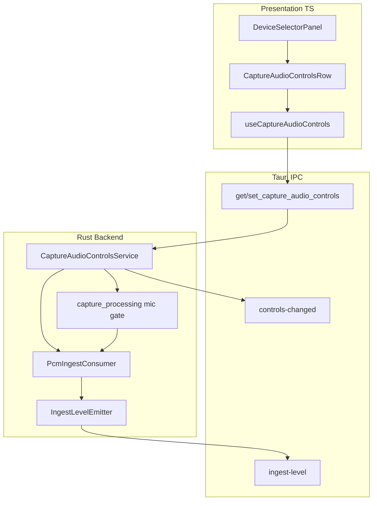
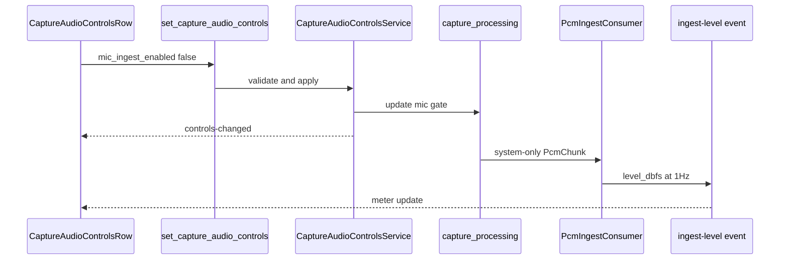

# 技術設計: capture-audio-controls

## Overview

会議利用者がキャプチャ設定 UI 上でマイク ingest の ON/OFF、転写 ingest 直前の dBFS レベル確認、手動ゲイン調整を行えるようにする。マイク OFF は OS ミュートではなく ingest ミックスからの除外であり、手動ゲイン未調整時は `transcribe-volume-normalize` と等価な ×1.25 + ソフトリミット 0.95 を維持する。

**ユーザー**: Web 会議中に相手音声のみを転写したい利用者、環境音量に合わせて推論入力レベルを調整したい利用者。

**影響**: `DeviceSelectorPanel` に横並び制御を追加し、`capture_processing` と `PcmIngestConsumer` をセッション制御可能にする。新 Tauri IPC 契約 `capture-audio-controls.md` を追加。

### Goals
- マイク ingest ON/OFF（スピーカー／システム音声のみ転写可能）
- ingest 直前 dBFS 表示（≥1 Hz、メタデータのみ）
- 手動ゲイン（−18〜−17 dBFS 目標の目視調整）
- デバイス再選択・キャプチャ再開との状態保持

### Non-Goals
- OS ミキサー・マイクミュートの代替
- キャプチャ段ミキサー（−20 dBFS）の変更
- 設定のディスク永続化、自動 AGC、生 PCM フロント配信

## Boundary Commitments

### This Spec Owns
- セッション内 `CaptureAudioControls` 状態（`mic_ingest_enabled`、`manual_ingest_gain`、`gain_user_adjusted`）
- キャプチャ processing 上のマイク ingest ゲート
- `PcmIngestConsumer` の動的 ingest ゲインと ingest 後 RMS 計測
- 1 Hz dBFS メーターイベントと制御 IPC
- `DeviceSelectorPanel` 内のトグル・メーター・ゲイン UI
- `TRANSCRIBE_INGEST_NO_AUDIO_SOURCE` エラー発火条件

### Out of Boundary
- マイク／スピーカーデバイス列挙・選択（`audio-device-selection`）
- PCM チャンク形状・ミキサー正規化アルゴリズム（`audio-capture`）
- Whisper 推論・バッチスケジュール（`whisper-transcribe`）
- OS レベル音量・ミュート

### Allowed Dependencies
- `audio-capture`: `CaptureOrchestrator`、`capture_processing`、`CapturePhase`
- `audio-device-selection`: `DeviceSelectorPanel` レイアウト領域、再キャプチャフロー
- `PcmChunkBus` / `PcmIngestConsumer`（presentation 結線）
- 契約: `capture-audio-controls.md`、`audio-capture-status.md`（エラー 1 件）、参照のみ `audio-capture-pcm.md`、`audio-device-selection.md`

### Revalidation Triggers
- `CaptureAudioControls` フィールド追加・意味変更
- ingest ゲイン適用位置の変更（ミキサー vs ingest）
- dBFS イベント payload 変更
- マイク OFF の意味域変更（OS ミュート化など）

## Architecture

### Existing Architecture Analysis
- 二重キャプチャ → `DefaultAudioMixer` → `PcmChunkBus` → `PcmIngestConsumer`（固定 ×1.25）→ rtrb → `TranscribeWorker`
- `DefaultAudioMixer` は単一トラックでも出力可能（`can_emit_at`）
- デバイス選択はセッション非永続の `DeviceSelectionStore` + Tauri IPC
- フロントは `useCaptureStatus` で phase 同期し、非 `capturing` 時 UI 無効化の先例あり

### Architecture Pattern & Boundary Map



**Architecture Integration**:
- パターン: セッション Store + Tauri command/event（`audio-device-selection` / `whisper-transcribe-settings` 踏襲）
- マイク除外はキャプチャ processing、ゲイン・メーターは ingest consumer
- ADR-0014 で `transcribe-volume-normalize` 固定定数をセッション乗数に置換

### Technology Stack

| Layer | Choice / Version | Role in Feature | Notes |
|-------|------------------|-----------------|-------|
| Frontend | React 19 + TypeScript strict | トグル・メーター・スライダー | `DeviceSelectorPanel` 拡張 |
| IPC | Tauri 2 invoke/event | 制御・dBFS メタデータ | 新 capability |
| Backend | Rust / gijirec-* crates | ゲート・ゲイン・集約 | bylaw 遵守 |
| Audio | 既存 PcmChunkBus / rtrb | ingest パス | 新依存なし |

## Persistent References

### Contracts
| Path | Mode | Notes |
|------|------|-------|
| docs/contracts/capture-audio-controls.md | modify | 新規作成済み — command / event / ゲイン制約 |
| docs/contracts/audio-capture-status.md | modify | `TRANSCRIBE_INGEST_NO_AUDIO_SOURCE` 追加 |
| docs/contracts/audio-device-selection.md | reference | UI 領域・再キャプチャパターン |
| docs/contracts/audio-capture-pcm.md | reference | PCM 形状不変 |

### Architecture
| Path | Mode | Notes |
|------|------|-------|
| docs/architecture/boundaries.md | modify | capture-audio-controls 境界節追加 |
| docs/architecture/adr/ADR-0014-capture-audio-controls-ingest-boundary.md | reference | ingest 境界判断 |

## File Structure Plan

### Directory Structure
```
src-tauri/crates/gijirec-domain/src/audio/
  capture_audio_controls.rs          # CaptureAudioControls 型・ゲイン制約定数

src-tauri/crates/gijirec-application/src/capture_audio_controls/
  mod.rs
  store.rs                           # セッション状態（Arc<Mutex>）
  service.rs                         # 検証・適用・ingest 源チェック

src-tauri/crates/gijirec-presentation/src/tauri/
  capture_audio_controls.rs          # command impl・イベント emit

src-tauri/crates/gijirec-presentation/src/transcribe/
  ingest_level_emitter.rs            # 1 Hz dBFS 集約・emit
  pcm_ingest_consumer.rs             # 動的ゲイン（modify）

src-tauri/src/
  capture_processing.rs              # mic_ingest_enabled ゲート（modify）
  compose.rs                         # store 結線（modify）
  commands.rs                        # #[tauri::command] 登録（modify）

src-tauri/permissions/
  allow-capture-audio-controls-commands.toml

src/infrastructure/tauri/
  captureAudioControlsCommands.ts

src/presentation/hooks/
  capture-audio-controls-types.ts
  useCaptureAudioControls.ts

src/presentation/components/
  CaptureAudioControlsRow.tsx        # トグル・メーター・スライダー
  DeviceSelectorPanel.tsx            # 横並び統合（modify）

src/presentation/
  App.css                            # flex 横並び（modify）
```

### Modified Files
- `pcm_ingest_consumer.rs` — 固定 `TRANSCRIBE_INGEST_GAIN` を `set_ingest_gain` に置換
- `capture_processing.rs` — `Arc<AtomicBool>` 等で mic ゲート
- `DeviceSelectorPanel.tsx` — `CaptureAudioControlsRow` 組み込み、phase で disabled
- `audio-capture-status` domain error mapping — 新コード追加

## System Flows



**フロー判断**: ゲイン変更は `PcmIngestConsumer` へ即時反映（次 chunk から）。mic OFF で system も無効なら `TRANSCRIBE_INGEST_NO_AUDIO_SOURCE` を emit。

## Requirements Traceability

| Requirement | Summary | Components | Interfaces | Flows |
|-------------|---------|------------|------------|-------|
| 1.1 | マイクトグル UI | D-CaptureAudioControlsRow | set_capture_audio_controls | 上記 sequence |
| 1.2 | OFF 時スピーカーのみ | D-CaptureProcessingGate | mic_ingest_enabled | capture_processing |
| 1.3 | ON 時二重ミックス | D-CaptureProcessingGate | 既定 true | 既存 mixer |
| 1.4 | 再起動不要 | D-CaptureAudioControlsService | 即時 apply | command |
| 1.5 | 音声源なしエラー | D-CaptureAudioControlsService | TRANSCRIBE_INGEST_NO_AUDIO_SOURCE | audio-capture error |
| 1.6 | 非キャプチャ時無効 | D-CaptureAudioControlsRow | useCaptureStatus | phase gate |
| 2.1 | dBFS 表示 | D-IngestLevelEmitter | ingest-level event | 1 Hz |
| 2.2 | ≥1 Hz 更新 | D-IngestLevelEmitter | 1 s 窓集約 | timer |
| 2.3 | dBFS ラベル | D-CaptureAudioControlsRow | UI ラベル「dBFS」 | — |
| 2.4 | 非供給時非活性 | D-CaptureAudioControlsRow | ingest_level null | — |
| 2.5 | 生 PCM 非配信 | D-IngestLevelEmitter | メタデータのみ | 契約 |
| 3.1 | ゲイン UI | D-CaptureAudioControlsRow | manual_ingest_gain | slider |
| 3.2 | 即時適用 | D-PcmIngestConsumer | set_ingest_gain | chunk path |
| 3.3 | メーターと整合 | D-PcmIngestConsumer | ゲイン後 RMS | 同一信号 |
| 3.4 | クリッピング防止 | D-CaptureAudioControlsService | 0.25–4.0 + soft limit | INVALID_GAIN / UI hint |
| 3.5 | 非キャプチャ無効 | D-CaptureAudioControlsRow | disabled | phase |
| 3.6 | 未調整時 1.25 | D-CaptureAudioControlsStore | gain_user_adjusted | 既定 |
| 4.1 | 同一パネル | D-DeviceSelectorPanel | レイアウト | — |
| 4.2 | 再開時保持 | D-CaptureAudioControlsStore | 非リセット | device restart |
| 4.3 | エラー時 UI 整合 | D-DeviceSelectorPanel | error panel 既存 | — |
| 4.4 | 仮想デバイス不要 | — | 変更なし | — |
| 4.5 | 横並び | D-DeviceSelectorPanel | CSS flex | — |
| 5.1 | バックプレッシャーなし | D-IngestLevelEmitter | 1 Hz のみ | bus 非追加 |
| 5.2 | レイアウトシフトなし | D-CaptureAudioControlsRow | 固定幅メーター | CSS |
| 5.3 | 段階的 degrade | D-IngestLevelEmitter | メーター低速化優先 | 転写継続 |

## Components and Interfaces

| Component | Anchor | Domain/Layer | Intent | Req Coverage | Key Dependencies | Contracts |
|-----------|--------|--------------|--------|--------------|------------------|-----------|
| CaptureAudioControlsService | D-CaptureAudioControlsService | application | 状態検証・適用 | 1.x, 3.x, 4.2 | Store, Orchestrator (P1) | Service |
| CaptureProcessingGate | D-CaptureProcessingGate | host/capture | mic push ゲート | 1.2, 1.3 | AudioMixer (P0) | — |
| PcmIngestConsumer | D-PcmIngestConsumer | presentation/transcribe | 動的ゲイン・RMS | 2.x, 3.x | PcmChunkBus (P0) | — |
| IngestLevelEmitter | D-IngestLevelEmitter | presentation/transcribe | 1 Hz dBFS emit | 2.x, 5.x | Tauri emit (P1) | Event |
| CaptureAudioControlsRow | D-CaptureAudioControlsRow | presentation UI | ユーザー操作 | 1.1, 2.x, 3.x, 4.x | useCaptureAudioControls (P0) | API |
| DeviceSelectorPanel | D-DeviceSelectorPanel | presentation UI | 統合レイアウト | 4.x | 既存 hooks (P0) | reference |

### Application / Rust

#### CaptureAudioControlsService {#D-CaptureAudioControlsService}

| Field | Detail |
|-------|--------|
| Intent | セッション制御の検証・適用・ingest 源妥当性 |
| Requirements | 1.4, 1.5, 3.2, 3.4, 3.6, 4.2 |

**Responsibilities & Constraints**
- `manual_ingest_gain` を 0.25–4.0 に clamp。NaN/Inf は `INVALID_GAIN`
- `gain_user_adjusted`: `manual_ingest_gain` 送信で true（明示 false でリセット可）
- 未調整時 `manual_ingest_gain = 1.25`
- mic OFF 後に system ingest 不可 → `TRANSCRIBE_INGEST_NO_AUDIO_SOURCE`
- デバイス再キャプチャ時 store をリセットしない
- 非 `capturing` 時もセッション store は更新し `controls-changed` を emit。`CaptureProcessingGate` / `PcmIngestConsumer` の live apply と `ingest-level` emit は `capturing` 時のみ（`audio-device-selection` の選択保持パターンと同型）

**Dependencies**
- Inbound: Tauri commands (P0)
- Outbound: `CaptureProcessingGate`, `PcmIngestConsumer`, `CaptureEventEmitter` (P0)

**Contracts**: Service [x] / API [ ] / Event [ ] / Batch [ ] / State [x]

##### Service Interface
```typescript
interface CaptureAudioControlsService {
  get_state(): CaptureAudioControlsState;
  apply_partial(update: Partial<CaptureAudioControls>): Result<CaptureAudioControlsState, CaptureAudioControlsError>;
}
```

**Implementation Notes**
- Integration: `compose.rs` で `Arc<CaptureAudioControlsService>` を processing と pcm_ingest に注入
- Validation: domain 定数 `MIN_INGEST_GAIN` / `MAX_INGEST_GAIN` / `DEFAULT_INGEST_GAIN`
- Risks: 再キャプチャ中の競合 — `Mutex` で単一 writer

#### CaptureProcessingGate {#D-CaptureProcessingGate}

| Field | Detail |
|-------|--------|
| Intent | `mic_ingest_enabled` が false のとき `push_mic` をスキップ |
| Requirements | 1.2, 1.3 |

**Contracts**: Service [ ] — `Arc<AtomicBool>` または store 参照を processing スレッドが読む

#### PcmIngestConsumer {#D-PcmIngestConsumer}

| Field | Detail |
|-------|--------|
| Intent | ingest 乗数適用 + ソフトリミット 0.95 + chunk RMS |
| Requirements | 2.1, 2.3, 3.2, 3.3, 3.6, 5.1 |

**Contracts**: Service [x]

```rust
// 概念 API（実装は Rust）
fn set_ingest_gain_multiplier(&self, gain: f32); // atomic, 0.25..4.0
fn ingest_gain_multiplier(&self) -> f32;
```

- `apply_gain(sample) = soft_limit(sample * multiplier)`
- 既存 `on_pcm_rms` を `IngestLevelEmitter` へ接続

#### IngestLevelEmitter {#D-IngestLevelEmitter}

| Field | Detail |
|-------|--------|
| Intent | 1 秒窓 RMS → dBFS → `capture-audio-controls://ingest-level` |
| Requirements | 2.2, 2.4, 2.5, 5.1, 5.3 |

- キャプチャ `capturing` かつ ingest 有効時のみ tick
- リソース圧迫時は emit 間隔を 2 s まで延長（転写は継続）
- ログに PCM 配列を出さない

### Presentation / UI

#### CaptureAudioControlsRow {#D-CaptureAudioControlsRow}

| Field | Detail |
|-------|--------|
| Intent | マイクトグル・dBFS メーター・ゲインスライダー |
| Requirements | 1.1, 1.6, 2.3, 2.4, 3.1, 3.4, 3.5, 4.5, 5.2 |

**Implementation Notes**
- `capturePhase !== 'capturing'` → 全 control `disabled` + メーター「—」
- スライダー range 0.25–4.0、step 0.05、中央付近 1.25
- 上下限到達時 `aria-live="polite"` で日本語ヒント
- メーター: 固定幅バー + 数値（例 `−18.2 dBFS`）

#### DeviceSelectorPanel {#D-DeviceSelectorPanel}

**Implementation Notes**
- `CaptureAudioControlsRow` をデバイス選択と同一 `<section>` 内に配置
- CSS: `.device-selector-panel { display: flex; flex-wrap: wrap; gap: 1rem; align-items: flex-end; }`
- 既存エラー表示（`CaptureErrorDisplay`）は維持（要件 4.3）

## Data Models

### Domain Model
- `CaptureAudioControls`: 3 フィールド（契約と一致）
- 不変条件: `0.25 ≤ manual_ingest_gain ≤ 4.0`；`mic_ingest_enabled` は bool

### Data Contracts & Integration
- 正本: `docs/contracts/capture-audio-controls.md`
- TS ミラー: `capture-audio-controls-types.ts`

## Error Handling

### Error Strategy
- invoke エラー: `INVALID_GAIN`、`INTERNAL`（契約表）
- 利用者向け: `TRANSCRIBE_INGEST_NO_AUDIO_SOURCE` → 既存 `error-panel`（`message_ja` / `action_ja`）
- 非キャプチャ時の操作は UI disabled（invoke 自体は許可、ingest へは未適用）

## Observability

- **Logging**: `capture_audio_controls_applied`（mic_enabled, gain, user_adjusted）— PCM・転写全文なし。PII/secret マスキング: デバイス名を出さない（`security.md` 準拠）
- **Metrics**: `ingest_level_emit_skipped_total`（非 capturing 時）、既存 `transcribe_window_rms_dbfs` は継続
- **Alerts**: N/A — ローカルデスクトップ、ページングなし
- **Debuggability**: gain / mic 状態は `get_capture_audio_controls` で再現。ingest 問題は `transcribe_pcm_ingest_*_rms_dbfs` ログと併用

## Testing Strategy

### Unit Tests
- `CaptureAudioControlsService`: gain clamp、gain_user_adjusted 遷移、既定 1.25
- `PcmIngestConsumer`: 動的ゲイン・ソフトリミット・既存 RMS テスト更新
- `IngestLevelEmitter`: 1 s 窓集約、dBFS 変換（−120 floor）
- `capture_processing`: mic gate ON/OFF で mixer 入力差分

### Integration Tests
- `set_capture_audio_controls` → `PcmIngestConsumer` ゲイン反映
- mic OFF + system 無効 → `TRANSCRIBE_INGEST_NO_AUDIO_SOURCE`
- デバイス再選択後も controls 保持
- 非 `capturing` 時の store 更新が次回 `capturing` 開始時に ingest へ反映されること

### E2E/UI Tests
- 非 capturing 時コントロール disabled
- capturing 中トグル・スライダー操作で invoke 呼び出し
- dBFS ラベル表示、メーター非活性表示

### Performance
- ingest-level 1 Hz が rtrb overflow を増加させない（既存統合テスト拡張）

## Operational Readiness

### Performance & Scalability
- メーター 1 Hz、chunk 100 ms でも集計のみ（要件 5.1）
- UI: メーター固定幅で layout shift 抑制（要件 5.2）

### Deployment & Rollout
- 単一リリース。feature flag なし
- Rollback: 契約コマンド未使用なら UI 非表示でも ingest 既定 1.25 で後方互換

### Migration
- N/A — 新 IPC・セッション状態のみ。永続化ファイルなし
- `transcribe-volume-normalize` 固定定数はコード削除し挙動は既定乗数 1.25 で継続

## Security Considerations

- 信頼モデルは `audio-device-selection` 同等（ローカル単一ユーザー、capability 許可リスト）
- presentation で gain 検証、フロントはメタデータのみ受信
- 生 PCM・転写全文をイベント／ログに含めない

### Threat model（STRIDE）

| # | Surface | Threat (STRIDE) | Impact | Mitigation |
| - | ------- | --------------- | ------ | ---------- |
| 1 | `set_capture_audio_controls` | Tampering (T) | 不正ゲインで転写品質劣化・クリッピング | presentation で 0.25–4.0 clamp、NaN/Inf → `INVALID_GAIN`、capability 許可リスト |
| 2 | `set_capture_audio_controls` | Elevation (E) | 他ユーザー権限の奪取 | N/A — ローカル単一ユーザー（要件スコープ境界） |
| 3 | `capture-audio-controls://ingest-level` | Information Disclosure (I) | 音声内容の漏洩 | dBFS メタデータのみ。生 PCM 非配信（要件 2 AC 5） |
| 4 | Observability ログ | Information Disclosure (I) | PCM・転写・デバイス名の漏洩 | `capture_audio_controls_applied` は mic/gain フラグのみ。`security.md` 準拠でデバイス名・PCM 配列を出さない |
| 5 | `set_capture_audio_controls` | Denial of Service (D) | 過大ゲイン・高頻度 invoke で CPU 負荷 | ゲイン上限 4.0 + ソフトリミット 0.95。メーター 1 Hz 集約。単一 writer `Mutex` |
