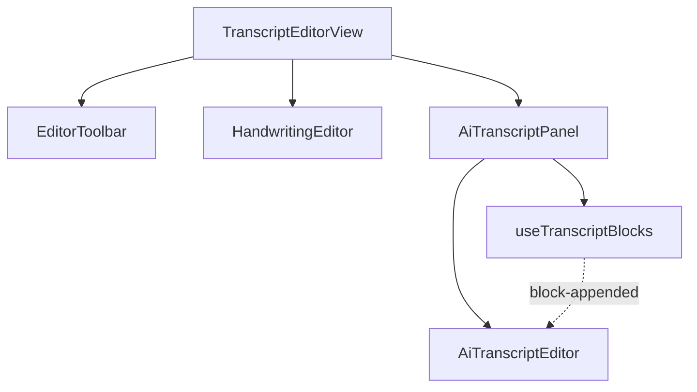
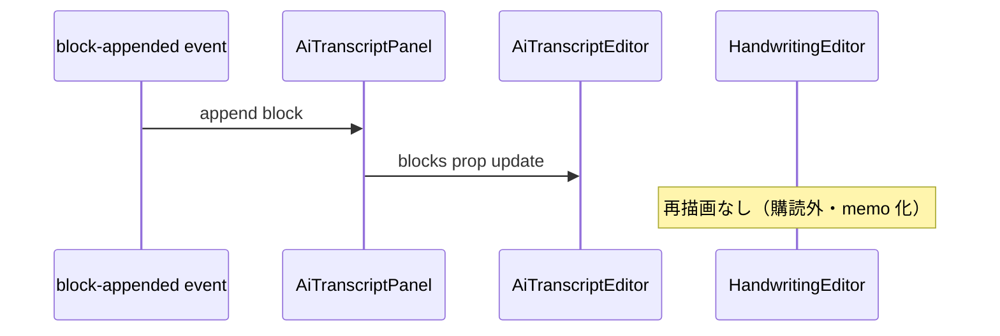

# 設計書: fix-handwriting-input

## Overview

本 feature は、二重エディタ画面の手入力エリア（HandwritingEditor）が AI 転写ブロック更新のたびに再描画され、日本語 IME 入力が不安定になる問題を修正する。

**目的**: 手入力エリアを AI 転写更新から独立させ、IME 変換中も入力内容を保持する安定した日本語入力体験を提供する。

**利用者**: Web 会議中にリアルタイム文字起こしと手書きメモを同時に行う利用者。

**影響**: `TranscriptEditorView` の再描画ツリーを分離し、`HandwritingEditor` の再描画抑止を追加する。IPC 契約・Rust バックエンドに変更なし。

### Goals

- AI 転写更新時に手入力 Slate が再描画されない
- 日本語 IME 変換中の文字列が保持される
- 既存の保存フロー・AI 転写表示を維持する

### Non-Goals

- AiTranscriptEditor の IME 問題修正
- Rust バックエンド変更
- 新 UI 機能、Linux 対応

## Boundary Commitments

### This Spec Owns

- 手入力エリアの再描画抑止と更新ツリー分離
- IME composition 中の入力保持ガード
- 回帰防止テスト（block 更新時の手入力保持）

### Out of Boundary

- AiTranscriptEditor の IME 挙動
- `whisper-transcribe://block-appended` イベント供給（上流）
- 保存コマンド・設定 IPC（transcript-editor 完了分）

### Allowed Dependencies

- 既存 `useTranscriptBlocks` hook
- 既存 `HandwritingEditor` / `AiTranscriptEditor` Slate 実装
- `whisper-transcribe-blocks` 契約（参照のみ、変更なし）

### Revalidation Triggers

- HandwritingEditor の公開 ref API（`getPlainText`）形状変更
- TranscriptEditorView の props 形状変更
- AI 転写ブロック購読の移動先変更

## Architecture

### Existing Architecture Analysis

- `TranscriptEditorView` が `useTranscriptBlocks` で block 購読し、`session.blocks` を `AiTranscriptEditor` に渡す
- `HandwritingEditor` は props なしで兄弟配置。親再描画に連動
- presentation 層のみの変更。dependency-cruiser 境界を維持

### Architecture Pattern & Boundary Map



**Architecture Integration**:
- Selected pattern: 購読局所化 + memo 化（Hybrid）
- Domain/feature boundaries: block 購読は AI サブツリー内に閉じる
- Existing patterns preserved: hooks ミラー、Slate エディタ分離
- New components rationale: `AiTranscriptPanel` で購読と AI エディタを束ね、親の state 更新を局所化
- Steering compliance: presentation 層のみ、IPC 経由の既存契約を維持

### Technology Stack

| Layer | Choice / Version | Role in Feature | Notes |
|-------|------------------|-----------------|-------|
| Frontend | React 19, TypeScript strict | 再描画分離・memo | 変更対象 |
| Editor | Slate.js + slate-react | IME composition ハンドラ | HandwritingEditor のみ |
| Events | `whisper-transcribe://block-appended` | AI ブロック供給 | 参照のみ |

## Persistent References

**No contract changes** — 純粋な presentation 層内部リファクタ。

### Contracts (authoritative outside this feature dir)

| Path | Mode | Notes |
|------|------|-------|
| docs/contracts/whisper-transcribe-blocks.md | reference | block 形状・イベント名（変更なし） |
| docs/contracts/transcript-editor-save.md | reference | 保存フロー（変更なし） |

### Architecture

| Path | Mode | Notes |
|------|------|-------|
| docs/architecture/boundaries.md | reference | presentation 層境界（変更なし） |

### ADRs

| Path | Status |
|------|--------|
| docs/architecture/adr/ADR-0005-transcript-editor-dual-editors.md | accepted |

## File Structure Plan

### Directory Structure

```
src/presentation/
├── components/
│   ├── HandwritingEditor.tsx      # memo + composition ガード追加
│   ├── AiTranscriptPanel.tsx      # 新規: block 購読 + AiTranscriptEditor ラッパー
│   ├── TranscriptEditorView.tsx   # 購読除去、Panel 配置、ref 安定化
│   ├── HandwritingEditor.test.tsx
│   └── TranscriptEditorView.test.tsx
```

### Modified Files

- `HandwritingEditor.tsx` — `React.memo` ラップ、composition 状態追跡（`onCompositionStart`/`End`）、composition 中の外部更新無視
- `AiTranscriptPanel.tsx`（新規）— `useTranscriptBlocks` 保持、`AiTranscriptEditor` に `blocks` を渡す
- `TranscriptEditorView.tsx` — `useTranscriptBlocks` 除去、`AiTranscriptPanel` 配置、`mergeRefs` を `useCallback` で安定化

## System Flows



## Components and Interfaces

| Component | Anchor | Domain/Layer | Intent | Req Coverage | Key Dependencies | Contracts |
|-----------|--------|--------------|--------|--------------|------------------|-----------|
| HandwritingEditor | D-HandwritingEditor | presentation | 手入力 Slate | 1, 2, 3 | Slate | — |
| AiTranscriptPanel | D-AiTranscriptPanel | presentation | block 購読局所化 | 1 | useTranscriptBlocks | whisper-transcribe-blocks |
| TranscriptEditorView | D-TranscriptEditorView | presentation | 二重エディタレイアウト | 1, 3 | Panel, HandwritingEditor | — |

### Presentation Layer

#### HandwritingEditor {#D-HandwritingEditor}

| Field | Detail |
|-------|--------|
| Intent | 手入力 Slate。AI 転写更新の影響を受けない |
| Requirements | 1.1, 1.2, 1.4, 2.1, 2.2, 2.3, 2.4, 3.1 |

**Responsibilities & Constraints**
- 独立 Slate インスタンスを保持
- `getPlainText()` ref API を維持
- composition 中は Slate 内容を外部更新から保護

**Implementation Notes**
- `memo(forwardRef(...))` でラップ
- `useRef<boolean>` で `isComposing` を追跡
- `Editable` に `onCompositionStart`/`onCompositionEnd` を追加

#### AiTranscriptPanel {#D-AiTranscriptPanel}

| Field | Detail |
|-------|--------|
| Intent | block 購読を AI サブツリー内に閉じる |
| Requirements | 1.1, 1.2, 1.3 |

**Responsibilities & Constraints**
- `useTranscriptBlocks` を内部で呼び出し
- `AiTranscriptEditor` に `blocks` を渡す
- 親 `TranscriptEditorView` の state を更新しない

#### TranscriptEditorView {#D-TranscriptEditorView}

| Field | Detail |
|-------|--------|
| Intent | ツールバー + 手入力 + AI パネルのレイアウト |
| Requirements | 1.3, 3.4 |

**Implementation Notes**
- `useTranscriptBlocks` を除去
- `mergeRefs` を `useCallback` でメモ化
- transcribe error 購読は維持（既存要件 9.3）

## Error Handling

### Error Strategy

本 feature は UI 再描画の修正であり、新規エラーパスは追加しない。

### Error Categories and Responses

**User Errors**: N/A — 既存の transcribe error 表示を維持

**System Errors**: N/A — IPC 変更なし

**Business Logic Errors**: N/A

## Observability

- **Logging**: N/A — ユーザー入力内容をログに出さない（PII マスキング不要、そもそもログ追加なし）
- **Metrics**: N/A — 内部 UI リファクタ
- **Alerts**: N/A
- **Debuggability**: 手入力保持の確認は既存 `data-testid="handwriting-editor"` とテストで検証

## Testing Strategy

### Unit Tests

1. HandwritingEditor: memo 化後も `getPlainText` が正しく動作する
2. HandwritingEditor: composition イベント発火中に Slate 内容が保持される
3. AiTranscriptPanel: block-appended イベントで AI エディタのみ更新される

### Integration Tests

1. TranscriptEditorView: block-appended 発火時に手入力テキストが変化しない
2. TranscriptEditorView: 複数 block 追加後も手入力内容が保持される
3. TranscriptEditorView: ツールバー・保存フローが既存動作を維持する

### E2E/UI Tests

N/A — 手動 IME 確認は `docs/manual/` チェックリストで実施（CI 対象外）

## Operational Readiness

### Performance & Scalability

- 手入力サブツリーの再描画削減により、block 追加時の不要な Slate reconciliation が減少
- N/A — 新規メトリクス不要

### Deployment & Rollout

- 通常リリース。feature flag 不要
- ロールバック: git revert で即時復旧可能

### Migration

N/A — データ・スキーマ変更なし
