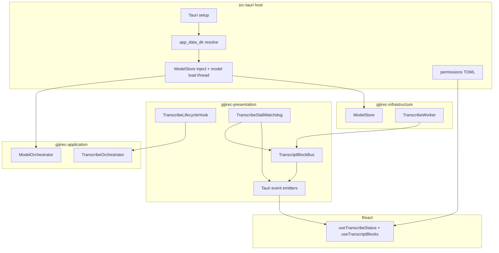
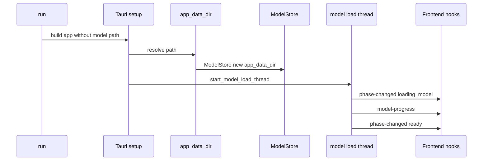
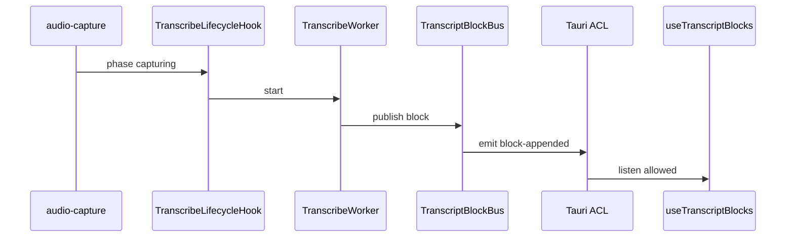

# 設計書: fix-release-transcribe

## Overview

gijirec の文字起こしパイプラインは開発モード（`cargo tauri dev`）で動作するが、リリースビルド（`cargo tauri build` の配布 EXE）では転写ブロックがエディタに届かず実用にならない。本設計は、既存 `whisper-transcribe` 実装をアルゴリズム変更なく維持し、**リリース固有の統合ギャップ**（モデル保存パス、Tauri イベント ACL、composition 起動順序）を修正して dev / release の動作等価性を回復する。

_Gap analysis: brownfield 完了（`research.md` 参照）。_

**Purpose**: 配布版でもリアルタイム文字起こしを利用可能にし、初回モデル取得から転写ブロック配信までを dev と同様に完了させる。

**Users**: エンドユーザー（配布 EXE 利用者）、開発者・運用者（`--log` による障害切り分け）。

**Impact**: ホスト crate の composition 順序変更、Tauri permission 1 件追加、転写停滞ウォッチドッグ追加。公開契約（イベント payload 形状）は変更しない。

### Goals

- リリース EXE でキャプチャ開始後、モデル利用可能時に `transcribing` へ遷移しタイムスタンプ付きブロックをエディタへ配信する（要件 1）
- モデル取得・検証を Tauri `app_data_dir` 基準で完結させる（要件 2、ADR-0008）
- 既存 transcribe ステータス UI と同一イベントでフェーズ・進捗を表示する（要件 3）
- 失敗時は `message_ja` / `action_ja` で通知し、サイレント停止を防ぐ（要件 4）
- `whisper-transcribe` の追記供給・遅延目標・エラー契約を維持する（要件 5）

### Non-Goals

- whisper アルゴリズム・デフォルトモデル・言語設定の変更
- Linux 対応、新モデル、クラウド STT
- release-logging のログ形式・CLI 変更
- フロントエンド UI の新規画面追加

## Boundary Commitments

### This Spec Owns

- リリースビルドでの転写パイプライン **統合** の動作回復（パス・ACL・起動順序）
- `ModelStore` 初期化タイミングと `app_data_dir` 正本化（ADR-0008）
- `whisper-transcribe://block-appended` の Tauri ACL 登録
- 転写停滞（`transcribing` かつブロック無し）の利用者向け検知
- リリース向け検証手順（clean build + `--log` 相関）

### Out of Boundary

- PCM キャプチャ・ミキシング（audio-capture）
- Whisper 推論ロジック・VAD パラメータ（whisper-transcribe infrastructure）
- ログファイル永続化 subscriber（release-logging）
- エディタ編集・保存 UI（transcript-editor — 購読側は変更最小）

### Allowed Dependencies

- **上流実装**: `gijirec-*` transcribe モジュール群（既存 ports / orchestrator）
- **上流 spec**: `whisper-transcribe`（フェーズ・ブロック契約の正本）、`release-logging`（診断手順）
- **契約**: `whisper-transcribe-blocks.md`, `whisper-transcribe-status.md`, `release-logging-persistence.md`（参照）
- **Tauri 2**: `app.path().app_data_dir()`, capabilities / permissions
- **診断**: `gijirec.exe --log` + `operations.md` 収集手順

### Revalidation Triggers

- Tauri identifier または `app_data_dir` API 変更 → ADR-0008 再検証
- `whisper-transcribe://block-appended` payload 変更 → transcript-editor 同期
- capabilities / permissions スキーマ変更 → `event_permissions.rs` 更新
- whisper-transcribe 遅延目標（5 秒）変更 → ウォッチドッグ閾値再調整

## Architecture

### Existing Architecture Analysis

- **パターン**: whisper-transcribe のレイヤード・ヘキサゴナル構成は維持。不具合はドメインロジックではなく **ホスト composition** と **ACL** に集中。
- **現状ギャップ**:
  1. `build_capture_stack()` が `dirs::data_local_dir()/gijirec` で `ModelStore` を構築（`compose.rs` L51–53）
  2. Tauri setup は `app.path().app_data_dir()` を editor / logging で使用（`lib.rs`）
  3. `allow-listen-transcribe-events.toml` に `block-appended` 未登録
  4. `transcribing` 固定のサイレント失敗に対する利用者通知なし
- **維持**: orchestrator / worker / block bus / observability の責務分割と契約イベント名

### Architecture Pattern & Boundary Map

**Selected pattern**: 既存レイヤード構成の **統合修正**（新規ドメイン層なし）。ホスト setup で依存注入を完了させ、presentation で停滞監視のみ追加。



**Architecture Integration**:

- **Domain boundaries**: 推論・ブロック生成は既存 crate。本 spec はホスト wiring + ACL + 停滞検知のみ
- **Preserved patterns**: ports & adapters、trait observability、bylaw
- **New components**: `TranscribeStallWatchdog`（単一責務: ブロック供給停滞の利用者通知）
- **Steering compliance**: レイヤ依存方向は `docs/steering/tech.md` / `structure.md` と cargo bylaw に整合。転写パイプライン詳細は whisper-transcribe 設計を正本とする

### Technology Stack

| Layer | Choice / Version | Role in Feature | Notes |
|-------|------------------|-----------------|-------|
| Desktop Shell | Tauri 2 | `app_data_dir`、ACL、イベント IPC | ADR-0008 |
| Backend | Rust edition 2024 | composition 順序修正 | 既存 workspace |
| STT | whisper-cpp-plus 0.1（ADR-0003） | 変更なし | release リンク smoke 検証 |
| Frontend | React 19 + Tauri event API | `listen` 購読 | ACL 必須 |
| 診断 | release-logging `--log` | phase / error 相関 | 契約参照のみ |

## Persistent References

**No contract changes** — 既存契約のイベント形状・エラーコードをそのまま使用。実装はパリティ回復のみ。

### Contracts (authoritative outside this feature dir)
| Path | Mode | Notes |
|------|------|-------|
| docs/contracts/whisper-transcribe-blocks.md | reference | `block-appended` — ACL 追加のみ、payload 不変 |
| docs/contracts/whisper-transcribe-status.md | reference | フェーズ・エラー — 不変 |
| docs/contracts/release-logging-persistence.md | reference | 診断ログ収集手順の正本 |

### Architecture
| Path | Mode | Notes |
|------|------|-------|
| docs/architecture/boundaries.md | modify | fix-release-transcribe 境界セクション追加 |
| docs/architecture/adr/ADR-0008-model-store-app-data-dir.md | modify | 新規 Accepted |

### ADRs
| Path | Status |
|------|--------|
| docs/architecture/adr/ADR-0008-model-store-app-data-dir.md | Accepted |
| docs/architecture/adr/ADR-0003-whisper-cpp-plus-streaming.md | Accepted |
| docs/architecture/adr/ADR-0004-whisper-model-kotoba.md | Accepted |
| docs/architecture/adr/ADR-0007-release-file-logging.md | Accepted |

## File Structure Plan

### Directory Structure

```
src-tauri/
├── src/
│   ├── lib.rs                    # setup 内で app_data_dir 注入後にモデルロード開始
│   └── compose.rs                # ModelStore を setup 後注入可能な構成に分割
├── permissions/
│   └── allow-listen-transcribe-events.toml  # block-appended 追加
├── capabilities/default.json     # 変更なし（permission identifier 参照済み）
└── tests/event_permissions.rs    # 既存 gate — block-appended 含む

src-tauri/crates/gijirec-presentation/src/transcribe/
├── stall_watchdog.rs             # 新規: 転写停滞検知
└── mod.rs                        # stall_watchdog export

src-tauri/crates/gijirec-presentation/src/tauri/
└── lifecycle.rs                  # 既存 TranscribeLifecycleHook — ウォッチドッグ start/stop 連動（最小変更）

src-tauri/crates/gijirec-infrastructure/src/transcribe/
└── model_store.rs                # 変更なし（base_data_dir 注入 API 既存）
```

### Modified Files

- `src-tauri/src/compose.rs` — `build_capture_stack()` から `dirs::data_local_dir` 依存を除去。`TranscribeComposeConfig.app_data_dir` を setup から渡す。モデル未初期化状態で capture のみ構築し、setup 後に `ModelOrchestrator` を構成
- `src-tauri/src/lib.rs` — `app_data_dir` 取得後に `ModelStore` / モデルロードスレッドを開始。既存 `start_model_load_thread` の呼び出し位置を setup 内の注入後に限定
- `src-tauri/permissions/allow-listen-transcribe-events.toml` — `whisper-transcribe://block-appended` を `[[permission.event.allow]]` に追加
- `src-tauri/crates/gijirec-presentation/src/transcribe/stall_watchdog.rs` — 新規
- `src-tauri/crates/gijirec-presentation/src/tauri/lifecycle.rs` — capture transcribing 時にウォッチドッグ起動
- `src-tauri/crates/gijirec-presentation/src/transcribe/mod.rs` — export 追加

## System Flows

### リリース起動 → モデル準備（修正後）



### キャプチャ → ブロック配信（ACL 修正後）



## Requirements Traceability

| Requirement | Summary | Components | Interfaces | Flows |
|-------------|---------|------------|------------|-------|
| 1.1 | リリースで transcribing + ブロック配信 | D-TranscribeLifecycleHook, D-TranscriptBlockBus, ACL | block-appended | キャプチャ→ブロック |
| 1.2 | 遅延ウィンドウ内の追記 | D-TranscribeWorker | 既存 VAD ウィンドウ | — |
| 1.3 | 停止後 ready、ブロック保持 | D-TranscribeOrchestrator | phase gate | ライフサイクル |
| 1.4 | オフライン転写 | D-ModelStore | ローカルパス | — |
| 2.1 | 初回モデル DL + 進捗 | D-ModelOrchestrator | model-progress | 起動フロー |
| 2.2 | 取得成功で ready | D-ModelOrchestrator | phase-changed | 起動フロー |
| 2.3 | 取得失敗で error + 通知 | D-TranscribeEventEmitter | whisper-transcribe://error | — |
| 2.4 | コンソール不要 | D-TranscribeEventEmitter | Tauri events | — |
| 3.1 | フェーズ UI 更新 | D-TauriTranscribeEventEmitter | phase-changed | — |
| 3.2 | DL 進捗表示 | D-TauriTranscribeEventEmitter | model-progress | — |
| 3.3 | transcribing 表示 | D-TauriTranscribeEventEmitter | phase-changed | — |
| 4.1 | 失敗時 message_ja / action_ja | D-TranscribeEventEmitter | error contract | — |
| 4.2 | モデル失敗で error 通知 | D-ModelOrchestrator | MODEL_* codes | — |
| 4.3 | サイレント停止防止 | D-TranscribeStallWatchdog | INFERENCE_FAILED | 停滞検知 |
| 4.4 | release ログに phase / error | 既存 observability | release-logging 契約 | `--log` |
| 5.1 | 追記供給維持 | D-TranscriptBlockBus | blocks contract | — |
| 5.2 | アルゴリズム不変 | — | 境界 | — |
| 5.3 | dev / release 等価動作 | 統合修正全体 | パリティ | 全フロー |
| 5.4 | Linux / 新モデルなし | — | 境界 | — |

## Components and Interfaces

| Component | Anchor | Domain/Layer | Intent | Req Coverage | Key Dependencies | Contracts |
|-----------|--------|--------------|--------|--------------|------------------|-----------|
| ReleaseComposeRoot | D-ReleaseComposeRoot | host | setup 後 app_data_dir 注入 | 2.1–2.4, 5.3 | Tauri path (P0) | — |
| TranscribeAclGate | D-TranscribeAclGate | host | block-appended listen 許可 | 1.1, 3.1 | permissions TOML (P0) | Event |
| TranscribeStallWatchdog | D-TranscribeStallWatchdog | presentation | ブロック停滞検知 | 4.3 | BlockBus, Emitter (P1) | Event |
| TranscribeLifecycleHook | D-TranscribeLifecycleHook | presentation | 既存キャプチャ連動 | 1.1, 1.3, 5.3 | Orchestrator (P0) | — |
| ModelStore | D-ModelStore | infrastructure | app_data_dir 基準パス | 2.1–2.4 | ADR-0008 (P0) | — |
| TranscriptBlockBus | D-TranscriptBlockBus | presentation | ブロック emit | 1.1, 5.1 | Tauri emit (P0) | Event |

### host

#### ReleaseComposeRoot {#D-ReleaseComposeRoot}

| Field | Detail |
|-------|--------|
| Intent | Tauri `app_data_dir` 解決後に `ModelStore` / `ModelOrchestrator` を構成しモデルロードを開始する |
| Requirements | 2.1, 2.2, 2.3, 2.4, 5.3 |

**Responsibilities & Constraints**

- `run()` 冒頭の `build_capture_stack()` は capture + transcribe wiring のみ構築。`ModelStore` はプレースホルダまたは deferred
- setup 内で `app.path().app_data_dir()` を取得し `compose::inject_model_stack(app_data_dir, ...)` を呼ぶ
- 既存 `start_model_load_thread` は注入完了後に一度だけ起動

**Dependencies**

- Outbound: `ModelStore`, `ModelOrchestrator` (P0)
- External: Tauri `app.path()` (P0)

**Contracts**: Service [ ]

**Implementation Notes**

- Integration: editor `SettingsService` と同一 `app_data_dir` を渡す
- Validation: unit test で compose が `dirs::data_local_dir` を参照しないことを assert
- Risks: 旧 Local パスへのモデル — 初回のみ `ModelNotFound` → 再 DL（移行は optional task）

#### TranscribeAclGate {#D-TranscribeAclGate}

| Field | Detail |
|-------|--------|
| Intent | フロント `listen("whisper-transcribe://block-appended")` を release で許可 |
| Requirements | 1.1, 3.1, 5.1 |

**Responsibilities & Constraints**

- `permissions/allow-listen-transcribe-events.toml` にイベント行を追加
- `capabilities/default.json` は既に `allow-listen-transcribe-events` を参照 — 変更不要
- `event_permissions.rs` が CI gate

**Contracts**: Event [x]

##### Event Contract

- **追加許可イベント**: `whisper-transcribe://block-appended`（payload は `whisper-transcribe-blocks.md` 正本）

### presentation

#### TranscribeStallWatchdog {#D-TranscribeStallWatchdog}

| Field | Detail |
|-------|--------|
| Intent | capture active + transcribing 中にブロック未供給が続く場合、利用者へ失敗を通知 |
| Requirements | 4.3 |

**Responsibilities & Constraints**

- 閾値: **8 秒**（whisper-transcribe 5 秒遅延目標 + 3 秒マージン）
- **入力あり判定**: `capturing` かつ直近 PCM チャンクの RMS が無音閾値超過（既存 VAD 閾値を再利用）、または worker が直近ウィンドウで推論を試行した observability を満たすこと。純粋な無音区間（VAD 無出力）は発火しない（要件 4.3 の「continuous audible input」と整合）
- 最終 `block-appended` または worker inference 成功 observability を監視
- 発火時: `TranscribeError::InferenceFailed`（`INFERENCE_FAILED`）を `whisper-transcribe://error` で emitし、orchestrator 経由で phase を **`error`** に遷移（`whisper-transcribe-status` 契約に準拠）

**Dependencies**

- Inbound: `TranscriptBlockBus` publish callback (P1)
- Outbound: `TranscribeEventEmitter` (P1)

**Contracts**: Event [x]

**Implementation Notes**

- Validation: unit test で閾値超過時に error emit を検証
- Risks: RMS 閾値が環境ノイズで常時超過する場合の誤検知 — 既存 VAD 閾値再利用と observability 併用で軽減。調整は実装タスクで統合テストと release smoke で検証

## Error Handling

### Error Strategy

| カテゴリ | 条件 | 応答 |
|---------|------|------|
| モデルパス不在 | `app_data_dir` 解決失敗 | setup エラー + `INTERNAL` ユーザー通知 |
| モデル取得失敗 | 既存 `MODEL_DOWNLOAD_FAILED` | 契約どおり `error` phase |
| ACL 拒否 | release で listen 失敗 | フロント console error — 修正後は permission で防止 |
| 転写停滞 | 4.3 条件成立 | `INFERENCE_FAILED` + `action_ja` で再起動・再取得を案内 |

## Observability

- **Logging**: 既存 `gijirec_transcribe` target を維持。`transcribe_phase` / `error_code` / `session_id` を phase 遷移・エラー・停滞検知時に記録。転写全文・PCM・デバイス表示名は **記録禁止**（release-logging 契約）
- **Metrics**: 既存 `log_inference_latency`, `log_block_buffer_drop` を継続。停滞検知時に `transcribe_stall_detected=true` を 1 回 emit（新規フィールド、契約外の diagnostic）
- **Alerts**: N/A — ローカルデスクトップ。利用者向けは UI error イベント
- **Debuggability**: 障害時 `gijirec.exe --log` で `{app_data_dir}/logs/sessions/.../gijirec.log` を収集。phase 遷移系列と `error_code` でモデル / worker / ACL を切り分け

## Testing Strategy

### Unit Tests

1. `compose` が `dirs::data_local_dir` を使用しないこと
2. `event_permissions.rs` — `block-appended` が permission TOML に存在
3. `TranscribeStallWatchdog` — 閾値超過で error emit
4. `ModelStore::model_path` が注入した `app_data_dir/models/` を返すこと

### Integration Tests

1. 既存 `transcribe_integration.rs` — deferred model inject 後も ready → transcribing 遷移
2. setup 順序 mock — `app_data_dir` 注入前に model load が走らないこと
3. `TranscriptBlockBus` + RecordingEmitter — block publish が emit されること（既存テスト維持）

### E2E / Release Smoke（手動 + CI optional ignore）

1. clean `gen` + `cargo tauri build` 後、EXE を `--log` 起動
2. モデル DL 完了 → `ready` をログと UI で確認（2.1, 2.2, 3.2）
3. キャプチャ開始 → 5 秒以内に `block-appended` でエディタ追記（1.1, 1.2, 3.3）
4. キャプチャ停止 → `ready`、既存ブロック保持（1.3）
5. オフラインで転写継続（1.4）

### Performance/Load

- N/A — 本修正は統合ギャップ修正。既存 whisper-transcribe 性能計画を維持

## Operational Readiness

### Performance & Scalability

- N/A — 推論性能変更なし。モデル再 DL は初回のみの一回限りコスト

### Deployment & Rollout

- 通常リリースビルドで配布。feature flag 不要
- Rollback: 前バージョン EXE に戻す。`app_data_dir` モデルは新パスに残存し害なし

### Migration

- 旧 `%LOCALAPPDATA%\gijirec\models\` にモデルがある場合:
  - **推奨**: 初回 setup で Roaming 側へコピー（存在時のみ）。失敗時は再 DL
  - 移行失敗は `MODEL_NOT_FOUND` → 既存 DL フローで回復
- 検証: 移行後 `verify` が成功し `ready` へ遷移すること

## Security Considerations

- モデルファイルはユーザーの `app_data_dir` にのみ保存。外部送信なし（既存要件 5.2 維持）
- ACL は最小追加（`block-appended` の listen のみ）。他イベント権限は変更しない
- ログは release-logging 禁止フィールドを遵守（4.4）
