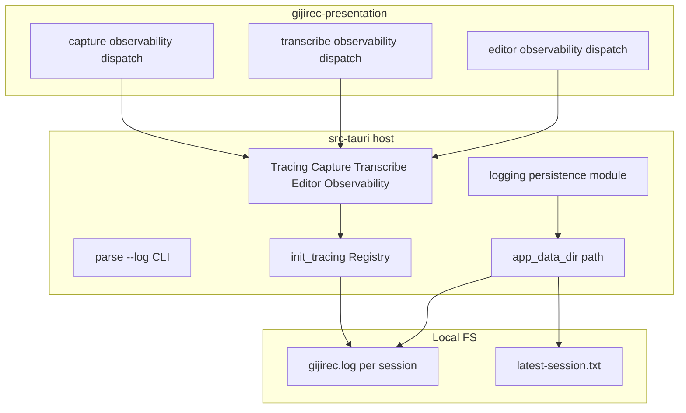
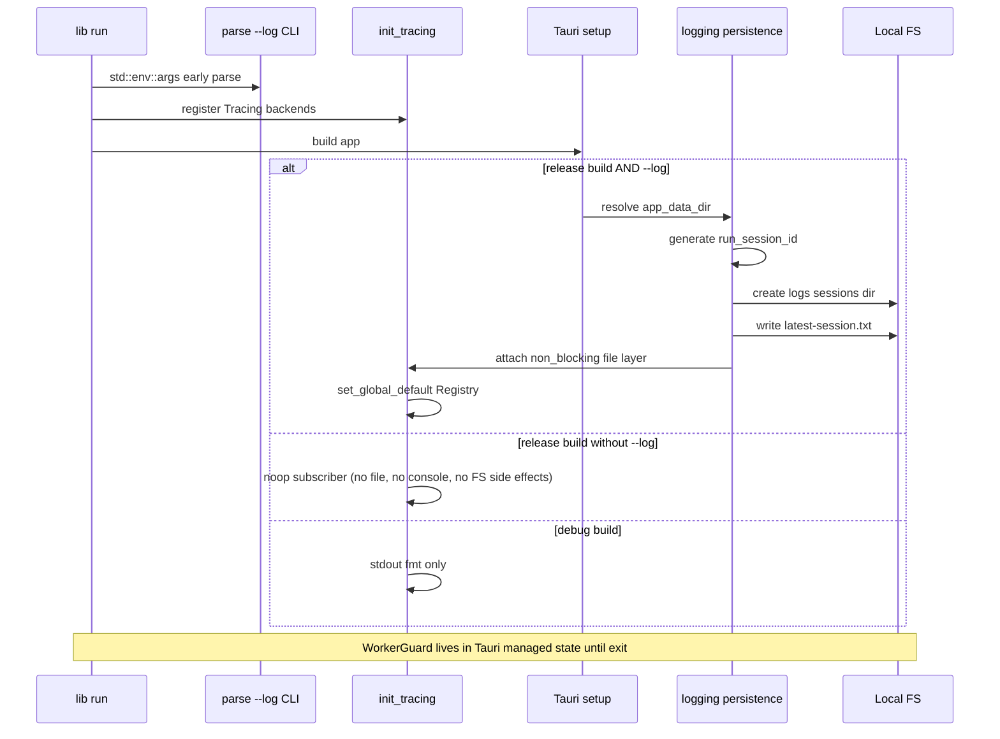

# 設計書: release-logging

## Overview

gijirec は開発モードでは `tracing` コンソール出力によりキャプチャ・文字起こし・エディタの observability を確認できるが、リリースビルドではコンソールが無く障害調査ができない。本設計は、**既存 observability イベントを変更せず**、ホスト crate の tracing subscriber に release 専用ファイルレイヤを追加し、**`--log` CLI オプション指定時のみ**ローカル診断ログを永続化する。オプション未指定の通常起動ではログを出力しない。

**利用者**: 開発者・運用者が障害調査時に `gijirec.exe --log`（等）で起動し、`fix-release-transcribe` 等の downstream 調査でログファイルを参照する。

**影響**: `init_tracing()` の初期化順序と構成が変わる。presentation / domain の observability trait は不変。

_Gap analysis: brownfield 完了（`research.md` 参照）。_

### Goals

- リリースビルドで **`--log` CLI オプション指定時のみ** observability イベントを `{app_data_dir}` 配下のファイルに永続化する
- オプション未指定の通常起動ではログファイルを作成せず、コンソールにも出力しない
- セッション単位でログを識別し、運用者が収集手順に従って取得できる
- 既存マスキング（PCM・全文・デバイス表示名の除外）を永続化時も維持する

### Non-Goals

- クラウドログ送信、APM、in-app ログ UI
- ログローテーション / 保持期間ポリシー（初版）
- observability イベント形状の変更や新規ドメインログの追加

## Boundary Commitments

### This Spec Owns

- ホスト crate の tracing subscriber 構成（release ファイルレイヤ、EnvFilter、WorkerGuard 寿命）
- **`--log` CLI オプションの解析**と release ログ有効化フラグ
- ログディレクトリ作成、`run_session_id` 生成、`latest-session.txt` 更新（`--log` 時のみ）
- 永続化失敗時の非ブロッキング degrade と diagnostic surface
- 運用者向け収集手順（`operations.md`）

### Out of Boundary

- capture / transcribe / editor の observability イベント定義とマスキング実装
- Tauri IPC によるログ閲覧 API
- フロントエンド変更

### Allowed Dependencies

- `tracing`, `tracing-subscriber`, `tracing-appender`（`src-tauri` ホストのみ）
- Tauri `app.path().app_data_dir()`
- 既存 `set_observability` / `set_transcribe_observability` / `set_editor_observability` 登録フロー

### Revalidation Triggers

- observability イベントフィールドの破壊的変更
- 禁止フィールド方針（契約 `release-logging-persistence.md`）の変更
- `app_data_dir` 解決タイミングまたは subscriber init 順序の変更
- release / debug 判定条件または **CLI オプション名・意味**の変更

## Architecture

### Existing Architecture Analysis

- **パターン**: presentation は trait ディスパッチ（tracing マクロ禁止）、ホスト crate が `Tracing*Observability` で `tracing` emit。
- **現状ギャップ**: `init_tracing()` が stdout のみ。release 向け writer なし。CLI オプションによる opt-in も未実装。
- **維持**: 3 ドメイン observability モジュールとマスキングテストは変更しない。

### Architecture Pattern & Boundary Map



**Architecture Integration**:

- **Selected pattern**: Subscriber レイヤ拡張（Registry + conditional fmt layer）
- **Domain boundaries**: ファイル I/O はホスト `logging/` のみ。presentation は従来どおり dispatch のみ
- **Preserved patterns**: trait injection、bylaw、EnvFilter デフォルト
- **New components**: `ReleaseLogPersistence`（パス解決 + appender + guard 保持）
- **Steering compliance**: レイヤ依存方向維持、オフライン・ローカル完結

### Technology Stack

| Layer | Choice / Version | Role in Feature | Notes |
|-------|------------------|-----------------|-------|
| Backend / Host | `tracing-subscriber` 0.3 | Registry、EnvFilter、fmt layer | 既存依存を拡張 |
| Backend / Host | `tracing-appender` 0.2 | non-blocking file writer、WorkerGuard | 新規追加 |
| Runtime | Tauri 2 `app_data_dir` | ログルート解決 | editor-settings と同領域 |
| Storage | Local FS | セッション別 `gijirec.log` | ネットワーク不使用 |

## Persistent References

### Contracts (authoritative outside this feature dir)

| Path | Mode | Notes |
|------|------|-------|
| `docs/contracts/release-logging-persistence.md` | modify | 初版作成済み — 保存場所・禁止フィールド・ビルドモード |

### Architecture

| Path | Mode | Notes |
|------|------|-------|
| `docs/architecture/boundaries.md` | modify | release-logging 境界セクション追加済み |
| `docs/architecture/adr/ADR-0007-release-file-logging.md` | modify | 初版 Accepted |

## File Structure Plan

### Directory Structure

```
src-tauri/
├── Cargo.toml                          # tracing-appender 依存追加
├── src/
│   ├── lib.rs                          # init_tracing 順序変更、LogGuardState manage、CLI 解析
│   ├── logging/
│   │   ├── mod.rs                      # 公開 API: init_release_log_layer, run_session_id, ReleaseLogConfig
│   │   ├── cli.rs                      # --log オプション解析
│   │   └── persistence.rs              # パス解決、appender 構築、失敗処理、latest-session.txt
│   ├── capture_observability.rs          # 変更なし（参照のみ）
│   ├── transcribe_observability.rs       # 変更なし
│   └── editor_observability.rs           # 変更なし
docs/specs/release-logging/
├── operations.md                         # 運用者向け収集手順（Req 2.1）
└── research.md                           # ギャップ分析 + discovery
```

### Modified Files

- `src-tauri/Cargo.toml` — `tracing-appender = "0.2"` 追加
- `src-tauri/src/lib.rs` — `init_tracing(ReleaseLogConfig)` 化、release + `--log` 時のみ file layer、`WorkerGuard` を Tauri state 保持
- `src-tauri/src/logging/cli.rs` — **新規** — `--log` フラグ解析
- `src-tauri/src/logging/mod.rs` — **新規** — モジュール境界
- `src-tauri/src/logging/persistence.rs` — **新規** — ファイル永続化実装
- `docs/contracts/README.md` — 契約 index 更新済み
- `docs/architecture/adr/README.md` — ADR-0007 登録済み
- `docs/architecture/boundaries.md` — release-logging 境界追加済み

## System Flows

### 起動時 subscriber 初期化（release）



**Flow decisions**:

- `std::env::args()` を `run()` 入口で解析し、`--log` の有無を `ReleaseLogConfig` に保持する。
- `app_data_dir` 解決後に file layer を構築（setup 内）。**release + `--log` のみ** file layer を付与。
- release で `--log` なし: subscriber はイベントを破棄（ファイル・コンソールとも出力なし）。`logs/` ディレクトリ・`latest-session.txt` も作成しない（Req 1.2・要件 2 の条件付き AC と整合）。observability trait 登録は維持しアプリ動作は変えない。
- debug ビルドは file layer をスキップし stdout のみ（現行同等）。
- ディレクトリ / appender 失敗時: WARN 1 回 + stderr diagnostic、subscriber は出力なし（release + `--log` 失敗時）または stdout-only（debug）で継続。

## Requirements Traceability

| Requirement | Summary | Components | Interfaces | Flows |
|-------------|---------|------------|------------|-------|
| 1.1 | release + `--log` で永続化 | D-ReleaseLogCli, D-ReleaseLogPersistence, D-TracingInit | `--log` | 起動シーケンス |
| 1.2 | release オプションなしは出力なし | D-ReleaseLogCli, D-TracingInit | noop subscriber | 起動シーケンス |
| 1.3 | release + `--log` で同一カテゴリ | D-TracingInit | 既存 Tracing* backends | — |
| 1.4 | dev はファイル不要 | D-TracingInit | stdout only | 起動シーケンス |
| 1.5 | 永続化失敗も継続 | D-ReleaseLogPersistence | WARN + diagnostic | 失敗分岐 |
| 2.1 | 運用ドキュメント | operations.md | — | — |
| 2.2 | app_data_dir 配下 | D-ReleaseLogPersistence | 契約パス | — |
| 2.3 | セッション識別 | D-ReleaseLogPersistence | run_session_id | — |
| 2.4 | 最低 1 ログファイル | D-ReleaseLogPersistence | gijirec.log | — |
| 3.1 | capture phase / error | 既存 TracingCaptureObservability | gijirec_capture target | — |
| 3.2 | transcribe phase / error / correlation | 既存 TracingTranscribeObservability | session_id フィールド | — |
| 3.3 | editor save outcome | 既存 TracingEditorObservability | 長さ・success のみ | — |
| 3.4 | buffer drop / gap / latency | 既存 3 backends | WARN/INFO metrics | — |
| 3.5 | デフォルト info 以上 | D-TracingInit | EnvFilter デフォルト | — |
| 4.1 | PCM / 全文 / デバイス名禁止 | 契約 + 既存 observability | 禁止フィールド表 | — |
| 4.2 | 開発同等マスキング | 既存 observability | subscriber は転写のみ | — |
| 4.3 | 診断フィールドのみ | 既存 observability | — | — |
| 4.4 | ローカル完結 | D-ReleaseLogPersistence | ネットワーク不使用 | — |
| 4.5 | 外部送信禁止 | Out of Boundary | — | — |

## Components and Interfaces

| Component | Anchor | Domain/Layer | Intent | Req Coverage | Key Dependencies (P0/P1) | Contracts |
|-----------|--------|--------------|--------|--------------|--------------------------|-----------|
| ReleaseLogCli | D-ReleaseLogCli | Host / logging | `--log` オプション解析 | 1.1, 1.2 | std::env::args (P0) | — |
| ReleaseLogPersistence | D-ReleaseLogPersistence | Host / logging | セッションログファイル作成・パス管理 | 1.1, 1.5, 2.2–2.4, 4.4 | Tauri app_data_dir (P0), tracing-appender (P0) | Data ownership |
| TracingInit | D-TracingInit | Host / lib.rs | Registry 構成・release/dev/CLI 分岐 | 1.1–1.5, 3.5 | Tracing* backends (P0), ReleaseLogCli (P0), ReleaseLogPersistence (P0) | — |
| OperationsDoc | D-OperationsDoc | Docs | 収集手順・CLI オプション説明 | 2.1 | 契約 (P1) | — |

### Host / Logging

#### ReleaseLogCli {#D-ReleaseLogCli}

| Field | Detail |
|-------|--------|
| Intent | 起動時 CLI 引数から release ログ有効化を判定する |
| Requirements | 1.1, 1.2 |

**Responsibilities & Constraints**

- `std::env::args()` を `run()` 入口で解析
- **`--log`**: release ビルドでファイル永続化を有効化（契約・operations 文書の正本オプション名）
- 未知オプションは無視（将来 Tauri CLI 拡張との共存を想定）
- debug ビルドでは `--log` を無視し stdout のみ（Req 1.4）

**Implementation Notes**

- Integration: `ReleaseLogConfig { file_logging_enabled: bool }` を `init_tracing` / setup に渡す
- Validation: unit test で `--log` あり/なし、debug/release cfg の組み合わせ

#### ReleaseLogPersistence {#D-ReleaseLogPersistence}

| Field | Detail |
|-------|--------|
| Intent | release ビルドのセッション別ログファイルと latest-session ポインタを管理する |
| Requirements | 1.1, 1.5, 2.2, 2.3, 2.4, 4.4 |

**Responsibilities & Constraints**

- `{app_data_dir}/logs/sessions/{run_session_id}/` を作成し `gijirec.log` へ append（**`--log` 有効時のみ**）
- `run_session_id` を UTC タイムスタンプ + capture `session_id()` suffix で生成
- `logs/latest-session.txt` をセッション開始時に上書き（**`--log` 有効時のみ**）
- 失敗時は `ReleaseLogInitError` を返し、呼び出し側が degrade する

**Dependencies**

- Inbound: TracingInit — appender 構築要求 (P0)
- Outbound: Tauri `PathResolver` — app_data_dir (P0)
- External: tracing-appender — non_blocking writer (P0)

**Contracts**: State [x]

##### State Management

- `WorkerGuard` + `NonBlocking` writer を `LogGuardState` として Tauri manage
- 不変: ログ内容は observability 上流のみが決定。本コンポーネントはフィールドを追加しない

**Implementation Notes**

- Integration: `RollingFileAppender::builder().rotation(Rotation::NEVER)` で 1 セッション 1 ファイル
- Validation: unit test でパス生成・禁止文字排除。integration test（release cfg）でファイル存在確認
- Risks: ディスク満杯 — append 失敗を WARN で surface、機能継続

#### TracingInit {#D-TracingInit}

| Field | Detail |
|-------|--------|
| Intent | tracing subscriber の global default を構成し、既存 observability 登録と統合する |
| Requirements | 1.1, 1.2, 1.3, 1.4, 1.5, 3.5 |

**Responsibilities & Constraints**

- `EnvFilter` デフォルト: `gijirec_capture=info,gijirec_transcribe=info,gijirec_editor=info,info`
- debug: `fmt` → stdout のみ（現行同等）。`--log` は無視
- release + `--log`: `Registry` + file fmt layer（`ReleaseLogPersistence` 成功時）
- release + `--log` なし: noop layer（ファイル・コンソール出力なし）
- `set_observability` 等の既存登録は init 内で維持

**Dependencies**

- Inbound: `run()` — 起動、`ReleaseLogCli` からの config (P0)
- Outbound: ReleaseLogPersistence — file writer (P0)
- Outbound: TracingCapture/Transcribe/EditorObservability — event emit (P0)

**Contracts**: Service [ ]

**Implementation Notes**

- Integration: setup コールバック内で `app_data_dir` を渡して file layer を追加
- Validation: debug ビルド test で logs ディレクトリ未作成を確認
- Risks: init 順序 — observability 登録後に `set_global_default` する。setup 完了前に emit された tracing イベントは release でもファイルに残らない（ブートストラップ窓）。ユーザー向け機能開始前の短い窓であり許容

## Observability

- **Logging**: release + `--log` 時のみ同一 tracing イベントを `gijirec.log` に記録。オプション未指定時は出力なし。マスキングは上流 observability が担当（PCM・全文・デバイス表示名禁止）。永続化層はフィールド追加禁止。失敗時 `release_log_persistence_failed=true` を WARN。
- **Metrics**: 専用メトリクス exporter は N/A — 構造化 tracing フィールド（drops、latency 等）が診断メトリクスを兼ねる。
- **Alerts**: N/A — ローカルデスクトップ、ページングなし。
- **Debuggability**: `operations.md` の手順で `latest-session.txt` → `gijirec.log`。相関 ID は transcribe の `session_id`、capture の `correlation_id` を参照。

## Testing Strategy

### Unit Tests

1. `run_session_id` 生成 — ファイルシステム安全文字、capture suffix 含有
2. ログパス解決 — `app_data_dir` + 契約どおりの相対パス
3. debug cfg — file layer スキップ判定
4. release cfg + `--log` — `file_logging_enabled == true`
5. release cfg オプションなし — `logs/` 未作成、noop subscriber

### Integration Tests

1. release cfg + `--log` スモーク — セッション開始後 `gijirec.log` が存在し、capture phase 行を含む
2. release cfg オプションなし — `logs/sessions/` が作成されない
3. 永続化失敗 degrade（起動時） — 書き込み不可ディレクトリでもアプリ setup が Err にならない
4. 永続化失敗 degrade（セッション中） — ログ書き込み開始後にディスク満杯または権限喪失をシミュレートし、ユーザー機能が継続し `release_log_persistence_failed=true` WARN が surface されること（Req 1.5 during-session）
5. マスキング回帰 — 既存 editor `save_log_fields_omit_markdown_bodies` 等は変更なしで pass

### E2E / Manual

1. `cargo tauri build` 実行ファイルを **`--log` 付きで** 起動 → `logs/sessions/` にログ生成（手動チェックリスト）
2. `cargo tauri build` 実行ファイルを **オプションなしで** 起動 → `logs/sessions/` が作成されないこと
3. `cargo tauri dev` 起動 → `logs/sessions/` が増えないこと（stdout は現行どおり）

## Operational Readiness

### Performance & Scalability

- non-blocking writer で RT パスをブロックしない。キュー満杯時は診断行ドロップ（許容）。
- 長時間セッションでのファイル肥大化 — 初版はローテーションなし（残リスク、requirements-review 受容済み）。

### Deployment & Rollout

- release ビルドに同梱。ログは **`--log` 指定時のみ** 有効。
- Rollback: subscriber 変更を revert すれば出力なしに戻る。既存ログファイルは残留するが無害。

### Migration

- N/A — 新規ディレクトリ作成のみ。既存ユーザーデータ移行不要。

## Security Considerations

- 禁止フィールドは契約 `release-logging-persistence.md` と既存 observability で二重に担保。
- ログは OS ユーザーデータ領域に保存 — 共有端末では同一 OS ユーザーの他プロセスから読取可能（残リスク、operations 文書で注意喚起）。
- AuthN/AuthZ: N/A（ローカルファイルのみ）。
- ネットワーク送信: 実装しない（Req 4.5）。
- 新規依存 `tracing-appender`: crates.io 公式パッケージを `Cargo.lock` で pin。ホスト crate のみに限定し権限スコープはファイル書き込みのみ。

## Supporting References

- 詳細調査: `docs/specs/release-logging/research.md`
- 運用手順: `docs/specs/release-logging/operations.md`
