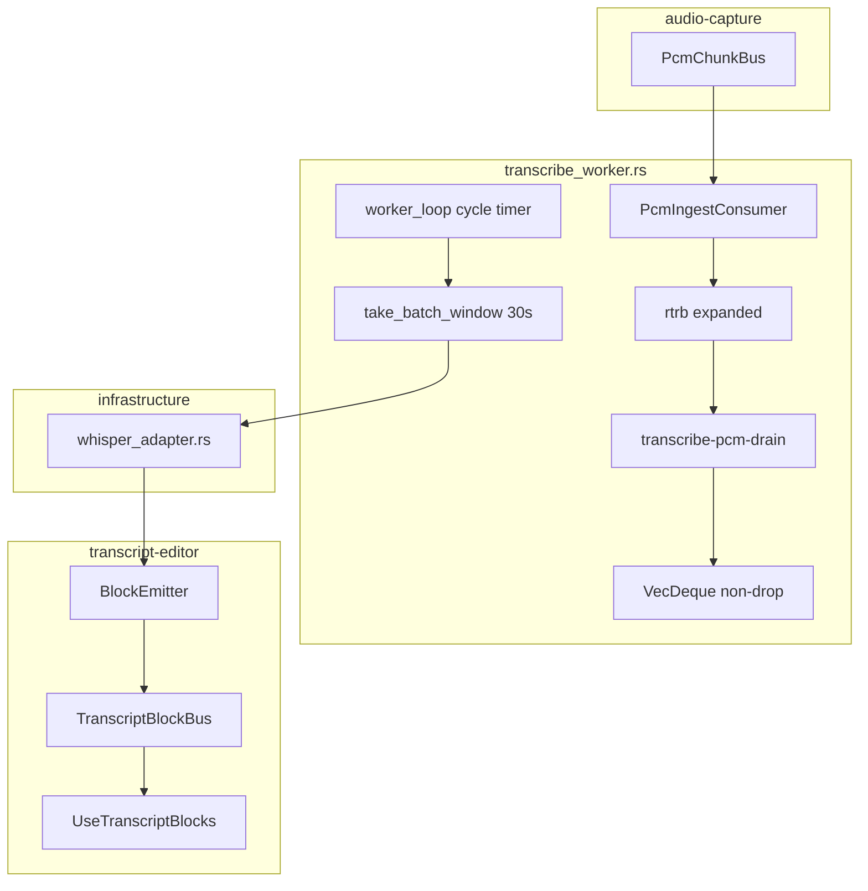
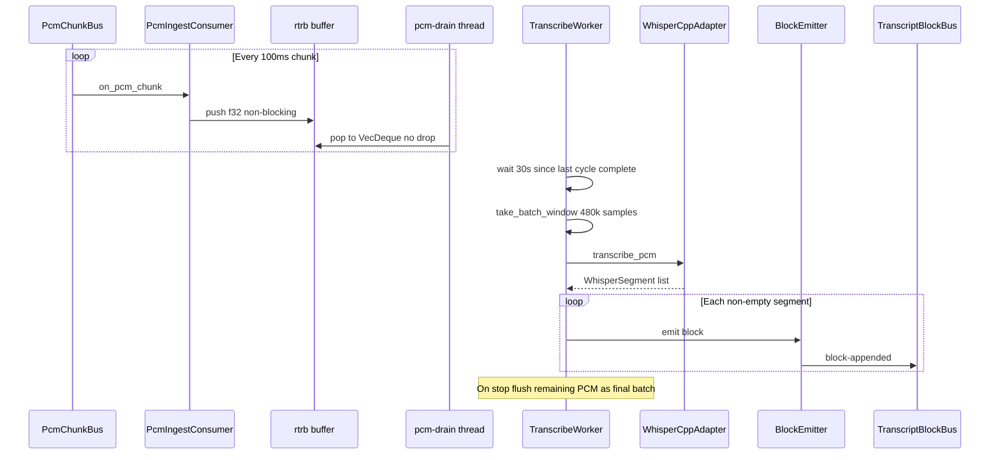

# 設計書: transcribe-batch-interval

## Overview

本 feature は gijirec の文字起こし推論を、VAD 駆動の低遅延ストリーミングから **約 30 秒間隔の固定バッチ実行**へ切り替える。会議参加者はリアルタイム性より **音声完全性と CPU 負荷の安定性** を得る。

**目的**: 推論処理中も PCM を欠落させず蓄積し、30 秒窓単位で Whisper 推論を実行する。  
**利用者**: Web 会議中に文字起こしを利用する参加者。既存エディタの追記 UX は維持する。  
**影響**: `transcribe_worker.rs` の VAD 窓切り出し・多層ドロップ政策を 30 s バッチスケジュールに置換。`whisper_adapter.rs` / 下流 `block-appended` はほぼ再利用。

_Gap analysis: brownfield 完了（`research.md` + [Explore transcribe codebase gap](6435dd2d-b0e3-4fba-b30b-8b00bed24f83))。_

### Goals

- 前回推論サイクル完了後、約 30 秒ごとに蓄積 PCM に対してバッチ推論を実行する（1.1–1.3）
- 推論中も PCM サンプルを欠落させない（2.1–2.2）
- 既存の追記のみブロック供給・タイムスタンプ単調性を維持する（3.1–3.5）
- 実機で 10 分連続検証可能な観点を設計に含める（6.1–6.3）

### Non-Goals

- 推論間隔のユーザー設定 UI（1.2）
- 音声キャプチャ方式・モデル・話者分離・クラウド STT の変更（5.1–5.4）
- transcript-editor UI の変更

## Boundary Commitments

### This Spec Owns

- `transcribe_worker.rs` 内の 30 秒固定バッチ推論スケジュール（前サイクル完了起点）
- v1 低遅延向け PCM ドロップ経路の除去（skip-to-latest、drop-oldest、bus/rtrb 溢れ対策）
- `MAX_INFERENCE_WINDOW_SAMPLES` を 480_000（30 s）への拡張とバッチ窓切り出し
- 既存 `WhisperCppAdapter::transcribe_pcm` による 30 s 窓推論（adapter API 形状は維持）
- バッチ窓からの `TranscriptBlock` 生成（`BlockEmitter` → `TranscriptBlockBus`）
- キャプチャ停止時の最終バッチフラッシュ（既存 flush パス拡張）
- 推論サイクル失敗時の継続試行

### Out of Boundary

- `PcmChunk` 生成・ミキシング（audio-capture）
- 転写ブロックの手動編集・部分ロック・Markdown 保存（transcript-editor）
- モデル取得・`TranscribePhase` イベント形状の再設計（形状は維持、フェーズ遷移タイミングのみ調整可）
- フロントエンドのブロック表示ロジック（同一イベントを消費）

### Allowed Dependencies

| 種別 | 依存 |
|------|------|
| 上流契約 | `audio-capture-pcm.md`（`PcmChunk` 形状・100 ms チャンク） |
| 上流イベント | `audio-capture-status.md`（`CapturePhase` — 停止検知） |
| Rust crates | `whisper-cpp-plus`、`rtrb`（既存ピン留めを維持） |
| 下流 | `whisper-transcribe-blocks.md`（追記供給規約） |

### Revalidation Triggers

- `TranscriptBlock` フィールド形状の変更 → transcript-editor
- `PcmChunk` チャンク長（100 ms）の変更 → 本 spec の窓切り出しロジック
- `whisper-transcribe://block-appended` ペイロード変更 → transcript-editor
- バッチ間隔の設定 UI 追加 → 本 spec のスケジューラ設定面

## Architecture

### Existing Architecture Analysis

v1 パイプライン（実コード確認済み）:

```
capture_processing (100 ms ChunkEmitter)
 → PcmChunkBus (MAX_QUEUED_CHUNKS=3, 溢れ時最古 drop)
 → PcmIngestConsumer (f32 rtrb push, 満杯時 Internal error)
 → rtrb 480_000 samples (compose.rs)
 → transcribe-pcm-drain → VecDeque (MAX_PCM_BUFFER_SAMPLES=320_000, drop-oldest)
 → take_inference_window (VAD, max 10 s, skip-to-latest)
 → WhisperCppAdapter::transcribe_pcm
 → BlockEmitter → TranscriptBlockBus → useTranscriptBlocks
```

**Req 2 と矛盾する v1 動作（除去対象）**:
- `take_window_from_state` の skip-to-latest（2× max window 超で最古破棄）
- `drain_consumer` の drop-oldest（`MAX_PCM_BUFFER_SAMPLES` 超）
- `PcmChunkBus` 3 チャンク cap（~300 ms）
- rtrb 満杯時 ingest 失敗

### Architecture Pattern & Boundary Map

**選択パターン**: Option A — `transcribe_worker.rs` 内リファクタ。新規 scheduler crate は作らない。



**Architecture Integration**:
- 既存維持: 専用 worker + drain スレッド、`DefaultTranscribeOrchestrator`、`lifecycle_hook.rs`
- 変更集中: `transcribe_worker.rs` 定数・`take_*_window`・`drain_consumer`・`worker_loop` タイミング
- 補助変更: `pcm_bus.rs` cap、`compose.rs` rtrb サイズ、`stall_watchdog.rs` 閾値（要実機確認）
- **boundaries.md との対応**: `boundaries.md` の論理コンポーネント `BatchInferenceScheduler` / `BatchWindowAccumulator` は、本設計では `transcribe_worker.rs` 内の `worker_loop` タイマーと `VecDeque` 非破棄バッファに実装統合する（新規 crate・ファイル分割なし）。ADR-0012 のスケジュール判断は維持

### Technology Stack

| Layer | Choice / Version | Role in Feature | Notes |
|-------|------------------|-----------------|-------|
| Backend | Rust 2024, gijirec-* crates | バッチスケジュール・PCM 蓄積・推論 | 変更は transcribe モジュールに限定 |
| STT | whisper-cpp-plus 0.1 | 30 s 窓 `transcribe_pcm` | `audio_ctx_for_pcm(480_000)=1500` 確認済み。API 変更なし |
| Buffer | rtrb + VecDeque | ingest 非ブロッキング + 長時間退避 | 要件 2 |
| Frontend | React 19 / Tauri 2 IPC | 変更なし | 同一 `block-appended` イベント |

## Persistent References

### Contracts (authoritative outside this feature dir)

| Path | Mode | Notes |
|------|------|-------|
| `docs/contracts/whisper-transcribe-blocks.md` | modify | 遅延目標を 30 s バッチ方式に更新済み |
| `docs/contracts/whisper-transcribe-status.md` | reference | フェーズ列挙・エラー形状は維持 |
| `docs/contracts/audio-capture-pcm.md` | reference | 上流 PCM 形状は変更しない |

### Architecture

| Path | Mode | Notes |
|------|------|-------|
| `docs/architecture/boundaries.md` | modify | whisper-transcribe 節にバッチコンポーネント追記済み |
| `docs/architecture/adr/ADR-0012-batch-inference-schedule.md` | modify | 新規作成済み |
| `docs/architecture/adr/ADR-0003-whisper-cpp-plus-streaming.md` | reference | Superseded by ADR-0012（ライブラリ履歴） |

### ADRs

| Path | Status |
|------|--------|
| `docs/architecture/adr/ADR-0012-batch-inference-schedule.md` | Accepted |
| `docs/architecture/adr/ADR-0003-whisper-cpp-plus-streaming.md` | Superseded by ADR-0012 |

## File Structure Plan

### Directory Structure

```
src-tauri/crates/gijirec-infrastructure/src/transcribe/
├── transcribe_worker.rs     # 主変更: バッチスケジュール、take_batch_window、drop 除去
├── whisper_adapter.rs       # 参照のみ（30 s 窓対応済み）
src-tauri/crates/gijirec-presentation/src/transcribe/
├── pcm_ingest_consumer.rs   # rtrb 満杯ハンドリング見直し（非破棄）
├── lifecycle_hook.rs        # 停止 flush（既存パス拡張）
src-tauri/crates/gijirec-presentation/src/tauri/
├── pcm_bus.rs               # MAX_QUEUED_CHUNKS 引き上げ検討
src-tauri/crates/gijirec-application/src/transcribe/
├── block_emitter.rs         # 変更なし（空スキップ・sequence 維持）
├── orchestrator.rs          # 変更なし
src-tauri/crates/gijirec-presentation/src/transcribe/
├── transcript_block_bus.rs  # 変更なし
src-tauri/src/compose.rs     # rtrb サイズ拡張
src-tauri/crates/gijirec-presentation/tests/
├── transcribe_integration.rs # バッチパイプライン統合テスト追加
src/presentation/hooks/
├── useTranscriptBlocks.ts   # 変更なし
```

### Modified Files

- `transcribe_worker.rs` — VAD `take_inference_window` → `take_batch_window`（480k samples）。skip-to-latest / drop-oldest 除去。`worker_loop` にサイクル完了起点 30 s 待機
- `pcm_bus.rs` — 長時間推論中の bus drop 防止（cap 拡張）
- `pcm_ingest_consumer.rs` — rtrb 満杯時の非破棄戦略
- `compose.rs` — rtrb 容量（現 480k）をバックログ深さに応じて拡張
- `stall_watchdog.rs` — 30 s 窓向け閾値再調整（要実機）

## System Flows



**フロー上の決定**:
- `take_batch_window`: 先頭から 480_000 samples（30 s）を切り出し。VAD / skip-to-latest は使用しない
- トリガー: 前サイクル完了 + 30 s 経過 **かつ** 未処理 ≥ 1 サンプル。バックログ時は sleep なしで連続サイクル（6.3）
- `start_timestamp_ms`: バッチ窓先頭の `samples_before_buffer` から算出（VAD 発話起点ではない）
- 空転写: `run_inference_window` の RMS 閾値または `BlockEmitter` 空スキップ（3.4）

## Requirements Traceability

| Requirement | Summary | Components | Interfaces |
|-------------|---------|------------|------------|
| 1.1 | 30 s バッチ推論 | D-TranscribeWorker | take_batch_window + cycle timer |
| 1.2 | 固定 30 s | D-TranscribeWorker | BATCH_INTERVAL_MS const |
| 1.3 | 前サイクル以降の音声 | D-TranscribeWorker | samples_before_buffer cursor |
| 1.4 | 完全性・安定性優先 | 全体 | NFR |
| 2.1 | 推論中も PCM 受信 | D-PcmIngestConsumer, D-TranscribeWorker | non-drop drain |
| 2.2 | 高速到着時も保持 | D-TranscribeWorker, D-PcmChunkBus | remove drop paths |
| 2.3 | 停止時最終処理 | D-TranscribeWorker | flush path |
| 2.4 | 失敗時キャプチャ継続 | D-TranscribeWorker | Error continue |
| 3.1 | 追記のみ供給 | D-TranscriptBlockBus | block-appended |
| 3.2 | sequence / timestamp | D-BlockEmitter | batch window base_ms |
| 3.3 | 既発行不変更 | D-TranscriptBlockBus | Append-only |
| 3.4 | 空ブロック不発行 | D-BlockEmitter | Skip empty |
| 3.5 | レイアウトシフト抑制 | downstream | イベント形状維持 |
| 4.1 | OS 負荷抑制 | D-TranscribeWorker | 30 s 間隔 |
| 4.2 | オフライン | D-WhisperCppAdapter | ModelStore |
| 4.3 | ウィンドウ閉じ停止 | D-TranscribeLifecycleHook | lifecycle_hook.rs |
| 5.1–5.4 | スコープ外変更禁止 | — | Out of boundary |
| 6.1–6.3 | 手動検証観点 | Testing Strategy | Manual checklist |

## Components and Interfaces

| Component | Anchor | Domain/Layer | Intent | Req Coverage | Key Dependencies |
|-----------|--------|--------------|--------|--------------|------------------|
| TranscribeWorker | D-TranscribeWorker | infrastructure | 30 s バッチループ・窓切り出し・drop 除去 | 1.1–1.4, 2.1–2.4, 4.1 | WhisperCppAdapter (P0), BlockEmitter (P0) |
| PcmChunkBus | D-PcmChunkBus | presentation | PCM 配信（cap 拡張） | 2.1 | PcmIngestConsumer (P0) |
| PcmIngestConsumer | D-PcmIngestConsumer | presentation | rtrb push | 2.1 | rtrb (P0) |
| WhisperCppAdapter | D-WhisperCppAdapter | infrastructure | 30 s 窓 transcribe_pcm | 1.1, 4.2, 5.2 | whisper-cpp-plus (P0) |
| BlockEmitter | D-BlockEmitter | application | ブロック生成 | 3.1–3.4 | TranscriptBlockBus (P0) |
| TranscriptBlockBus | D-TranscriptBlockBus | presentation | block-appended 発行 | 3.1, 3.3 | Tauri emit (P0) |
| TranscribeLifecycleHook | D-TranscribeLifecycleHook | presentation | 停止・flush | 2.3, 4.3 | CapturePhase (P1) |

### infrastructure

#### TranscribeWorker {#D-TranscribeWorker}

| Field | Detail |
|-------|--------|
| Intent | 30 s 固定バッチ推論。VAD 窓切りを置換し v1 drop 経路を除去 |
| Requirements | 1.1–1.4, 2.1–2.4, 4.1 |

**Responsibilities & Constraints**
- 定数: `MAX_INFERENCE_WINDOW_SAMPLES = 480_000`（30 s）、`BATCH_INTERVAL = Duration::from_secs(30)`
- `take_batch_window`: 先頭 480k samples + `samples_before_buffer` を返す。VAD / skip-to-latest 不使用
- `drain_consumer`: drop-oldest 禁止。`MAX_PCM_BUFFER_SAMPLES` を 10 分相当以上に拡張
- **初回サイクル**: 未処理 PCM ≥ 480k（30 s 分）で起動。満たない部分窓では推論しない
- **バックログ**: 未処理 PCM が次の 480k に達したら 30 s 待機をスキップし連続サイクル（6.3）
- 停止時: 既存 flush パスで残 PCM を最終バッチ

**Contracts**: Batch [x]

##### Batch / Job Contract
- Trigger: 未処理 PCM ≥ 480k（`take_batch_window` は先頭 480k を切り出し）。2 回目以降は前サイクル完了 + 30 s も満たす（フル窓バックログ時は 30 s スキップ）。停止 flush のみ残量すべて
- Failure: ログ後次サイクル継続（2.4）

#### WhisperCppAdapter {#D-WhisperCppAdapter}

| Field | Detail |
|-------|--------|
| Intent | 16 kHz f32 PCM 窓を transcribe。スケジューリングは worker 側 |
| Requirements | 1.1, 4.2, 5.2 |

**Implementation Notes**
- 変更最小: 既存 `transcribe_pcm` / `audio_ctx_for_pcm(480_000)` を使用
- 複数セグメントは worker が `BlockEmitter` へ個別 emit

### presentation

#### PcmChunkBus {#D-PcmChunkBus}

| Field | Detail |
|-------|--------|
| Intent | 100 ms チャンク配信。長時間推論中の drop を防止 |
| Requirements | 2.1 |

**Implementation Notes**
- `MAX_QUEUED_CHUNKS`（現 3）を引き上げ。推論 worst-case / 100 ms で実機決定

#### PcmIngestConsumer {#D-PcmIngestConsumer}

| Field | Detail |
|-------|--------|
| Intent | `on_pcm_chunk` で rtrb push（非ブロッキング） |
| Requirements | 2.1 |

**Implementation Notes**
- rtrb 満杯時 `Internal` を compose 側 rtrb 拡張とセットで解消

#### TranscribeLifecycleHook {#D-TranscribeLifecycleHook}

| Field | Detail |
|-------|--------|
| Intent | キャプチャ停止・アプリ終了で worker 停止 + flush |
| Requirements | 2.3, 4.3 |

**Implementation Notes**
- 既存 `lifecycle_hook.rs` パターン再利用

## Data Models

### Domain Model

- **BatchWindow**: `{ samples: Vec<i16>, start_timestamp_ms: u64, duration_ms: u64 }`
- **TranscriptBlock**: 既存 domain 型を維持。`start_timestamp_ms = window_start_ms + segment.start_offset_ms`

### Data Contracts & Integration

- 公開イベント `TranscriptBlockAppended` は `whisper-transcribe-blocks.md` に準拠（形状変更なし）
- `sequence` はセッション内単調増加。バッチ内複数セグメントは連番で発行

## Error Handling

### Error Strategy

- バッチ推論失敗: `TranscribeError::InferenceFailed` → `whisper-transcribe://error`（`INFERENCE_FAILED`, recoverable=true）。キャプチャは継続（2.4）
- メモリ上限接近: tracing warn + メトリクス。上限超過は設計時点ではソフト制限（実機 10 分検証でキャリブレーション）

### Error Categories and Responses

**Business Logic Errors**: 空転写 — ブロック不発行（正常系、3.4）  
**System Errors**: 推論失敗 — 次サイクル継続（2.4）

## Observability

- **Logging**: `batch_cycle_started` / `batch_cycle_completed`（duration_ms, samples_count, segments_count）。PCM 全文・転写全文はログ禁止（既存 8.4 準拠）
- **Metrics**: `transcribe_batch_duration_ms`, `transcribe_pcm_backlog_seconds`, `transcribe_rtrb_overflow_count`
- **Alerts**: N/A — デスクトップ単体アプリ。UI エラーイベントで通知
- **Debuggability**: サイクル ID をログ相関キーに使用。`--log` 時は `app_data_dir/logs/` に出力（ADR-0007）

## Testing Strategy

### Unit Tests

- `take_batch_window`: 480k samples 切り出しと `samples_before_buffer` 整合
- `worker_loop` タイミング: サイクル完了 + 30 s 後トリガー、バックログ時連続サイクル
- skip-to-latest / drop-oldest 除去後: 溢れ入力でもサンプル数が単調増加
- `BlockEmitter`: 空テキスト入力でブロック不発行（3.4）
- `start_timestamp_ms` 単調増加プロパティ（3.2）

### Integration Tests

- `transcribe_integration.rs`: 合成 PCM → バッチ worker → モック adapter → sequence 欠番なし
- 推論失敗注入後も次サイクル実行（2.4）
- 停止 flush で残 PCM 処理（2.3）

### E2E/UI Tests

- N/A — 本 feature は Rust バックエンド中心。フロントは既存 `useTranscriptBlocks` テストで回帰

### Manual Verification（要件 6）

1. **6.1**: 実機 10 分連続キャプチャ＋文字起こし。ログの `pcm_backlog` と録音長を照合し欠落なし
2. **6.2**: 連続発話中、各ブロックの `start_timestamp_ms` が直前バッチ境界から 30 s 以内
3. **6.3**: CPU 負荷で推論遅延を人工的に発生させ、停止後に全期間がブロックでカバーされること

## Operational Readiness

### Performance & Scalability

- バッチ間隔 30 s により推論 CPU スパイク頻度を ~1/30（対 VAD 連続）に低減（4.1）
- 16 kHz × 30 s ≈ 480k samples/窓。メモリ ~1 MB/窓 + バックログ退避

### Deployment & Rollout

- 単一バイナリ同梱。feature flag なし（固定 30 s）
- ロールバック: git revert で VAD ストリーミングへ戻す（ADR-0012 を Superseded に戻す新 ADR が必要）

### Migration

- データ移行なし。セッション内 state のみ変更
- 既存保存済み Markdown / JSONL への影響なし

## Security Considerations

- 変更なし。転写テキスト・PCM の外部送信禁止は既存契約を維持（5.4, 8.4）
- **メモリ蓄積**: バックログ退避によりセッション内メモリ使用量が増加する。単一ユーザー・ローカル処理のため DoS 面は限定的。ソフト上限はメトリクス警告のみとし、上限超過時もキャプチャは継続する（要件 2.4）。実機 10 分検証でキャリブレーション
