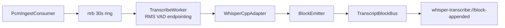
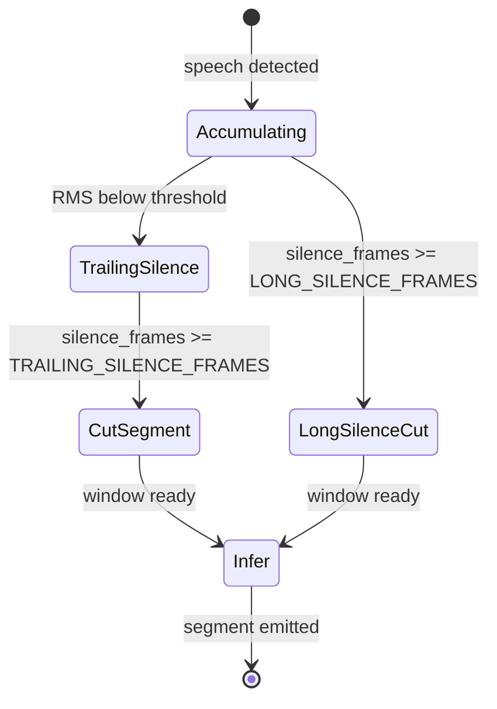

# Design: transcribe-segment-timing

## Overview

本 feature は既存 Whisper ストリーミングパイプラインの **VAD エンドポイント検出定数** をチューニングし、発話区切りから転写ブロック供給までの待ち時間を約 50% 短縮する。フロントエンド・契約形状・モデルは変更しない。

**Users**: 会議参加者（転写の体感速度向上の受益者）。実装者は `transcribe_worker.rs` の定数を 1 軸ずつ調整する。

**Impact**: `TRAILING_SILENCE_FRAMES`（主）および必要時 `LONG_SILENCE_FRAMES`（副）の値変更。ユニットテスト期待値と手動性能記録の更新。

### Goals

- 発話区切り待ち時間をベースライン比 50% 以上短縮
- `whisper-transcribe-blocks` 契約と 5 秒遅延目標を維持
- 既存品質ゲート（`bun run verify`）とエンドポイント検出テストをパス

### Non-Goals

- ランタイム設定 UI / 環境変数による動的チューニング
- `single_segment` の有効化
- Silero VAD 導入（steering 記載と実装の乖離は本 spec では解消しない）
- フロントエンド変更

## Boundary Commitments

### This Spec Owns

- `transcribe_worker.rs` の VAD / エンドポイント検出定数
- 定数変更に伴うユニットテスト期待値
- 手動性能記録（`docs/manual/whisper-transcribe/`）

### Out of Boundary

- `WhisperCppAdapter` の推論パラメータ（`single_segment`, `audio_ctx` 等）— 変更禁止 unless `entropy_thold` 第二軸
- フロントエンド・エディタ UI
- `TranscriptBlock` 契約形状
- モデル取得・ロード

### Allowed Dependencies

- 上流: `PcmIngestConsumer` / rtrb バッファ（変更なし）
- 下流: `BlockEmitter` / `TranscriptBlockBus`（変更なし）
- 契約: `docs/contracts/whisper-transcribe-blocks.md`（reference only）

### Revalidation Triggers

- `TranscriptBlock` 形状変更
- VAD アルゴリズム自体の変更（RMS → Silero 等）
- 推論パラメータの同時変更

## Architecture

### Existing Architecture Analysis

現行パイプライン（変更なし）:

**Architecture Integration**:
- Selected pattern: 既存レイヤード（infrastructure → application → presentation）を維持
- 変更は infrastructure 層の `transcribe_worker.rs` に限定
- Steering compliance: `tech.md` の 1 軸ずつ調整ルールに従う

### Technology Stack

| Layer | Choice | Role | Notes |
|-------|--------|------|-------|
| Backend | Rust / whisper-rs 0.16 | VAD + 推論 | 定数変更のみ |
| Audio buffer | rtrb | スレッド間 PCM | 変更なし |
| Event | Tauri 2 | block-appended | 変更なし |

## Persistent References

### Contracts

| Path | Mode | Notes |
|------|------|-------|
| docs/contracts/whisper-transcribe-blocks.md | reference | 形状・5s 遅延目標・追記のみ |

### Architecture

| Path | Mode | Notes |
|------|------|-------|
| docs/architecture/adr/ADR-0003-whisper-cpp-plus-streaming.md | reference | ストリーミング ADR |

## File Structure Plan

### Modified Files

- `src-tauri/crates/gijirec-infrastructure/src/transcribe/transcribe_worker.rs` — VAD 定数変更、テスト期待値更新
- `docs/manual/whisper-transcribe/performance-results.md` — ベースライン・調整後記録（存在しなければ作成）

### Unchanged Files

- `whisper_adapter.rs` — `single_segment=false` 維持（第一軸では触らない）
- フロントエンド全般
- `compose.rs` — rtrb サイズ変更なし

## System Flows

### Segment Endpoint Detection (変更箇所)

**Decision**: `TRAILING_SILENCE_FRAMES` を 5 → 2〜3 に短縮することで、500 ms → 200〜300 ms の trailing silence 待ちを削減。`LONG_SILENCE_FRAMES` は第一軸で不足時のみ 12 → 6〜8。

## Components and Interfaces

| Component | Anchor | Layer | Intent | Req Coverage |
|-----------|--------|-------|--------|--------------|
| TranscribeWorker | D-TranscribeWorker | infrastructure | VAD エンドポイント検出・窓切断 | 1, 2, 4 |

### Infrastructure

#### TranscribeWorker {#D-TranscribeWorker}

| Field | Detail |
|-------|--------|
| Intent | PCM バッファから RMS VAD で発話区切りを検出し推論ウィンドウを切り出す |
| Requirements | 1, 2, 4 |

**Responsibilities & Constraints**
- `TRAILING_SILENCE_FRAMES` / `LONG_SILENCE_FRAMES` でエンドポイント決定
- `MIN_SPEECH_SAMPLES` 未満の短い発話は long-pause でのみ切断
- 2 ウィンドウ遅延時は skip-to-latest（既存動作維持）

**Dependencies**
- Inbound: rtrb PCM samples (P0)
- Outbound: `WhisperCppAdapter` inference (P0), `TranscriptSegmentSink` (P0)

**Implementation Notes**
- 定数はファイル上部 private const として保持（runtime config 追加しない）
- テスト: `mod tests` 内の `trailing_silence_cut`, `long_pause_short_speech` 等の期待フレーム数を新定数に合わせて更新
- ベースライン計測: 調整前に現行値を `performance-results.md` に記録

## Data Models

変更なし。`TranscriptBlock` 形状は契約通り。

## Error Handling

### Error Strategy

定数が短すぎる場合の品質劣化は revert で対処（要件 2.1）。コードレベルの新規エラーパスは追加しない。

## Observability

- **Logging**: 既存 `log_inference_latency` を維持。定数変更による latency 変化を手動記録で追跡
- **Metrics**: N/A — 新規メトリクス追加なし
- **Alerts**: N/A
- **Debuggability**: `--log` 診断ログで推論 latency を確認（既存）

## Testing Strategy

### Unit Tests

- `transcribe_worker.rs` mod tests: trailing silence cut, long-pause short speech, forced cut, skip-to-latest, leading silence trim — 期待値を新定数に更新

### Integration Tests

- `transcribe_integration.rs`: パイプラインスモーク（既存パス維持）

### Manual / E2E

- 3 秒連続日本語発話 → ブロック供給までの時間計測
- 過剰分割・繰り返し・欠落の目視確認
- 5 秒遅延目標の維持確認

## Operational Readiness

### Performance & Scalability

- 目標: 区切り待ち中央値 50% 短縮（手動計測）
- 推論スレッド数・rtrb サイズは変更しない

### Deployment & Rollout

- 定数 revert は単一コミット revert で可能
- feature flag 不要

### Migration

N/A — データ移行なし
