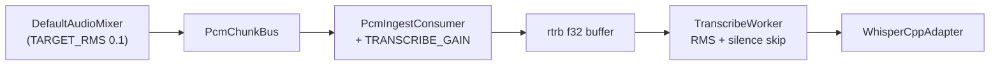
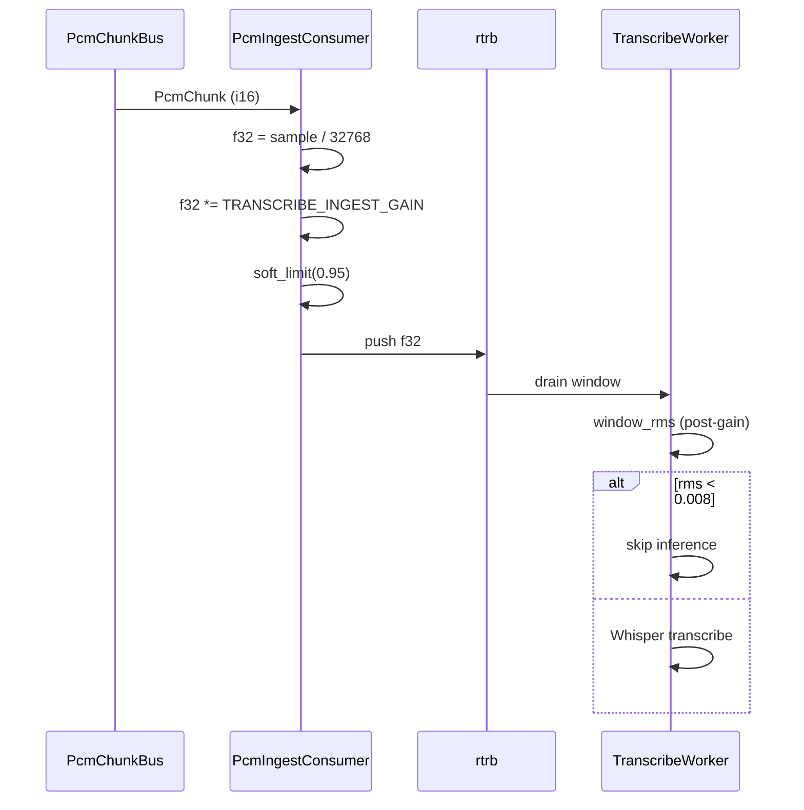

# Design Document: transcribe-volume-normalize

## Overview

Whisper 転写精度は推論窓の入力レベルに依存するが、快適な OS 音量では現状約 −23 dBFS となり小さすぎる。本 feature は **転写 ingest 経路のみ** に固定ゲイン（×1.45）とソフトリミッターを追加し、推論窓 RMS を −18〜−17 dBFS 付近へ正規化する。ミキサー・モニター経路は変更しない。

**Users**: 会議参加者（快適音量でキャプチャしつつ転写精度を得る）、開発者（RMS ログで効果を確認）。

**Impact**: `PcmIngestConsumer` に転写専用ゲインを追加。`transcribe_worker` の RMS 計測はゲイン後 PCM を反映（既存ログフィールド維持）。

### Goals

- 転写パス専用ゲイン ×1.45（−18〜−17 dBFS 目標）
- ミキサー `TARGET_RMS` 非変更
- 無音スキップ閾値 0.008 との整合
- 既存 RMS 可観測性維持

### Non-Goals

- OS 音量制御、モニター出力調整、AGC、設定 UI
- ミキサー `TARGET_RMS` 引き上げ（代替案・非推奨）

## Boundary Commitments

### This Spec Owns

- 転写 ingest 経路の固定ゲインとソフトリミッター
- ゲイン定数の単一集約
- ゲイン適用後 RMS が既存ログに反映されることの検証

### Out of Boundary

- ミキサー RMS 正規化ロジック（`audio-capture`）
- Whisper モデル選択・バッチ間隔（`whisper-transcribe`）
- フロントエンド UI

### Allowed Dependencies

- `PcmChunkBus` / `PcmIngestConsumer`（presentation）
- `TranscribeWorker` / rtrb ingest（infrastructure）
- `compose.rs` wiring（host）
- 既存 transcribe observability（`transcribe_observability.rs`）

### Revalidation Triggers

- `PcmChunk` フォーマット変更
- `SILENCE_RMS_THRESHOLD` 変更
- ingest → worker 間バッファ契約変更

## Architecture

### Existing Architecture Analysis

- キャプチャ: `capture_processing` → `DefaultAudioMixer` → 100 ms `PcmChunk`（i16）
- 転写: `PcmIngestConsumer` → f32 rtrb → `TranscribeWorker` → `WhisperCppAdapter`
- レイヤ: presentation（ingest）→ infrastructure（worker）— bylaw 遵守

### Architecture Pattern & Boundary Map



**Architecture Integration**:
- Selected pattern: **transcribe-path decorator** at ingest boundary
- Domain boundaries: gain in presentation ingest only; worker unchanged except RMS reflects post-gain PCM
- Existing patterns preserved: rtrb backpressure, observability callbacks, const + unit test style from `mixer.rs`
- New components rationale: none — extend `PcmIngestConsumer` inline
- Steering compliance: no PCM/transcript body logging; `bun run verify` gate

### Technology Stack

| Layer | Choice | Role in Feature |
|-------|--------|-----------------|
| Backend | Rust / gijirec-presentation | Ingest gain + soft limit |
| Backend | Rust / gijirec-infrastructure | Window RMS (post-gain) |
| Observability | tracing (`gijirec_transcribe`) | Existing RMS fields |

## Persistent References

### Contracts

| Path | Mode | Notes |
|------|------|-------|
| — | — | No public IPC/API contract changes |

### Architecture

| Path | Mode | Notes |
|------|------|-------|
| `docs/architecture/boundaries.md` | reference | Layering unchanged |

### ADRs

| Path | Status |
|------|--------|
| ADR-0012 (batch transcribe) | accepted — 30 s window unchanged |

## File Structure Plan

### Directory Structure

```
src-tauri/crates/gijirec-presentation/src/transcribe/
└── pcm_ingest_consumer.rs    # TRANSCRIBE_INGEST_GAIN, soft_limit, unit tests

src-tauri/crates/gijirec-infrastructure/src/transcribe/
└── transcribe_worker.rs      # (verify only) RMS on post-gain PCM

src-tauri/tests/
└── transcribe_observability.rs  # assert RMS fields still emitted
```

### Modified Files

- `pcm_ingest_consumer.rs` — apply `TRANSCRIBE_INGEST_GAIN` (1.45) and `soft_limit(0.95)` after i16→f32
- `transcribe_observability.rs` / tests — confirm post-gain RMS in logs (if test fixtures need update)

## System Flows



## Components and Interfaces

| Component | Anchor | Domain/Layer | Intent | Req Coverage |
|-----------|--------|--------------|--------|--------------|
| PcmIngestConsumer | D-PcmIngestConsumer | presentation | Transcribe-only gain + limit | 1, 2, 4 |
| TranscribeWorker (RMS path) | D-TranscribeWorkerRms | infrastructure | Post-gain window RMS | 2, 3 |

### presentation

#### PcmIngestConsumer {#D-PcmIngestConsumer}

| Field | Detail |
|-------|--------|
| Intent | Convert i16 chunks to f32, apply transcribe-only gain, push to rtrb |
| Requirements | 1, 2, 4 |

**Responsibilities & Constraints**
- Apply `TRANSCRIBE_INGEST_GAIN = 1.45_f32` (tunable constant, single definition)
- Apply `soft_limit(sample, SOFT_LIMIT = 0.95)` per sample (reuse pattern from mixer or local const)
- Do not modify i16 bus payload or mixer state

**Dependencies**
- Inbound: `PcmChunkBus` — 100 ms mono 16 kHz chunks (P0)
- Outbound: rtrb `Consumer<f32>` — transcribe buffer (P0)

**Implementation Notes**
- Integration: change only the sample loop in `on_pcm_chunk`
- Validation: unit test — silence stays below 0.008 after gain; nominal −23 dBFS input → ~−18 dBFS after ×1.45
- Risks: loud input + gain → soft limit; verify no spurious inference on noise floor

#### TranscribeWorkerRms {#D-TranscribeWorkerRms}

| Field | Detail |
|-------|--------|
| Intent | Window RMS and silence skip on post-gain PCM |
| Requirements | 2, 3 |

**Implementation Notes**
- No code change required if RMS is computed on rtrb samples (already post-ingest)
- Confirm `run_inference_window` RMS precedes skip decision on buffered f32

## Data Models

N/A — no new persistent data. Constants only:

| Constant | Value | Meaning |
|----------|-------|---------|
| `TRANSCRIBE_INGEST_GAIN` | `1.45` | Fixed v1 gain |
| `TRANSCRIBE_SOFT_LIMIT` | `0.95` | Clip ceiling (match mixer) |

## Error Handling

### Error Strategy

Gain application is synchronous per-sample; no new error paths. rtrb overflow behavior unchanged.

## Observability

- **Logging**: Existing `transcribe_window_rms_dbfs` and ingest summary fields reflect post-gain levels; no PCM/transcript body logging
- **Metrics**: No new metrics; use existing batch cycle logs
- **Alerts**: N/A
- **Debuggability**: Compare pre/post deploy `transcribe_window_rms_dbfs` at comfortable OS volume

## Testing Strategy

### Unit Tests

- `pcm_ingest_consumer`: gain + soft_limit on known samples; silence below 0.008 remains below threshold after gain
- `gain_for_rms` style table: input RMS −23 dBFS → output ~−18 dBFS

### Integration Tests

- `transcribe_observability.rs`: RMS fields still present with synthetic pipeline

### Manual Verification

- Comfortable OS volume capture; confirm `transcribe_window_rms_dbfs` ∈ [−19, −16] dBFS and subjective transcription improvement

## Operational Readiness

### Performance & Scalability

- O(n) per chunk multiply — negligible vs resample/mix

### Deployment & Rollout

- Single constant change; revert by setting `TRANSCRIBE_INGEST_GAIN = 1.0`

### Migration

N/A — no schema migration

## Security Considerations

- No new external surface; logging contract unchanged (no raw PCM/transcript)
