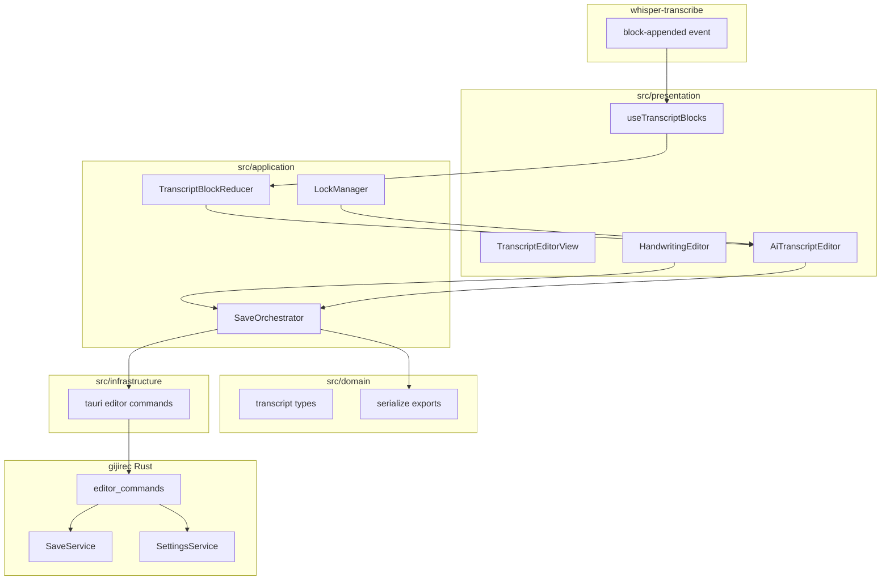
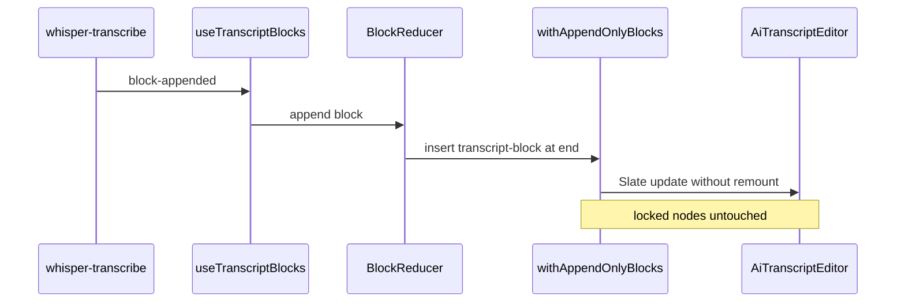
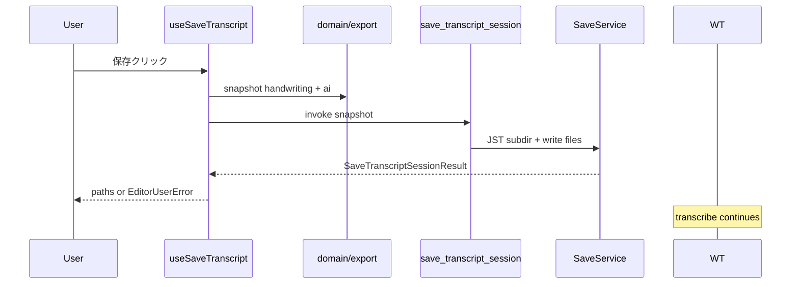

# 設計書: transcript-editor

## Overview

gijirec Transcript Editor は、上流 whisper-transcribe が供給するタイムスタンプ付きテキストブロックをリアルタイム表示し、利用者が手動議事録と AI 転写を並行編集できる二重エディタ体験を提供する。部分ロックにより手動修正箇所を AI 追記から保護し、追記のみ更新でレイアウト安定を維持する。明示的保存操作で `handwriting.md` / `ai-transcription.md`（オプション `ai-transcription.jsonl`）を JST 日時サブディレクトリへ出力する。

_Gap analysis: skipped (greenfield per brief Current State)._

**Purpose**: 会議中のリアルタイム議事録作成において、AI 転写を追いながら手動メモを残し、会議後に Markdown ファイルとして清書素材を得る。

**Users**: Web 会議参加者（エンドユーザー）、gijirec 開発者（エディタ・保存 IPC 統合）。

**Impact**: 既存 React ステータス UI を拡張し、TypeScript レイヤ（domain / application / infrastructure / presentation）と Rust 保存モジュールを新規追加する。

### Goals
- 上流 `whisper-transcribe://block-appended` の追記のみリアルタイム表示
- 選択・入力箇所の部分ロックと block_id 関連の維持
- 追記時のレイアウト安定（点滅・激しいシフトなし）
- 保存先設定永続化と JST サブディレクトリへの Markdown / JSONL 出力
- ローカル完結（外部ネットワーク送信なし）

### Non-Goals
- 音声キャプチャ、Whisper 推論、モデル取得
- 清書の自動マージ、話者分離、クラウド同期
- ロック状態の上流返送
- Linux 対応、ユーザー認証・認可

## Boundary Commitments

### This Spec Owns
- AI 転写表示領域（Slate エディタ）と手動議事録エディタ
- 部分ロック状態（セッション内メモリ）
- 上流ブロックの追記表示と block_id / start_timestamp_ms 関連
- 保存・設定 Tauri コマンドとファイル I/O（`transcript-editor-save.md` / `settings.md` / `status.md`）
- エディタ UI テーマ（shadcn セマンティックトークン + Slate パネル用 CSS 変数）

### Out of Boundary
- `TranscriptBlock` 生成・供給規約（whisper-transcribe）
- 音声 PCM、推論フェーズ、モデルダウンロード
- 転写テキストの自動ディスク永続化（明示保存のみ）
- 上流への編集状態返送

### Allowed Dependencies
- **上流**: `whisper-transcribe://block-appended`、`whisper-transcribe-blocks.md`
- **参照のみ**: `whisper-transcribe-status.md`（フェーズ・エラー表示、保存継続判断）
- **フロント**: Slate.js（ADR-0005）、shadcn/ui（ADR-0006）、React 19、Tailwind CSS、Tauri IPC
- **Rust**: Tauri 2 command / dialog、std::fs、serde_json
- **ネットワーク**: なし

### Revalidation Triggers
- `TranscriptBlock` フィールド変更（上流契約 Changelog）
- 保存ファイル形状・JST パス規約変更
- Slate データモデル変更（JSONL export 互換）
- shadcn / Tailwind メジャーアップグレード（セマンティックトークン互換）
- Tauri 保存 / 設定コマンドの破壊的変更

## Architecture

### Architecture Pattern & Boundary Map

**Selected pattern**: フロント主導編集 + Rust 保存 I/O（steering レイヤ準拠）。編集状態は TypeScript domain/application に保持し、永続化は invoke スナップショット経由で Rust `SaveService` が実行。



**Architecture Integration**:
- Domain/feature boundaries: 編集ロジックは TS domain/application、ファイル I/O は Rust application
- Existing patterns preserved: 契約型ミラー hooks、`listenFn`/`invokeFn` 注入テスト、UserFacingError 形状
- Steering compliance: dependency-cruiser / cargo bylaw レイヤ依存
- New components rationale: Slate プラグインで部分ロック・追記安定をカプセル化。shadcn/ui でツールバー・通知・設定 chrome を統一

### Technology Stack

| Layer | Choice / Version | Role in Feature | Notes |
|-------|------------------|-----------------|-------|
| Editor UI | Slate.js + slate-react | 二重エディタ、部分ロック | ADR-0005 |
| App chrome | shadcn/ui + Radix UI | Button, Switch, Alert, Sonner, Separator 等 | ADR-0006 |
| Frontend | TypeScript strict + React 19 | 編集体験・状態管理 | 既存 Vite 8 |
| Styling | Tailwind CSS + CVA | shadcn コンポーネント、レイアウトユーティリティ | `globals.css` + `editor-theme.css` |
| IPC | Tauri 2 `@tauri-apps/api` | block 購読・保存 invoke | 契約 3 ファイル |
| Backend | Rust edition 2024 | 保存 I/O・設定 JSON | gijirec-domain/application/presentation |
| Storage | ローカル fs + app_data_dir JSON | Markdown/JSONL・設定 | クラウドなし |
| Events | whisper-transcribe://block-appended | 上流ブロック購読 | 変更なし |

### Visual Design / Theme / CSS Variables

アプリ chrome は **shadcn/ui** のセマンティックトークン（`globals.css`）を正本とする。Slate パネル背景・ロック装飾は `editor-theme.css` で定義する。

**パレット方針**: ユーザー提示の 12 色（alto, chicago, casal, azure, plum, royal-purple, oregon, jagged-ice, hawkes-blue, classic-rose, snuff, almond）は **候補パレット** である。**v1 で UI に必要な色だけ** CSS 変数として定義すればよく、未使用色を `:root` に載せる必要はない。

**v1 で使用する色（8 色）**

| 変数 | 値 | 用途 |
|------|-----|------|
| `--alto` | `#dedede` | border、Separator |
| `--chicago` | `#5f5f5f` | 本文・ラベル（`--foreground`） |
| `--casal` | `#2c6b6a` | プライマリ（`--primary`, `--ring`） |
| `--oregon` | `#9b4100` | 警告・エラー（`--destructive`） |
| `--jagged-ice` | `#c1e7e6` | AI 転写パネル背景 |
| `--hawkes-blue` | `#cfdeff` | 手動議事録パネル背景 |
| `--classic-rose` | `#ffccef` | ロック範囲背景 |
| `--plum` | `#8f3a7b` | ロック範囲下線 |

**v1 で未使用（定義省略可）**: `--azure`, `--royal-purple`, `--snuff`, `--almond` — 将来必要になったときだけ追加する。

**shadcn ブリッジ（`globals.css`）**

| shadcn 変数 | v1 ソース |
|-------------|-----------|
| `--primary`, `--ring` | `--casal` |
| `--foreground`, `--muted-foreground` | `--chicago` |
| `--border`, `--input` | `--alto` |
| `--destructive` | `--oregon` |
| `--muted`, `--secondary`, `--accent` | shadcn デフォルトまたは `--alto` / `--jagged-ice` から最小限に選ぶ（専用色は必須ではない） |

**Slate パネル（`editor-theme.css` — 上表の 8 色のみ）**

```css
:root {
  --alto: #dedede;
  --chicago: #5f5f5f;
  --casal: #2c6b6a;
  --oregon: #9b4100;
  --jagged-ice: #c1e7e6;
  --hawkes-blue: #cfdeff;
  --classic-rose: #ffccef;
  --plum: #8f3a7b;
}
```

- shadcn コンポーネント: `Button`, `Switch`, `Label`, `Separator`, `Alert`, `Sonner`
- 保存先選択ボタンは shadcn `Button` variant `outline`（専用 `--azure` は不要）
- ツールバー背景は shadcn `--muted`（`--almond` 不要）
- ダークモード: v1 対象外

## Persistent References

### Contracts (authoritative outside this feature dir)
| Path | Mode | Notes |
|------|------|-------|
| docs/contracts/transcript-editor-save.md | modify | 初版 — 保存コマンド・出力形状 |
| docs/contracts/transcript-editor-settings.md | modify | 初版 — 設定永続化 |
| docs/contracts/transcript-editor-status.md | modify | 初版 — EditorUserError |
| docs/contracts/whisper-transcribe-blocks.md | reference | 上流ブロック購読（変更なし） |
| docs/contracts/whisper-transcribe-status.md | reference | フェーズ・エラー購読（変更なし） |

### Architecture
| Path | Mode | Notes |
|------|------|-------|
| docs/architecture/boundaries.md | modify | transcript-editor 境界セクション追加 |
| docs/architecture/adr/ADR-0005-slate-js-transcript-editor.md | modify | 新規 — Slate.js 採用 |
| docs/architecture/adr/ADR-0006-shadcn-ui-transcript-editor.md | modify | 新規 — shadcn/ui chrome 採用 |

### ADRs
| Path | Status |
|------|--------|
| docs/architecture/adr/ADR-0005-slate-js-transcript-editor.md | Accepted |
| docs/architecture/adr/ADR-0006-shadcn-ui-transcript-editor.md | Accepted |
| docs/architecture/adr/ADR-0002-bun-frontend-toolchain.md | Accepted |

## File Structure Plan

### Directory Structure
```
src/
├── domain/
│   └── transcript/
│       ├── types.ts                 # TranscriptBlockView, LockRange, EditorSettings mirror
│       ├── slateTypes.ts            # Slate custom element / mark types
│       └── export.ts                # toAiMarkdown, toJsonlRecords（純関数）
├── application/
│   └── transcript/
│       ├── blockReducer.ts          # 追記のみブロック統合
│       ├── lockManager.ts           # 選択/入力ロック操作
│       ├── saveOrchestrator.ts      # スナップショット組立 + invoke
│       └── plugins/
│           ├── withAppendOnlyBlocks.ts
│           ├── withLockedRanges.ts
│           └── withStableSelection.ts
├── infrastructure/
│   └── tauri/
│       └── editorCommands.ts        # save / settings invoke ラッパ
├── presentation/
│   ├── components/
│   │   ├── ui/                      # shadcn/ui（button, switch, label, separator, alert, sonner）
│   │   ├── TranscriptEditorView.tsx # 二重エディタレイアウト + Separator
│   │   ├── AiTranscriptEditor.tsx   # AI Slate エディタ
│   │   ├── HandwritingEditor.tsx    # 手動 Slate エディタ
│   │   ├── EditorToolbar.tsx        # shadcn Button / Switch / Label
│   │   └── SaveResultToast.tsx      # Sonner toast ラッパ
│   ├── lib/
│   │   └── utils.ts                 # cn()（tailwind-merge + clsx）
│   ├── hooks/
│   │   ├── transcript-blocks.ts     # 契約型ミラー（block-appended）
│   │   ├── useTranscriptBlocks.ts   # ブロック購読 + reducer 接続
│   │   ├── editor-settings.ts       # 契約型ミラー（settings）
│   │   ├── useEditorSettings.ts     # 設定 load/save
│   │   └── useSaveTranscript.ts     # 保存操作
│   ├── styles/
│   │   ├── globals.css              # Tailwind + shadcn セマンティックトークン
│   │   └── editor-theme.css         # Slate パネル用 CSS 変数
│   └── App.tsx                      # TranscriptEditorView + Toaster 統合
components.json                      # shadcn CLI 設定（@/ → src/presentation）
tailwind.config.ts
postcss.config.js
src-tauri/
├── src/
│   └── commands.rs                  # editor コマンド登録追加
└── crates/
    ├── gijirec-domain/src/editor/
    │   ├── mod.rs
    │   ├── settings.rs              # EditorSettings
    │   ├── save.rs                  # SavePayload, SaveResult types
    │   └── error.rs                 # EditorError, to_user_facing
    ├── gijirec-application/src/editor/
    │   ├── mod.rs
    │   ├── save_service.rs          # JST パス生成・fs 書込
    │   └── settings_service.rs      # JSON 永続化
    └── gijirec-presentation/src/editor/
        ├── mod.rs
        └── commands.rs              # Tauri command handlers
```

### Modified Files
- `src/presentation/App.tsx` — 二重エディタ + `<Toaster />` + 既存ステータスパネル統合
- `src/presentation/styles/globals.css` — Tailwind + shadcn トークン（新規または拡張）
- `src/main.tsx`（またはエントリ）— `globals.css` import
- `tsconfig.json` — `@/*` パスエイリアス（shadcn CLI 用）
- `src-tauri/src/lib.rs` — editor コマンド・state 登録
- `src-tauri/src/commands.rs` — `save_transcript_session` 等追加
- `package.json` — `slate`, `slate-react`, `@tauri-apps/plugin-dialog`, `tailwindcss`, `class-variance-authority`, `clsx`, `tailwind-merge`, Radix 依存（shadcn 追加時）

## System Flows

### 上流ブロック追記フロー



### 保存フロー



## Requirements Traceability

| Requirement | Summary | Components | Interfaces | Flows |
|-------------|---------|------------|------------|-------|
| 1.1 | ブロック追記表示 | D-UseTranscriptBlocks, D-BlockReducer | block-appended | 追記フロー |
| 1.2 | 追記のみ | D-WithAppendOnlyBlocks | insert at end | 追記フロー |
| 1.3 | 手動編集継続 | D-TranscriptEditorView | 独立 editors | — |
| 1.4 | 停止後保持 | D-BlockReducer | in-memory state | — |
| 1.5 | 推論非所有 | — | 境界 | — |
| 1.6 | block_id 関連維持 | D-AiTranscriptEditor, transcript-block | blockId attr | export |
| 2.1 | 独立手動領域 | D-HandwritingEditor | separate Slate | — |
| 2.2 | 即時反映 | D-HandwritingEditor | onChange | — |
| 2.3 | 同時利用 | D-TranscriptEditorView | layout | — |
| 2.4 | 自動書込なし | D-SaveOrchestrator | invoke only | 保存フロー |
| 3.1 | 選択ロック | D-LockManager | locked mark | — |
| 3.2 | 入力ロック | D-LockManager | locked mark | — |
| 3.3 | 非ロックへ追記 | D-WithAppendOnlyBlocks | append end | 追記フロー |
| 3.4 | 再編集優先 | D-WithLockedRanges | apply guard | — |
| 3.5 | 上流返送なし | — | 境界 | — |
| 4.1 | レイアウト安定 | D-WithStableSelection, CSS | overflow-anchor | 追記フロー |
| 4.2 | 点滅なし | D-WithAppendOnlyBlocks | no replace | 追記フロー |
| 4.3 | カーソル維持 | D-WithStableSelection | selection ref | 追記フロー |
| 4.4 | 高頻度追記 | D-BlockReducer | batch insert | 追記フロー |
| 5.1 | 保存先設定 | D-UseEditorSettings | set_editor_settings | — |
| 5.2 | 設定永続化 | D-SettingsService | JSON file | — |
| 5.3 | 再起動復元 | D-UseEditorSettings | get_editor_settings | — |
| 5.4 | 保存先不可 | D-SaveService | SAVE_DIRECTORY_UNAVAILABLE | 保存フロー |
| 5.5 | 未設定通知 | D-SaveService | SAVE_DIRECTORY_NOT_SET | 保存フロー |
| 6.1 | JST サブディレクトリ | D-SaveService | path format | 保存フロー |
| 6.2 | 同一秒衝突 | D-SaveService | _001 suffix | 保存フロー |
| 6.3 | 作成失敗 | D-SaveService | SAVE_DIRECTORY_CREATE_FAILED | 保存フロー |
| 7.1 | handwriting.md | D-SaveService | fs write | 保存フロー |
| 7.2 | ai-transcription.md | D-Export, D-SaveService | plain text | 保存フロー |
| 7.3 | 保存中ブロック除外 | D-SaveOrchestrator | snapshot time | 保存フロー |
| 7.4 | 保存中も転写継続 | — | no upstream stop | 保存フロー |
| 7.5 | md に TS なし | D-Export | toAiMarkdown | — |
| 7.6 | パス表示 | D-SaveResultToast | result paths | 保存フロー |
| 7.7 | 部分失敗通知 | D-SaveService | files_failed | 保存フロー |
| 7.8 | 自動マージなし | D-SaveService | 2 files only | — |
| 8.1 | JSONL 出力 | D-Export, D-SaveService | jsonl records | 保存フロー |
| 8.2 | JSONL に TS | D-Export | start_timestamp_ms | — |
| 8.3 | JSONL 無効時省略 | D-SaveOrchestrator | conditional | 保存フロー |
| 8.4 | JSONL 設定永続 | D-SettingsService | export_jsonl_enabled | — |
| 8.5 | JSONL 切替 UI | D-EditorToolbar | toggle | — |
| 9.1 | 行動可能エラー | D-EditorError | action_ja | — |
| 9.2 | 失敗時内容保持 | D-BlockReducer | no clear | — |
| 9.3 | 上流エラー時保存可 | D-TranscriptEditorView | state retain | — |
| 9.4 | ログに全文なし | observability | masking | — |
| 10.1 | 外部送信なし | 全コンポーネント | local only | — |
| 10.2 | 明示保存のみ | D-SaveOrchestrator | invoke gate | — |
| 10.3 | クラウド同期なし | — | 境界 | — |
| 10.4 | 認証なし | — | 境界 | — |

## Components and Interfaces

| Component | Anchor | Domain/Layer | Intent | Req Coverage | Key Dependencies | Contracts |
|-----------|--------|--------------|--------|--------------|------------------|-----------|
| useTranscriptBlocks | D-UseTranscriptBlocks | presentation | block-appended 購読 | 1.1–1.4 | Tauri listen (P0) | Event |
| BlockReducer | D-BlockReducer | application | 追記のみ状態管理 | 1.1, 1.2, 4.4 | domain types (P0) | State |
| withAppendOnlyBlocks | D-WithAppendOnlyBlocks | application | 末尾 insert プラグイン | 1.2, 4.1, 4.2 | Slate (P0) | — |
| withLockedRanges | D-WithLockedRanges | application | 部分ロック | 3.1–3.4 | Slate (P0) | — |
| withStableSelection | D-WithStableSelection | application | 追記時 selection 維持 | 4.1, 4.3 | Slate (P0) | — |
| LockManager | D-LockManager | application | ロック操作 API | 3.1, 3.2 | Slate editor (P0) | — |
| AiTranscriptEditor | D-AiTranscriptEditor | presentation | AI 転写 UI | 1.6, 3.x, 4.x | plugins (P0) | State |
| HandwritingEditor | D-HandwritingEditor | presentation | 手動議事録 UI | 2.1–2.3 | Slate (P0) | State |
| SaveOrchestrator | D-SaveOrchestrator | application | スナップショット + invoke | 2.4, 7.3, 8.x | export (P0), IPC (P0) | Service |
| SaveService | D-SaveService | application (Rust) | JST パス + fs | 5.4, 6.x, 7.x | std::fs (P0) | API |
| SettingsService | D-SettingsService | application (Rust) | 設定 JSON | 5.2, 8.4 | app_data_dir (P0) | API |
| useEditorSettings | D-UseEditorSettings | presentation | 設定 UI 状態 | 5.1, 5.3, 8.5 | IPC (P0) | API |
| useSaveTranscript | D-UseSaveTranscript | presentation | 保存操作 | 7.6, 9.1 | SaveOrchestrator (P0) | API |
| TranscriptEditorView | D-TranscriptEditorView | presentation | レイアウト root | 2.3, 10.x | child editors (P0) | — |
| EditorToolbar | D-EditorToolbar | presentation | shadcn chrome（保存・設定） | 5.1, 8.5 | hooks (P1), shadcn/ui (P1) | — |

### application

#### BlockReducer {#D-BlockReducer}

| Field | Detail |
|-------|--------|
| Intent | 上流ブロックの追記のみ in-memory 状態を管理 |
| Requirements | 1.1, 1.2, 1.4, 4.4 |

**Responsibilities & Constraints**
- `appendBlock(block)`: sequence 単調増加を期待。欠番は許容し `sequenceGapCount` を increment
- 既存ブロックの text / block_id を変更しない
- 上流停止後も状態を保持

**Contracts**: State [x]

##### State Management
- State model: `TranscriptSessionState { blocks: TranscriptBlockView[], sequenceGapCount: number }`
- Persistence: セッション内メモリのみ（再起動でクリア — 要件 2.4）
- Concurrency: React state + reducer dispatch（単一スレッド）

#### withAppendOnlyBlocks {#D-WithAppendOnlyBlocks}

| Field | Detail |
|-------|--------|
| Intent | Slate ドキュメント末尾への insert のみ許可 |
| Requirements | 1.2, 4.1, 4.2, 3.3 |

**Implementation Notes**
- 新規 `transcript-block` 要素を `Editor.withoutNormalizing` で末尾 insert
- 既存ノードへの `set_node` / `remove_node` を upstream 由来操作で禁止
- Integration: `createAiTranscriptEditor()` factory で compose

#### withLockedRanges {#D-WithLockedRanges}

| Field | Detail |
|-------|--------|
| Intent | `locked` mark 付与と保護 |
| Requirements | 3.1, 3.2, 3.4 |

**Implementation Notes**
- 選択確定 / 直接入力時に `LockManager.lockSelection()` → `locked: true` mark
- `editor.apply` で locked 範囲への remove/replace を reject（利用者の明示編集は許可）
- renderLeaf: `--classic-rose` 背景 + `--plum` 下線

#### SaveOrchestrator {#D-SaveOrchestrator}

| Field | Detail |
|-------|--------|
| Intent | 保存開始時点スナップショットを組立て invoke |
| Requirements | 2.4, 7.3, 7.4, 8.1, 8.3 |

**Contracts**: Service [x]

##### Service Interface
```typescript
interface SaveOrchestrator {
  saveSession(input: {
    handwritingEditor: HandwritingEditorRef;
    aiEditor: AiTranscriptEditorRef;
    settings: EditorSettings;
    sessionId: string;
  }): Promise<SaveTranscriptSessionResult>;
}
```
- Preconditions: `settings.save_directory !== null`（未設定時は Rust が `SAVE_DIRECTORY_NOT_SET` を返す）
- Postconditions: 成功時 `files_written` 非空。失敗時 in-memory 編集内容は保持
- Invariants: スナップショット後到着ブロックは export に含めない
- Concurrency: `isSaving` フラグで二重保存を拒否（2 回目は UI で無視し、進行中の結果を待つ）
- Edge cases: 手動議事録・AI 転写が空でも `handwriting.md` / `ai-transcription.md` は作成する

### application (Rust)

#### SaveService {#D-SaveService}

| Field | Detail |
|-------|--------|
| Intent | JST サブディレクトリ作成と Markdown/JSONL 書込 |
| Requirements | 5.4, 6.1, 6.2, 6.3, 7.1, 7.2, 7.7, 7.8 |

**Contracts**: API [x] — `docs/contracts/transcript-editor-save.md`

**Implementation Notes**
- JST: `chrono` + `chrono-tz`（`Asia/Tokyo`）で `{YYYY}/{MM}/{DD}/{hh}_{mm}_{ss}` 生成
- 衝突: 同一秒に `_001` インクリメント
- 部分失敗: 成功ファイルは残し `SAVE_PARTIAL_FAILURE` + `files_failed`
- Validation: パス traversal 禁止（canonicalize + save_directory prefix 検証）

#### SettingsService {#D-SettingsService}

| Field | Detail |
|-------|--------|
| Intent | EditorSettings JSON 読み書き |
| Requirements | 5.2, 5.3, 8.4 |

**Contracts**: API [x] — `docs/contracts/transcript-editor-settings.md`

### presentation (TypeScript)

#### useTranscriptBlocks {#D-UseTranscriptBlocks}

| Field | Detail |
|-------|--------|
| Intent | `whisper-transcribe://block-appended` 購読 |
| Requirements | 1.1, 1.2, 1.3 |

**Contracts**: Event [x]

##### Event Contract
- Subscribed: `whisper-transcribe://block-appended`
- Handler: `BlockReducer.appendBlock(payload.block)`
- Ordering: sequence 順を UI 側で best-effort（欠番許容）
- Startup: v1 はマウント時 replay なし — 再起動後は空状態から新規ブロックのみ受信（要件 2.4 準拠・セッション内メモリのみ）

#### AiTranscriptEditor {#D-AiTranscriptEditor}

| Field | Detail |
|-------|--------|
| Intent | AI 転写 Slate エディタ UI |
| Requirements | 1.6, 3.x, 4.x |

**Implementation Notes**
- `data-testid="ai-transcript-editor"`、背景 `--jagged-ice`
- `ref` で SaveOrchestrator から serialize 可能
- scroll container: `overflow-y: auto; overflow-anchor: auto;`

#### HandwritingEditor {#D-HandwritingEditor}

| Field | Detail |
|-------|--------|
| Intent | 手動議事録 Slate エディタ |
| Requirements | 2.1, 2.2 |

**Implementation Notes**
- 背景 `--hawkes-blue`、AI エディタと独立した Slate インスタンス
- プレーンテキスト export: `Editor.string(editor, [])`

#### EditorToolbar {#D-EditorToolbar}

| Field | Detail |
|-------|--------|
| Intent | 保存・設定・JSONL 切替の shadcn chrome |
| Requirements | 5.1, 8.5 |

**Implementation Notes**
- shadcn `Button`（保存 primary、保存先選択 outline）
- shadcn `Switch` + `Label`（`export_jsonl_enabled`）
- 行背景: shadcn `--muted`（専用パレット色は不要）
- `@tauri-apps/plugin-dialog` は invoke ラッパ経由（ボタン onClick）

#### SaveResultToast {#D-SaveResultToast}

| Field | Detail |
|-------|--------|
| Intent | 保存成功/失敗の利用者通知 |
| Requirements | 7.6, 9.1 |

**Implementation Notes**
- shadcn `Sonner`（`toast.success` / `toast.error`）でパス表示または `EditorUserError.message_ja`
- `App.tsx` ルートに `<Toaster />` を 1 つ配置
- 保存中は `Button` を `disabled` + loading 表示（`isSaving`）

## Data Models

### Domain Model (TypeScript)

**TranscriptBlockView**（上流契約ミラー + 表示テキスト）:
- `blockId`, `sequence`, `text`, `startTimestampMs`, `language`
- `displayText`: 利用者修正後テキスト（初期は `text` と同一）

**LockRange**: Slate `Range` + `blockId` 関連（export 用）

**EditorSettings**: 契約ミラー（`save_directory`, `export_jsonl_enabled`）

### Slate Document Model

```typescript
type TranscriptBlockElement = {
  type: "transcript-block";
  blockId: string;
  startTimestampMs: number;
  language: string;
  children: CustomText[];
};

type CustomText = {
  text: string;
  locked?: boolean;
};
```

### Domain Model (Rust)

**EditorSettings**: serde 永続化 struct

**SaveTranscriptSessionRequest / Result**: 契約形状（`gijirec-domain/src/editor/save.rs`）

**EditorError**: 内部列挙 → `to_user_facing()` → `EditorUserError`

## Error Handling

### Error Strategy
- Rust domain `EditorError::to_user_facing()` に変換集約（steering error-handling）
- invoke 応答内 `EditorUserError` — 専用 error イベントなし
- 保存失敗時も in-memory 編集内容は破棄しない（9.2）

### Error Categories and Responses

| 区分 | code | 応答 |
|------|------|------|
| User（設定） | SAVE_DIRECTORY_NOT_SET | 保存先設定を促す action_ja |
| User（I/O） | SAVE_DIRECTORY_UNAVAILABLE | 別ディレクトリ選択案内 |
| User（I/O） | SAVE_DIRECTORY_CREATE_FAILED | 別ディレクトリ選択または権限確認 |
| User（I/O） | SAVE_FILE_WRITE_FAILED | 再試行または保存先変更案内 |
| User（I/O） | SAVE_PARTIAL_FAILURE | 成功/失敗ファイル一覧 |
| User（設定） | SETTINGS_PERSIST_FAILED | ディスク容量・権限確認を促す action_ja |
| System | INTERNAL | 再起動案内（recoverable: false） |

## Observability

- **Logging**:
  - INFO: `editor_save_started`, `editor_save_completed`, `files_written_count`, `settings_updated`
  - WARN: `editor_sequence_gap_detected`, `editor_save_partial_failure`
  - ERROR: `error_code` のみ（detail は内部）
  - **マスキング**: 転写テキスト全文・手動議事録全文・保存パス以外のユーザー内容をログに出力しない（9.4, steering security）
  - ログターゲット: `gijirec_editor`（`RUST_LOG=gijirec_editor=info`）
- **Metrics**:
  - `editor_blocks_received_total`
  - `editor_sequence_gaps_total`
  - `editor_save_duration_ms`
  - `editor_save_failures_total`（code label）
- **Alerts**: N/A — ローカルデスクトップ。UI エラー表示が代替
- **Debuggability**: `session_id`（capture/transcribe と共有）を保存ログに付与

## Testing Strategy

### Unit Tests
1. `BlockReducer`: 追記のみ、既存 block 不変、sequence gap カウント（1.1, 1.2）
2. `withLockedRanges`: locked 範囲への remove 拒否、利用者編集許可（3.1–3.4）
3. `toAiMarkdown` / `toJsonlRecords`: タイムスタンプなし md、JSONL フィールド（7.5, 8.2）
4. `EditorError::to_user_facing`: 全 code で `action_ja` 非空（9.1）
5. `SaveService`: JST パス形式、同一秒 `_001`、traversal 拒否（6.1, 6.2）
6. `SettingsService`: 読み書きラウンドトリップ、デフォルト値（5.2, 8.4）
7. `SaveOrchestrator`: `isSaving` ガードで二重 invoke 防止（9.2）

### Integration Tests
1. mock block-appended → AiTranscriptEditor 末尾追記（1.1, 4.2）
2. ロック後追記 → locked テキスト不変（3.1, 3.3）
3. invoke save → ファイル存在 + 内容一致（7.1, 7.2）
4. JSONL 有効/無効 → ファイル生成/省略（8.1, 8.3）
5. 保存中追加ブロック → 出力ファイルに含まれない（7.3）

### E2E/UI Tests
1. 二重エディタ同時入力（2.3）
2. 選択ロック → 追記後も locked テキスト保持（3.1）
3. 保存成功 → パス表示（7.6）
4. 保存先未設定 → 通知（5.5）
5. 高頻度 mock 追記 → カーソル維持（4.3）— happy-dom + Slate

### Performance/Load
1. 500 ブロック追記: 追記 1 回 < 16 ms p95（60 fps 目標）（4.4）
2. 10 分相当ブロック mock: メモリ増分 < 50 MB（フロント）
3. 保存 100 KB テキスト: invoke + write < 500 ms — 手動計測

## Operational Readiness

### Performance & Scalability
- **追記レイテンシ**: Slate insert at end の p95 < 16 ms（4.4）
- **メモリ**: ブロック 500 件 + テキスト — 上流リングと同等上限を想定
- **スクロール**: `overflow-anchor: auto` で読了位置維持（4.1）

### Deployment & Rollout
- whisper-transcribe 完了後に transcript-editor UI を同一アプリへ統合
- フィーチャーフラグ: N/A — spec 単位投入
- **Rollback**: アプリ downgrade で設定 JSON 互換（v1 単一バージョン）

### Migration
- N/A — greenfield UI 追加。既存ステータスパネルは TranscriptEditorView 内に統合

### Security Considerations
- 転写・手動議事録の外部送信禁止（10.1）— invoke payload はローカル IPC のみ
- 保存パス traversal 防止: canonicalize + prefix 検証
- ログマスキング（9.4）— steering security 準拠
- 認証 N/A（10.4）
- Tauri dialog / fs permissions を capabilities に明示追加
- shadcn / Radix 依存は `bun.lock` ピン + `bun run check` CI ゲート（steering security）
- 上流ブロック入力: 同一アプリ内信頼境界。異常に長い `text` は v1 では truncate せず表示・保存（単一利用者・ローカル完結）。メモリ上限は上流 500 ブロックリングと整合（受容残リスク — Sec）

## Supporting References

- 詳細 Slate プラグイン調査: `docs/specs/transcript-editor/research.md`
- 上流ブロック契約: `docs/contracts/whisper-transcribe-blocks.md`
