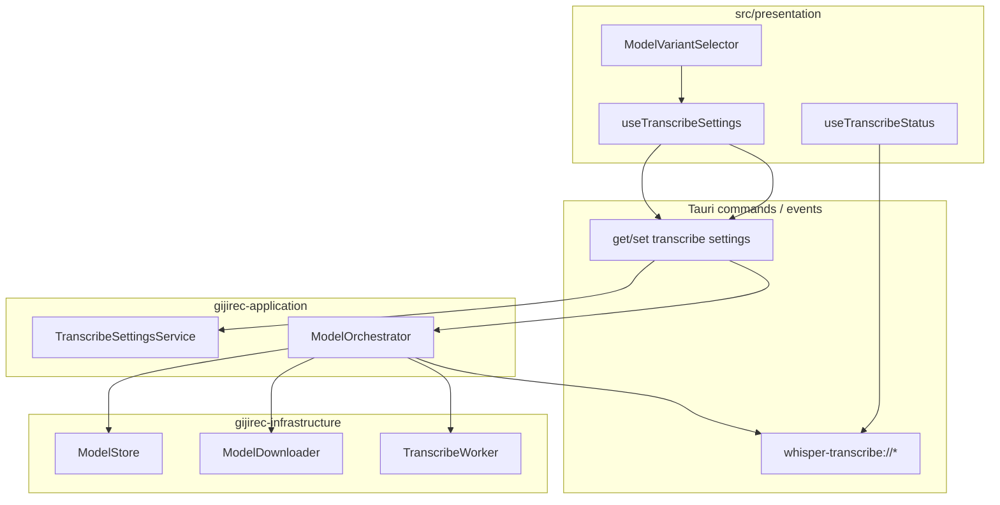
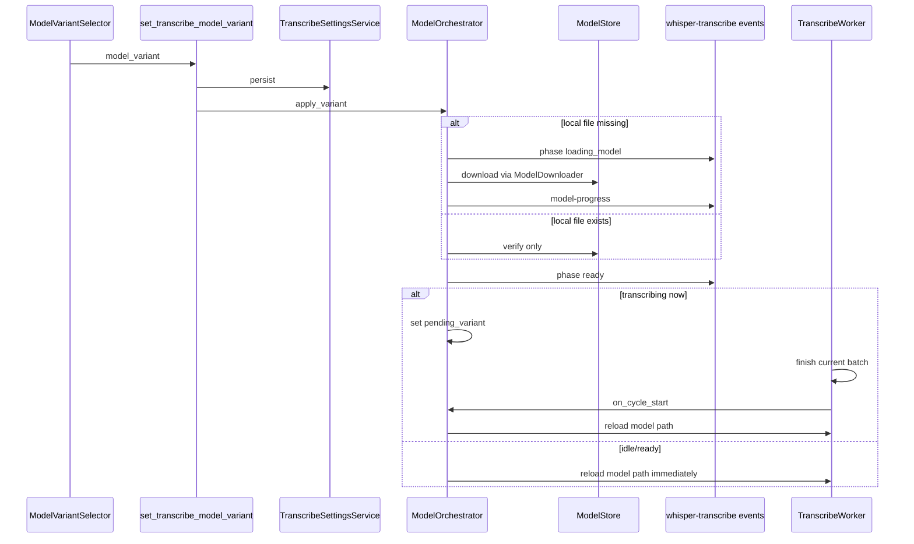
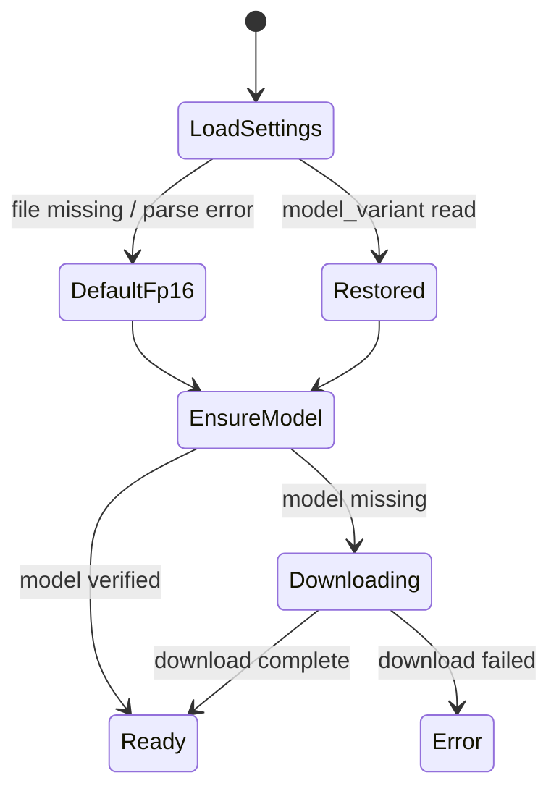

# 設計書: whisper-model-selection

## Overview

本機能は、ローカル Whisper 転写利用者が **kotoba-whisper-v2.2** の量子化バリアント（**Q5_0 / Q8_0 / FP16**）を選択し、精度・速度・メモリのトレードオフを調整できるようにする。完了済み `whisper-transcribe` のモデル取得・ロード・フェーズ表示を拡張し、選択は `app_data_dir` に永続化する。

**ユーザー**: 会議中のリアルタイム文字起こし利用者が、マシン性能や精度要件に応じてモデルを切り替える。

**影響**: 単一 FP16 固定から 3 バリアント選択へ。既存 `whisper-transcribe://*` イベント購読とマウント時同期は維持する。

_Gap analysis: brownfield — 既存 `ModelStore` / `ModelOrchestrator` / `compose.rs` を拡張（`research.md`）。_

### Goals
- 3 バリアントの選択 UI と永続化
- 選択バリアントの取得・ロード・次サイクルからの転写適用
- 既存フェーズ／進捗／エラー表示との整合
- 既存 FP16 モデルファイルの追加取得なし利用

### Non-Goals
- kotoba-whisper 以外のモデル、カスタムモデル、クラウド STT
- ハードウェア自動推奨、転写中即時ホットスワップ
- `whisper-transcribe-status` のフェーズ列挙変更
- 音量正規化（`transcribe-volume-normalize`）

## Boundary Commitments

### This Spec Owns
- `WhisperModelVariant` 列挙と `ModelVariantCatalog`（URL / filename / SHA-256）
- バリアント別 `ModelStore` パス解決・検証
- `TranscribeSettings` 永続化と Tauri `get_transcribe_settings` / `set_transcribe_model_variant`
- バリアント切替時の `ModelOrchestrator` フロー（DL → load → 次サイクル適用）
- バリアント選択 UI（現在選択の明示を含む）

### Out of Boundary
- `TranscribePhase` 列挙、`whisper-transcribe://model-progress` 形状
- 30 s バッチ推論スケジュール、`TranscriptBlock` 生成
- エディタ・保存・デバイス選択
- PCM 音量正規化

### Allowed Dependencies
- `ModelDownloader`、`TranscribeWorker`、`TranscribeLifecycleHook`（whisper-transcribe）
- `whisper-transcribe-status.md` イベント（購読・発行のみ、形状変更なし）
- Tauri `app_data_dir`、HTTPS（kenrouse 配布）

### Revalidation Triggers
- バリアント列挙・filename / URL / SHA の追加変更
- 永続化ファイルパスまたは Tauri command 形状の変更
- 切替タイミング（次サイクル以外への変更）
- `app_data_dir` 解決方式の変更（ADR-0008 再検証）

## Architecture

### Existing Architecture Analysis
- `ModelStore` は単一 `MODEL_FILENAME`（FP16）を `{app_data_dir}/models/` に保存（ADR-0008）
- `ModelOrchestrator` は `ModelOrchestratorConfig { model_url, expected_sha256 }` で DL → verify → worker へパス供給
- `compose.rs` に FP16 の URL/SHA 定数。Tauri setup 後に `inject_model_stack` で `app_data_dir` を注入
- フロントは `useTranscribeStatus` でフェーズ・進捗を購読。設定永続化は editor-settings が先例

### Architecture Pattern & Boundary Map



**Architecture Integration**:
- Selected pattern: **Catalog + extend orchestrator**（`research.md` Option C）
- Domain boundaries: バリアント定義は domain、I/O は infrastructure、切替フローは application
- Existing patterns preserved: editor-settings 型の JSON 永続化、既存 transcribe フェーズイベント
- New components: `ModelVariantCatalog`, `TranscribeSettingsService`, `ModelVariantSelector`
- Steering compliance: レイヤ依存（bylaw / depcruise）、契約正本は `docs/contracts/`

### Technology Stack

| Layer | Choice | Role | Notes |
|-------|--------|------|-------|
| Frontend | React 19 + shadcn/ui Select/Radio | バリアント選択 UI | `DeviceSelectorPanel` / editor 設定と同階層 |
| Backend | Rust / Tauri 2 | 永続化・DL・ロード | 既存 transcribe crate 拡張 |
| Storage | `transcribe-settings.json` | 選択永続化 | `app_data_dir` |
| Models | kenrouse GGML ×3 | オフライン推論 | SHA-256 検証継続 |

## Persistent References

### Contracts
| Path | Mode | Notes |
|------|------|-------|
| `docs/contracts/whisper-transcribe-settings.md` | modify | 新規作成済み — 永続化・command 正本 |
| `docs/contracts/whisper-transcribe-status.md` | reference | フェーズ・進捗・エラー形状は変更なし |

### Architecture
| Path | Mode | Notes |
|------|------|-------|
| `docs/architecture/boundaries.md` | modify | whisper-model-selection 境界セクション追加済み |

### ADRs
| Path | Status |
|------|--------|
| `docs/architecture/adr/ADR-0013-whisper-model-variant-selection.md` | Accepted |
| `docs/architecture/adr/ADR-0011-whisper-model-kotoba-fp16.md` | Accepted（FP16 既定） |
| `docs/architecture/adr/ADR-0008-model-store-app-data-dir.md` | Accepted（保存先） |

## File Structure Plan

### Directory Structure
```
src-tauri/crates/gijirec-domain/src/transcribe/
├── model_variant.rs          # WhisperModelVariant, ModelVariantCatalog entry types
src-tauri/crates/gijirec-application/src/transcribe/
├── settings_service.rs       # TranscribeSettings load/save
├── model_orchestrator.rs     # 拡張: variant selection, pending switch, DL bind
src-tauri/crates/gijirec-infrastructure/src/transcribe/
├── model_store.rs            # 拡張: variant-aware path/verify
src-tauri/crates/gijirec-presentation/src/transcribe/
├── settings_commands.rs      # get_transcribe_settings, set_transcribe_model_variant
src-tauri/src/
├── compose.rs                # ModelVariantCatalog 定数、起動時 settings 復元
src/infrastructure/tauri/
├── transcribeSettingsCommands.ts
src/presentation/
├── hooks/useTranscribeSettings.ts
├── components/ModelVariantSelector.tsx
```

### Modified Files
- `model_store.rs` — `MODEL_FILENAME` 単一前提を `model_path(variant)` / `verify(variant, sha)` に拡張。legacy FP16 ファイル互換維持
- `model_orchestrator.rs` — 選択バリアントの DL/ロード、転写中は `pending_variant` をサイクル境界で適用
- `transcribe_worker.rs` — サイクル開始時にモデルパス再読込 API（既存 load フロー再利用）
- `compose.rs` — 3 バリアントカタログ、起動時 `get_transcribe_settings` 相当の復元 → orchestrator 初期化
- `App.tsx`（または設定パネル） — `ModelVariantSelector` 配置

## System Flows

### バリアント選択〜転写適用



### 起動時復元



## Requirements Traceability

| Requirement | Summary | Components | Interfaces |
|-------------|---------|------------|------------|
| 1.1 | 3 選択肢提示 | D-ModelVariantSelector | `WhisperModelVariant` |
| 1.2 | 現在選択明示 | D-ModelVariantSelector | `get_transcribe_settings` |
| 1.3–1.5 | 他ファミリ・量子化・自動推奨なし | D-ModelVariantCatalog | 列挙固定 |
| 2.1 | 未取得時 DL | D-ModelOrchestrator | `ModelDownloader`, `model-progress` |
| 2.2 | 既存時 DL スキップ | D-ModelStore | verify |
| 2.3 | 利用可能後推論使用 | D-TranscribeWorker | model reload |
| 2.4 | 転写中は次サイクル適用 | D-ModelOrchestrator | pending_variant |
| 2.5 | オフライン継続 | D-ModelStore | ローカルファイル保持 |
| 2.6 | DL 失敗日本語 | D-ModelOrchestrator | `whisper-transcribe://error` |
| 3.1–3.4 | 状態表示 | D-useTranscribeStatus | `whisper-transcribe-status`（reference） |
| 4.1–4.3 | 永続化・復元・FP16 既定 | D-TranscribeSettingsService | `transcribe-settings.json` |
| 4.4 | 永続化失敗通知 + FP16 継続 | D-TranscribeSettingsService | toast / error event |
| 4.5 | 機微データ非含有 | D-TranscribeSettingsService | settings schema |
| 5.1–5.2 | IPC 後方互換・主要フロー | 全体 | 既存イベント維持 |
| 5.3 | クラウド STT なし | — | out of scope |
| 5.4 | 既存 FP16 ファイル互換 | D-ModelStore | `fp16` → `kotoba-whisper-v2.2-ggml.bin` |

## Components and Interfaces

| Component | Anchor | Layer | Intent | Req | Contracts |
|-----------|--------|-------|--------|-----|-----------|
| ModelVariantCatalog | D-ModelVariantCatalog | domain | 3 バリアント metadata 正本 | 1, 2 | settings |
| ModelStore | D-ModelStore | infrastructure | バリアント別 path/verify | 2, 5.4 | — |
| TranscribeSettingsService | D-TranscribeSettingsService | application | JSON 永続化 | 4 | settings |
| ModelOrchestrator | D-ModelOrchestrator | application | DL/ロード/切替 | 2, 3 | status |
| ModelVariantSelector | D-ModelVariantSelector | presentation | 選択 UI | 1 | settings |
| useTranscribeSettings | D-useTranscribeSettings | presentation | invoke + 状態 | 1, 4 | settings |

#### ModelVariantCatalog {#D-ModelVariantCatalog}

| Field | Detail |
|-------|--------|
| Intent | 3 バリアントの filename / URL / SHA-256 を単一正本として提供 |
| Requirements | 1.3, 1.4, 2.1, 2.2 |

**Responsibilities & Constraints**
- `WhisperModelVariant` は `Q5_0 | Q8_0 | FP16` のみ（serde: `q5_0` / `q8_0` / `fp16`）
- `default()` は `FP16`（要件 4.3、ADR-0011）
- URL / SHA は `whisper-transcribe-settings.md` と一致

#### ModelOrchestrator {#D-ModelOrchestrator}

| Field | Detail |
|-------|--------|
| Intent | 選択バリアントの ensure（DL+verify+load）と worker へのパス供給 |
| Requirements | 2.1–2.4, 2.6, 3.1–3.4 |

**State Management**
- `active_variant`: 現在ロード済み
- `pending_variant`: 転写中切替時、次サイクルで適用
- `loading` 中は既存 `loading_model` フェーズを発行

**Implementation Notes**
- サイクル境界フックは `TranscribeWorker` の `on_batch_cycle_started`（既存 observability 経路）で `try_apply_pending_variant` を呼ぶ
- 同一 `model_variant` の再設定は no-op（永続化のみ、DL/再ロードなし）
- DL trust boundary: `ModelDownloader` HTTPS-only + SHA-256（Sec deferred 項目クローズ）

#### TranscribeSettingsService {#D-TranscribeSettingsService}

| Field | Detail |
|-------|--------|
| Intent | `transcribe-settings.json` の読み書き |
| Requirements | 4.1–4.5 |

##### Service Interface
```rust
trait TranscribeSettingsStore {
    fn load(&self) -> Result<TranscribeSettings, SettingsError>;
    fn save(&self, settings: &TranscribeSettings) -> Result<(), SettingsError>;
}
```
- 読み込み失敗: ログ + 利用者通知 + `TranscribeSettings::default()`（fp16）
- 保存失敗: `SETTINGS_PERSIST_FAILED` invoke エラー

#### ModelVariantSelector {#D-ModelVariantSelector}

| Field | Detail |
|-------|--------|
| Intent | Q5_0 / Q8_0 / FP16 の選択と現在値表示 |
| Requirements | 1.1, 1.2 |

**Implementation Notes**
- shadcn `Select` または `RadioGroup`。DL 中は disabled + `useTranscribeStatus` の `loading_model` 表示
- `local_availability` で未取得バリアントに「要ダウンロード」補助表示（任意、v1 最小は選択のみ）

## Data Models

### Domain Model
- `WhisperModelVariant`: 3 値列挙
- `TranscribeSettings { model_variant }`: 永続化 AGGREGATE
- `ModelVariantDescriptor { variant, filename, url, expected_sha256 }`: カタログ行

### Physical Data Model
- `{app_data_dir}/transcribe-settings.json` — UTF-8 JSON、単一フィールド v1
- `{app_data_dir}/models/kotoba-whisper-v2.2-ggml-q5_0.bin` 等 — バイナリ、共存可

## Error Handling

### Error Strategy
- DL / verify 失敗: 既存 `TranscribeUserError`（`MODEL_DOWNLOAD_FAILED`, `MODEL_CORRUPT`）を `whisper-transcribe://error` で発行
- 永続化書き込み失敗: invoke `SETTINGS_PERSIST_FAILED`
- 永続化読み込み失敗: fp16 既定で起動継続 + 日本語通知（要件 4.4）
- 不正 variant 値: `INVALID_MODEL_VARIANT`

## Observability

- **Logging**: `model_variant_selected`, `model_variant_applied`, `model_download_started/completed` を INFO。URL 全文・転写テキスト・PCM はログ禁止（既存規約）
- **Metrics**: `transcribe_active_model_variant`（ラベル q5_0/q8_0/fp16）、既存 `batch_cycle_*` 継続
- **Alerts**: N/A — デスクトップ単一利用者。エラーは UI 通知
- **Debuggability**: 起動ログに復元 variant + 各ファイル存在フラグ。相関は既存 transcribe セッション ID

## Testing Strategy

### Unit Tests
- `ModelVariantCatalog`: 3 エントリの filename/SHA 整合
- `ModelStore::model_path(variant)`: 各バリアントパス解決、FP16 既存ファイル互換
- `TranscribeSettingsService`: 欠落ファイル → default fp16、破損 JSON → default + エラー記録
- `ModelOrchestrator`: ローカル存在時 DL 未呼び出し、pending_variant がサイクル境界でのみ適用

### Integration Tests
- `set_transcribe_model_variant` → `loading_model` → `ready` イベント系列（モック HTTP）
- 起動時 settings 復元 → 正しい variant で orchestrator 初期化
- 転写中 variant 変更 → 現サイクル完了後に worker が新パスを使用

### E2E/UI Tests
- 3 選択肢表示と現在選択ラベル（1.1, 1.2）
- バリアント変更後、次バッチで転写継続（スモーク）
- マウント時 `get_transcribe_status` 同期が従来どおり動作（5.1）

## Operational Readiness

### Performance & Scalability
- Q5_0 は latency/メモリ最小、FP16 は最大。バリアント変更はモデル reload コストのみ（推論パイプラインは同一）
- 3 ファイル共存時ディスク ~2.8 GB — 利用者選択による段階的 DL を許容

### Deployment & Rollout
- 機能フラグ不要。既存 FP16 利用者は設定ファイル未作成でも fp16 既定で無変更起動
- Rollback: settings ファイル削除で fp16 既定に戻る（DL 済みファイルは残存）

### Migration
- 既存 `kotoba-whisper-v2.2-ggml.bin` は `fp16` として即利用（rename 不要）
- legacy `%LOCALAPPDATA%/gijirec/models/` 移行は既存 `maybe_migrate_from_legacy_local` を fp16 パスに適用

## Security Considerations

- AuthN/AuthZ: N/A（ローカルデスクトップ）
- モデル取得: HTTPS-only `ModelDownloader`、SHA-256 検証（要件 Sec deferred クローズ）
- 永続化: 転写・PCM・認証情報を含めない（要件 4.5）
- 外部送信: 設定・選択内容のネットワーク送信なし
