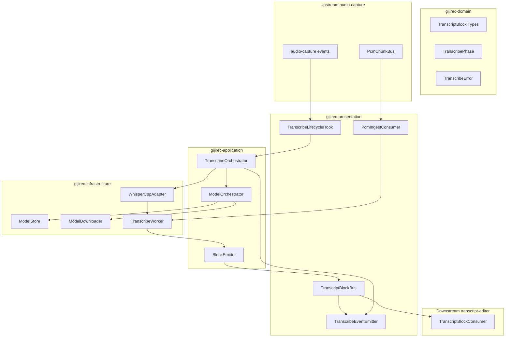
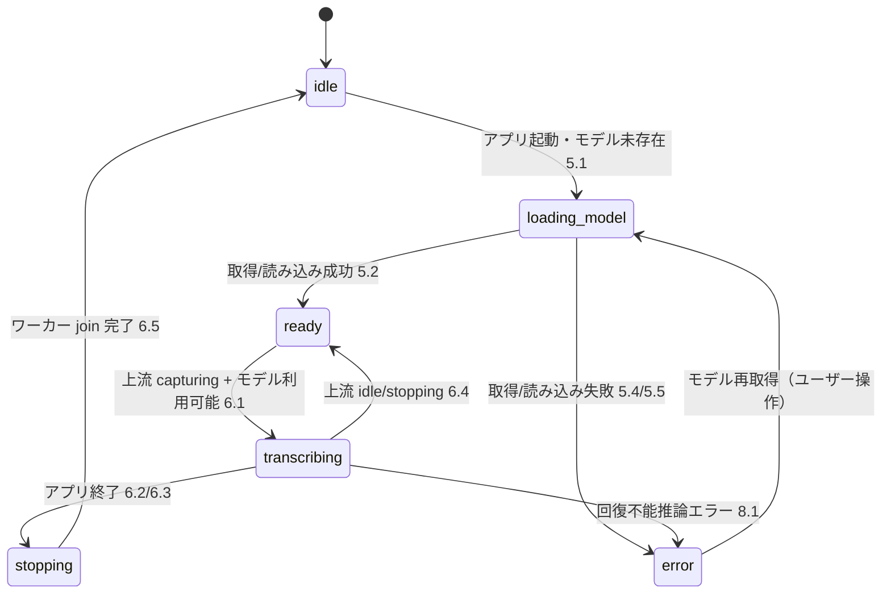
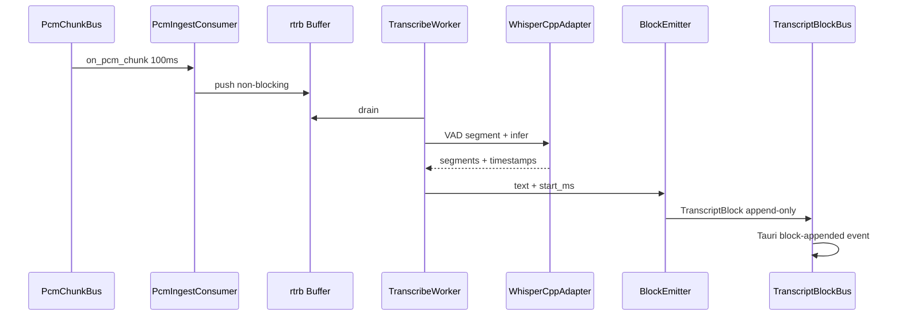

# 設計書: whisper-transcribe

## Overview

gijirec Whisper Transcribe は、上流 audio-capture が供給する 16 kHz モノラル PCM をローカル whisper.cpp 推論で逐次文字起こしし、タイムスタンプ付きテキストブロックを下流 transcript-editor へ追記供給する機能である。利用者は会議中に発言内容を数秒遅延でテキストとして追跡でき、モデル初回取得後はオフラインで継続できる。

_Gap analysis: skipped (greenfield per brief Current State)._

**Purpose**: ミックス済み会議音声をローカル完結で低遅延転写し、後段エディタの入力源となるテキストストリームを供給する。

**Users**: 会議参加者（エンドユーザー）、gijirec 開発者（推論パイプライン統合）。

**Impact**: 既存 Rust レイヤード crates に `transcribe/` モジュールを追加し、永続契約（`whisper-transcribe-blocks` / `whisper-transcribe-status`）と ADR-0003 を確立する。

### Goals
- 上流 `PcmChunk` の継続消費と 3〜5 秒ウィンドウでのローカル逐次推論
- 発話区間終了から 5 秒以内のテキストブロック下流供給（追記のみ）
- ブロック単位のキャプチャ開始基準タイムスタンプ付与
- モデル初回取得・オフライン推論・アプリ終了時の推論完全停止
- 会議アプリ並行利用を想定した CPU / メモリ抑制

### Non-Goals
- 手動編集 UI、部分ロック、Markdown 出力（transcript-editor）
- クラウド STT、話者分離、Python ランタイム
- 音声キャプチャそのもの（audio-capture）
- 転写テキストのディスク永続保存
- Linux 対応、ユーザー認証・認可

## Boundary Commitments

### This Spec Owns
- ミックス PCM チャンクの消費・推論ウィンドウ蓄積・ローカル Whisper 推論
- `TranscriptBlock` の生成と下流供給（`docs/contracts/whisper-transcribe-blocks.md`）
- 音声認識モデルの初回取得・ローカル検証・オフライン推論
- 文字起こしフェーズ・モデル進捗・利用者向けエラーイベント（`docs/contracts/whisper-transcribe-status.md`）
- 推論ライフサイクル（キャプチャ連動開始・停止、アプリ終了時の完全リソース解放）
- 最小 UI（モデル取得進捗・文字起こしステータス表示）

### Out of Boundary
- マイク / システム音声の取得・ミキシング（audio-capture）
- テキストの手動編集・ロック・Markdown 保存（transcript-editor）
- キャプチャフェーズイベントの定義（audio-capture-status が所有 — 本 spec は購読のみ）

### Allowed Dependencies
- **上流契約**: `PcmChunk`（`audio-capture-pcm.md`）、`CapturePhase` / `CaptureUserError` イベント（`audio-capture-status.md`）
- **Rust crates**: `whisper-cpp-plus`（ADR-0003）、`rtrb`（ワーカー間 PCM バッファ）
- **Tauri 2**: lifecycle フック、イベント emit
- **ネットワーク**: モデル初回取得の HTTPS のみ
- **下流**: transcript-editor は `TranscriptBlock` 契約のみ消費（本 spec は編集状態を知らない）

### Revalidation Triggers
- `TranscriptBlock` フィールド追加・削除 → transcript-editor
- `PcmChunk` サンプルレート・チャンク長変更 → 本 spec 再検証
- whisper.cpp バインディング変更（ADR 置換）→ 性能・遅延テスト再実行
- Tauri イベント名・payload 形状の破壊的変更 → フロント hook 同期

## Architecture

### Architecture Pattern & Boundary Map

**Selected pattern**: レイヤード・ヘキサゴナル（steering `structure.md` 準拠）。既存 4 crate に `transcribe/` モジュールを追加。OS / whisper.cpp 依存は `gijirec-infrastructure` に隔離。



**Architecture Integration**:
- Domain/feature boundaries: PCM 消費・推論オーケストレーションは application、whisper.cpp は infrastructure、Tauri 結線は presentation
- Existing patterns preserved: `PcmChunkConsumer` / `TranscriptBlockConsumer` トレイトミラー、composition root 登録
- Steering compliance: cargo bylaw / dependency-cruiser でレイヤ依存を CI 検証
- New components rationale: 推論ワーカー分離で RT パスと CPU 集中推論を隔離（要件 7）

### Technology Stack

| Layer | Choice / Version | Role in Feature | Notes |
|-------|------------------|-----------------|-------|
| STT | whisper-cpp-plus 0.1.x | VAD 駆動ストリーミング推論 | ADR-0003。macOS `metal` feature |
| PCM バッファ | rtrb 0.3 | consumer → worker 間非ブロッキング転送 | audio-capture と同パターン |
| Backend | Rust edition 2024 | transcribe モジュール群 | 既存 workspace 拡張 |
| Desktop Shell | Tauri 2 | イベント IPC・app_data_dir | モデル保存先 |
| Frontend | TypeScript strict + React 19 | ステータス・進捗 UI | `useTranscribeStatus` |
| Model | kotoba-whisper-v2.2-ggml-q5_0.bin | 日本語会議向け・Q5_0 量子化（ADR-0004、kenrouse 配布） | HuggingFace 取得 |

## Persistent References

### Contracts (authoritative outside this feature dir)
| Path | Mode | Notes |
|------|------|-------|
| docs/contracts/whisper-transcribe-blocks.md | modify | 初版作成 — TranscriptBlock 形状・追記供給 |
| docs/contracts/whisper-transcribe-status.md | modify | 初版作成 — フェーズ・モデル進捗・エラー |
| docs/contracts/audio-capture-pcm.md | reference | 上流 PCM 消費（変更なし） |
| docs/contracts/audio-capture-status.md | reference | キャプチャフェーズ購読（変更なし） |

### Architecture
| Path | Mode | Notes |
|------|------|-------|
| docs/architecture/boundaries.md | modify | whisper-transcribe 境界セクション追加 |
| docs/architecture/README.md | reference | index のみ |

### ADRs
| Path | Status |
|------|--------|
| docs/architecture/adr/ADR-0003-whisper-cpp-plus-streaming.md | Accepted |
| docs/architecture/adr/ADR-0004-whisper-model-kotoba.md | Accepted |
| docs/architecture/adr/ADR-0001-platform-audio-capture.md | Accepted |
| docs/architecture/adr/ADR-0002-bun-frontend-toolchain.md | Accepted |

## File Structure Plan

### Directory Structure
```
src/
├── presentation/
│   ├── App.tsx                          # キャプチャ + 文字起こしステータス統合表示
│   └── hooks/
│       ├── useCaptureStatus.ts          # 既存（変更なし）
│       └── useTranscribeStatus.ts       # phase / model-progress / error 購読
└── src-tauri/
    └── crates/
        ├── gijirec-domain/src/transcribe/
        │   ├── mod.rs
        │   ├── transcript_block.rs      # TranscriptBlock, TranscriptBlockConsumer trait
        │   ├── phase.rs                 # TranscribePhase
        │   └── error.rs                 # TranscribeError, UserFacingTranscribeError
        ├── gijirec-application/src/transcribe/
        │   ├── mod.rs
        │   ├── orchestrator.rs          # TranscribeOrchestrator（開始/停止/フェーズ）
        │   ├── block_emitter.rs         # 推論結果 → TranscriptBlock 変換・sequence 管理
        │   └── model_orchestrator.rs    # モデル存在確認・取得トリガー
        ├── gijirec-infrastructure/src/transcribe/
        │   ├── mod.rs
        │   ├── whisper_adapter.rs       # whisper-cpp-plus ラッパ（WhisperContext 管理）
        │   ├── transcribe_worker.rs     # 専用スレッド: VAD + 推論ループ
        │   ├── model_store.rs           # app_data_dir パス解決・整合性検証
        │   └── model_downloader.rs      # HTTPS 取得・進捗コールバック
        └── gijirec-presentation/src/tauri/
            ├── transcribe_lifecycle.rs  # CaptureProcessingHook 実装・終了 join
            ├── transcribe_events.rs     # Tauri emit（blocks / phase / error / progress）
            ├── transcribe_pcm_consumer.rs # PcmChunkConsumer 実装（rtrb push）
            └── transcript_block_bus.rs  # TranscriptBlockBus（下流 consumer 登録）
```

### Modified Files
- `src-tauri/crates/gijirec-domain/src/lib.rs` — `transcribe` モジュール公開
- `src-tauri/crates/gijirec-application/src/lib.rs` — `transcribe` モジュール公開
- `src-tauri/crates/gijirec-infrastructure/Cargo.toml` — `whisper-cpp-plus` 依存追加
- `src-tauri/crates/gijirec-infrastructure/src/lib.rs` — `transcribe` モジュール公開
- `src-tauri/crates/gijirec-presentation/src/tauri/mod.rs` — transcribe モジュール export
- `src-tauri/crates/gijirec-presentation/src/lib.rs` — composition root で PcmChunkBus consumer 登録・lifecycle 結線
- `src/presentation/App.tsx` — 文字起こしステータス・モデル進捗表示追加

## System Flows

### 文字起こしライフサイクル



### PCM → テキスト パイプライン



## Requirements Traceability

| Requirement | Summary | Components | Interfaces | Flows |
|-------------|---------|------------|------------|-------|
| 1.1 | PCM 継続受信 | D-PcmIngestConsumer, D-TranscribeWorker | PcmChunkConsumer | PCM パイプライン |
| 1.2 | 順序欠落でも継続 | D-PcmIngestConsumer | 欠番許容 | PCM パイプライン |
| 1.3 | PCM 他用途不使用 | D-PcmIngestConsumer | メモリのみ | — |
| 1.4 | キャプチャ非所有 | — | 境界 | — |
| 2.1 | ローカル逐次推論 | D-WhisperCppAdapter, D-TranscribeWorker | whisper-cpp-plus | パイプライン |
| 2.2 | クラウド送信禁止 | D-WhisperCppAdapter | ローカルのみ | — |
| 2.3 | Python 不要 | ADR-0003 | Rust バインディング | — |
| 2.4 | 話者分離なし | D-BlockEmitter | テキストのみ | — |
| 3.1 | 逐次下流供給 | D-BlockEmitter, D-TranscriptBlockBus | block-appended | パイプライン |
| 3.2 | 5 秒以内供給 | D-TranscribeWorker | VAD 駆動 | 性能計画 |
| 3.3 | 無音ブロックなし | D-TranscribeWorker | Silero VAD | パイプライン |
| 3.4 | 編集 UI なし | — | 境界 | — |
| 3.5 | 追記のみ | D-BlockEmitter | append-only 契約 | — |
| 4.1 | 開始タイムスタンプ | D-BlockEmitter | start_timestamp_ms | — |
| 4.2 | 時刻基準整合 | D-BlockEmitter | PcmChunk.timestamp_ms | — |
| 4.3 | ブロック独立 TS | D-BlockEmitter | sequence | — |
| 4.4 | ロック非管理 | — | 境界 | — |
| 5.1 | モデル取得開始 | D-ModelOrchestrator, D-ModelDownloader | model-progress | loading_model |
| 5.2 | 取得後オフライン | D-ModelStore | ローカルパス | ready |
| 5.3 | 推論時ネット不要 | D-WhisperCppAdapter | オフライン | transcribing |
| 5.4 | 取得失敗通知 | D-TranscribeEventEmitter | MODEL_DOWNLOAD_FAILED | error |
| 5.5 | 破損モデル通知 | D-ModelStore | MODEL_CORRUPT | error |
| 6.1 | キャプチャ連動開始 | D-TranscribeLifecycleHook | CaptureProcessingHook | ライフサイクル |
| 6.2 | ウィンドウ閉鎖停止 | D-TranscribeLifecycleHook | join worker | stopping |
| 6.3 | OS 終了停止 | D-TranscribeLifecycleHook | RunEvent::Exit | stopping |
| 6.4 | キャプチャ停止時推論停止 | D-TranscribeOrchestrator | phase gate | ready |
| 6.5 | バックグラウンド継続なし | D-TranscribeWorker | join + drop context | stopping |
| 7.1 | 会議アプリ並行 | D-TranscribeWorker | 低優先度スレッド | 性能計画 |
| 7.2 | CPU/メモリ上限 | 性能テスト計画 | 計測 | Operational |
| 8.1 | 回復不能停止 | D-TranscribeOrchestrator | INFERENCE_FAILED | error |
| 8.2 | 行動可能通知 | D-TranscribeEventEmitter | action_ja | 契約 |
| 8.3 | 上流エラー連動 | D-TranscribeLifecycleHook | UPSTREAM_CAPTURE_ERROR | transcribing→ready |
| 8.4 | ログに転写/PCM なし | observability | マスキング | Observability |
| 9.1 | 外部送信禁止 | 全コンポーネント | HTTPS 初回のみ | — |
| 9.2 | ディスク永続化なし | D-TranscriptBlockBus | メモリ 500 ブロック上限 | — |
| 9.3 | 認証 N/A | — | — | N/A |
| 9.4 | 第三者送信なし | D-TranscriptBlockBus | ローカル IPC のみ | — |

## Components and Interfaces

| Component | Anchor | Domain/Layer | Intent | Req Coverage | Key Dependencies | Contracts |
|-----------|--------|--------------|--------|--------------|------------------|-----------|
| PcmIngestConsumer | D-PcmIngestConsumer | presentation | PCM チャンク非ブロッキング受信 | 1.1–1.3 | rtrb (P0) | Service |
| TranscribeWorker | D-TranscribeWorker | infrastructure | VAD + 推論ワーカースレッド | 2.1, 3.2, 3.3, 6.5, 7.1 | WhisperCppAdapter (P0) | — |
| WhisperCppAdapter | D-WhisperCppAdapter | infrastructure | whisper-cpp-plus ラッパ | 2.1–2.3, 5.3 | whisper-cpp-plus (P0) | — |
| TranscribeOrchestrator | D-TranscribeOrchestrator | application | フェーズ管理・開始/停止ゲート | 6.1, 6.4, 8.1 | TranscribeWorkerPort (P0), Capture phase (P0) | Service, State |
| BlockEmitter | D-BlockEmitter | application | 推論結果 → TranscriptBlock | 3.1, 3.5, 4.1–4.3 | domain types (P0) | Event |
| ModelOrchestrator | D-ModelOrchestrator | application | モデル存在確認・取得オーケストレーション | 5.1–5.5 | ModelStore (P0), ModelDownloader (P1) | State |
| ModelStore | D-ModelStore | infrastructure | ローカルモデルパス・整合性検証 | 5.2, 5.5 | Tauri app_data_dir (P0) | — |
| ModelDownloader | D-ModelDownloader | infrastructure | HTTPS モデル取得 | 5.1, 5.4 | reqwest or ureq (P1) | — |
| TranscriptBlockBus | D-TranscriptBlockBus | presentation | 下流ブロック配信 | 3.1, 9.2 | BlockEmitter (P0) | Event |
| TranscribeEventEmitter | D-TranscribeEventEmitter | presentation | UI 向けイベント | 5.1, 5.4, 8.2 | Tauri (P0) | Event |
| TranscribeLifecycleHook | D-TranscribeLifecycleHook | presentation | キャプチャ・アプリ終了連動 | 6.1–6.3, 8.3 | CaptureProcessingHook (P0) | — |
| useTranscribeStatus | D-UseTranscribeStatus | presentation (TS) | フロント状態購読 | 5.1, 8.2 | Tauri events (P0) | Event |

### presentation

#### PcmIngestConsumer {#D-PcmIngestConsumer}

| Field | Detail |
|-------|--------|
| Intent | `PcmChunkBus` からの同期コールバックで PCM を rtrb に push するのみ |
| Requirements | 1.1, 1.2, 1.3 |

**Responsibilities & Constraints**
- `on_pcm_chunk`: rtrb push のみ。推論・I/O を実行しない（`MAX_QUEUED_CHUNKS=3` 制約対応）
- 順序欠落（sequence 欠番）を検出しても処理継続。欠番はメトリクス `transcribe_pcm_sequence_gaps` に記録
- PCM をファイル・ネットワークへ送らない

**Dependencies**
- Inbound: PcmChunkBus — 100 ms チャンク (P0)
- Outbound: rtrb Producer — ワーカーへ転送 (P0)

**Contracts**: Service [x]

##### Service Interface
```rust
impl PcmChunkConsumer for PcmIngestConsumer {
    fn on_pcm_chunk(&self, chunk: PcmChunk) -> Result<(), PcmConsumerError>;
}
```

**Implementation Notes**
- Integration: composition root で `PcmChunkBus::register` に登録
- Validation: push 失敗時は `PcmConsumerError::Internal` を返し bus がドロップ記録
- Risks: 推論遅延による bus ドロップ — ワーカー性能で対処（要件 7）

#### TranscriptBlockBus {#D-TranscriptBlockBus}

| Field | Detail |
|-------|--------|
| Intent | `TranscriptBlock` を単一下流 consumer と Tauri へ配信 |
| Requirements | 3.1, 3.5, 9.2, 9.4 |

**Responsibilities & Constraints**
- 追記のみ。既発行ブロックの変更・撤回禁止
- メモリリング最大 500 ブロック。超過時最古破棄 + メトリクス `transcribe_block_buffer_drops`
- Tauri `whisper-transcribe://block-appended` を毎ブロック emit

**Contracts**: Event [x] — 形状は `docs/contracts/whisper-transcribe-blocks.md`

#### TranscribeLifecycleHook {#D-TranscribeLifecycleHook}

| Field | Detail |
|-------|--------|
| Intent | キャプチャ開始/停止・アプリ終了と推論ライフサイクルの同期 |
| Requirements | 6.1, 6.2, 6.3, 6.4, 8.3 |

**Responsibilities & Constraints**
- `CaptureProcessingHook::on_capture_started` → `TranscribeOrchestrator::start`（モデル ready 時）
- `on_capture_stopping` / アプリ終了 → `stop` + ワーカー `join`（最大 5 s）。タイムアウト時は WARN ログ + ワーカー強制中断し `stopping` → `ready`/`idle` へ遷移（`INTERNAL` は emit しない — 正常終了優先）
- `audio-capture://phase-changed` の `error` 購読 → 新規 PCM 処理停止、`UPSTREAM_CAPTURE_ERROR` 発行。`capturing` 復帰で再開

**Dependencies**
- Inbound: CaptureLifecycleState processing hook (P0)
- Inbound: audio-capture phase events (P0)
- Outbound: TranscribeOrchestrator (P0)

#### TranscribeEventEmitter {#D-TranscribeEventEmitter}

| Field | Detail |
|-------|--------|
| Intent | phase / model-progress / error イベントを Tauri へ emit |
| Requirements | 5.1, 5.4, 5.5, 8.1, 8.2 |

**Contracts**: Event [x] — `docs/contracts/whisper-transcribe-status.md`

### application

#### TranscribeOrchestrator {#D-TranscribeOrchestrator}

| Field | Detail |
|-------|--------|
| Intent | 文字起こしフェーズ管理、キャプチャ・モデル状態に基づく開始/停止 |
| Requirements | 6.1, 6.4, 8.1 |

**Contracts**: Service [x] / State [x]

##### Service Interface
```rust
pub trait TranscribeOrchestrator: Send + Sync {
    fn ensure_model(&mut self) -> Result<(), TranscribeError>;
    fn start(&mut self) -> Result<(), TranscribeError>;
    fn stop(&mut self) -> Result<(), TranscribeError>;
    fn phase(&self) -> TranscribePhase;
    fn on_upstream_capture_error(&mut self);
}
```

**Implementation Notes**
- `start`: `ready` + 上流 `capturing` のときのみ `transcribing` へ。`TranscribeWorkerPort::spawn` でワーカー起動
- `stop`: `stopping` → ワーカー join → `ready` or `idle`
- 回復不能エラーで `error` へ。新規ブロック供給停止（8.1）
- **レイヤ依存**: `gijirec-application` は domain のみに依存。`TranscribeWorker` 具象は infrastructure に置き、application 層の port トレイト経由で presentation が結線（audio-capture の `MicCapturePort` パターン）

##### Application Ports（cargo bylaw 準拠）

```rust
/// 推論ワーカーの起動・停止。infrastructure の TranscribeWorker が実装。
pub trait TranscribeWorkerPort: Send {
    fn spawn(&mut self) -> Result<(), TranscribeError>;
    fn stop_and_join(&mut self, timeout: Duration) -> Result<(), TranscribeError>;
}

/// whisper コンテキストのロード。infrastructure の WhisperCppAdapter が実装。
pub trait WhisperContextPort: Send {
    fn load_model(&mut self, path: &Path) -> Result<(), TranscribeError>;
}
```

`DefaultTranscribeOrchestrator<W: TranscribeWorkerPort>` を application に配置。composition root（presentation）が infrastructure 実装を注入する。

#### BlockEmitter {#D-BlockEmitter}

| Field | Detail |
|-------|--------|
| Intent | whisper セグメントを `TranscriptBlock` に変換し sequence / timestamp を付与 |
| Requirements | 3.1, 3.3, 3.5, 4.1, 4.2, 4.3 |

**Responsibilities & Constraints**
- 空テキスト・空白のみセグメントは発行しない（3.3）
- `start_timestamp_ms` = セグメント開始サンプル位置をキャプチャ開始基準 ms に変換。`PcmChunk.timestamp_ms` と整合
- **キャプチャセッション境界**: 上流が新規キャプチャを開始すると `timestamp_ms` 基準がリセットされる。`sequence` はセッション内で単調増加し、セッション跨ぎではリセットしない（契約 `whisper-transcribe-blocks` の `sequence` 欠番なしはセッション内を指す）
- `block_id` = UUID v4。`sequence` は単調増加

#### ModelOrchestrator {#D-ModelOrchestrator}

| Field | Detail |
|-------|--------|
| Intent | 起動時モデル存在確認、未取得時ダウンロード、破損検出 |
| Requirements | 5.1, 5.2, 5.4, 5.5 |

### infrastructure

#### WhisperCppAdapter {#D-WhisperCppAdapter}

| Field | Detail |
|-------|--------|
| Intent | `WhisperContext` のロード・推論パラメータ管理 |
| Requirements | 2.1, 2.2, 2.3, 5.3 |

**Dependencies**
- External: whisper-cpp-plus — `WhisperContext`, `WhisperStreamPcm` (P0)

**Implementation Notes**
- 言語: 自動検出（`language` フィールドをブロックに付与）
- macOS: `metal` feature で GPU 推論
- モデルロード失敗 → `MODEL_CORRUPT`

#### TranscribeWorker {#D-TranscribeWorker}

| Field | Detail |
|-------|--------|
| Intent | 専用スレッドで rtrb から PCM を読み取り、VAD 駆動推論を実行 |
| Requirements | 2.1, 3.2, 3.3, 6.5, 7.1 |

**Responsibilities & Constraints**
- `WhisperStreamPcmConfig`: `length_ms=5000`, VAD 駆動、最大セグメント 5 s
- スレッド優先度: 可能な OS では `BelowNormal`（要件 7.1）
- 停止シグナル受信後: 進行中推論を完了または中断し、コンテキストを drop（6.5）
- 推論レイテンシを `transcribe_inference_latency_ms` に記録

## Data Models

### Domain Model

**TranscriptBlock**（値オブジェクト）:
- `block_id: String`, `sequence: u64`, `text: String`, `start_timestamp_ms: u64`, `language: String`
- 不変。生成後変更禁止（追記のみ供給）

**TranscribePhase**（列挙）: `idle | loading_model | ready | transcribing | stopping | error`

**TranscribeError**（内部列挙）: 技術詳細を保持。`to_user_facing()` で契約 payload に変換

### Logical Data Model

- PCM ワーカーバッファ: rtrb、最大 30 s 分（480,000 samples @ 16 kHz）— 超過時最古破棄
- ブロックリング: 最大 500 `TranscriptBlock`（メモリのみ、9.2）
- モデルファイル: `{app_data_dir}/models/kotoba-whisper-v2.2-ggml-q5_0.bin`（ADR-0004、単一ファイル、SHA-256 チェックサム検証。部分ダウンロード失敗時はファイル削除して再取得）

## Error Handling

### Error Strategy
- **内部と利用者向け分離** — `TranscribeError`（domain）→ `UserFacingTranscribeError`（契約形状）→ Tauri emit
- **fail closed** — モデル未取得・破損時は推論開始しない（5.4, 5.5）
- **上流連動** — キャプチャ `error` で PCM 処理停止、復帰後自動再開（8.3）

### Error Categories and Responses

| 区分 | 例 | 応答 |
|------|-----|------|
| User（モデル） | ダウンロード失敗 | `MODEL_DOWNLOAD_FAILED` + 再試行案内 |
| User（モデル） | モデルパス不在かつ取得不可（オフライン初回等） | `MODEL_NOT_FOUND` + 再起動・取得案内 |
| User（モデル） | 破損・読み込み不能 | `MODEL_CORRUPT` + 再取得案内 |
| User（推論） | whisper 内部エラー | `INFERENCE_FAILED` + 再起動案内 |
| System | ワーカー join タイムアウト | `INTERNAL` + ログ（転写内容なし） |
| Upstream | キャプチャ error | `UPSTREAM_CAPTURE_ERROR`、推論一時停止 |

## Observability

- **Logging**:
  - INFO: `transcribe_phase` 遷移、`blocks_emitted_total`、`model_download_status`
  - WARN: `transcribe_pcm_sequence_gaps`、`transcribe_block_buffer_drops`、`transcribe_pcm_drops_observed`（上流 bus 由来）
  - ERROR: `error_code`、推論失敗（detail は内部のみ）
  - **マスキング**: 転写テキスト全文・PCM サンプル・モデル URL トークンをログに出力しない（8.4, steering security）
  - ログターゲット: `gijirec_transcribe`（`RUST_LOG=gijirec_transcribe=info`）
- **Metrics**:
  - `transcribe_inference_latency_ms`（セグメント終了→ブロック emit）
  - `transcribe_blocks_emitted_total`
  - `transcribe_pcm_sequence_gaps_total`
  - `transcribe_worker_active`（0/1 gauge）
- **Alerts**: N/A — ローカルデスクトップアプリ。利用者向けエラーイベントが代替（8.2）
- **Debuggability**: `session_id`（capture と共有）を全 transcribe ログに付与。phase + error code で状態復元可能

## Testing Strategy

### Unit Tests
1. `BlockEmitter`: 空テキスト非発行、sequence 単調増加、timestamp_ms 計算（4.1, 4.3）
2. `TranscribeError::to_user_facing`: 全 code が `action_ja` 非空（8.2）
3. `ModelStore`: 存在/不存在/破損ファイル検出（5.4, 5.5）
4. `PcmIngestConsumer`: rtrb push のみで即時 return（1.1, 7.1）
5. `TranscribeOrchestrator`: capturing + ready で start、idle で stop（6.1, 6.4）
6. `ModelOrchestrator`: オフライン初回起動で `MODEL_NOT_FOUND` を返す（5.4, 契約 `whisper-transcribe-status`）

### Integration Tests
1. 合成 PCM（正弦波 + 無音）→ ブロック emit（モック WhisperAdapter）（2.1, 3.3）
2. `PcmChunkBus` 登録 → consumer 経由でワーカーへ到達（1.1）
3. キャプチャ `error` イベント → 推論停止 → `capturing` 復帰で再開（8.3）
4. `stop` → ワーカー join 完了、バックグラウンドスレッド残存なし（6.5）
5. モデルダウンロードモック → `model-progress` イベント系列（5.1）

### E2E/UI Tests
1. アプリ起動 → モデル未取得時 `loading_model` 表示と進捗バー（5.1）
2. キャプチャ中 → `transcribing` フェーズ表示（6.1）
3. ウィンドウ閉鎖 → 5 秒以内にプロセス終了、推論スレッド残存なし（6.2, 6.5）
4. モデル破損ファイル → エラーメッセージと `action_ja` 表示（5.5）
5. 実音声 E2E: 3 s 発話 → 5 s 以内にブロック表示（3.2）— **手動チェックリスト**（CI 対象外）

### Performance/Load
1. 10 分連続転写: `transcribe_inference_latency_ms` p95 < 5000 ms（3.2）
2. キャプチャ + 転写同時: 追加 CPU 平均 < 25%（4 コア基準）、ピーク < 50%（7.2）— WPR / Instruments 手動
3. 常駐メモリ: モデルロード後の増分 < 400 MB（量子化 small）（7.2）
4. Web 会議アプリ並行: 音声途切れなし（主観 + 会議側ログ）— 手動（7.1）

## Operational Readiness

### Performance & Scalability
- **遅延目標**: 発話区間終了 → ブロック emit の p95 < 5000 ms（要件 3.2）
- **CPU 予算**: audio-capture 性能計画（平均 < 5%）と合算して会議アプリに影響しない設計。転写単体追加平均 < 25%（4 コア）
- **メモリ**: 量子化モデル ~300 MB + ワーキングバッファ < 100 MB
- **計測**: `transcribe_inference_latency_ms` メトリクス + 手動プロファイル（`docs/specs/whisper-transcribe/performance-results.md` を Validation で作成）

### Deployment & Rollout
- モデルは初回起動時に自動取得。オフライン初回起動は `MODEL_DOWNLOAD_FAILED` で案内
- フィーチャーフラグ: N/A — spec 単位で一括投入
- **Rollback**: アプリバージョン downgrade でモデルファイルは互換維持（同一 ggml 形式）

### Migration
- N/A — 新規機能（greenfield）。既存 audio-capture への変更は `PcmChunkBus::register` 呼び出し追加のみ

### Security Considerations
- 音声・転写テキストの外部送信禁止（9.1, 9.4）— HTTPS（TLS 1.2+）モデル取得のみ
- ログマスキング（8.4）— steering security 準拠。転写テキスト・PCM・モデル URL トークンをログ/メトリクスに含めない
- 認証 N/A（9.3）
- モデルファイルは app_data_dir に保存。SHA-256 整合性検証後のみロード。他アプリからの読み取りは OS ファイル権限に依存（追加暗号化は v1 対象外 — 受容リスク）
- サプライチェーン: `whisper-cpp-plus` は Cargo.lock ピン留め。C++ ビルドは CI で Windows/macOS 検証（ADR-0003）
- リソース枯渇対策: rtrb 30 s 上限・ブロック 500 上限・PCM bus 3 チャンク上限で無制限メモリ成長を防止
